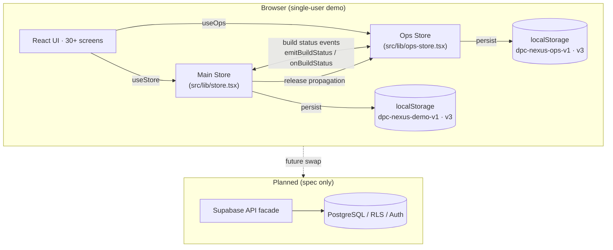
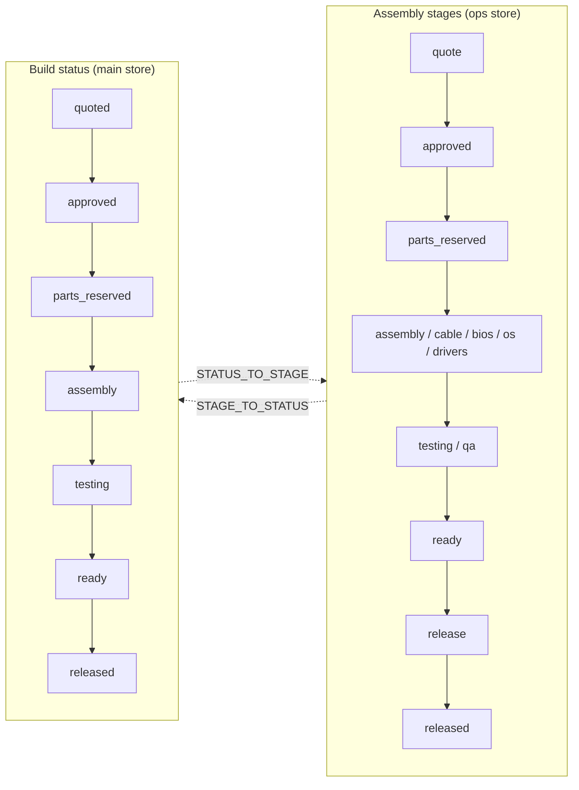
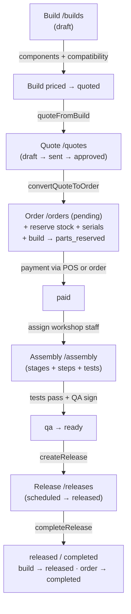
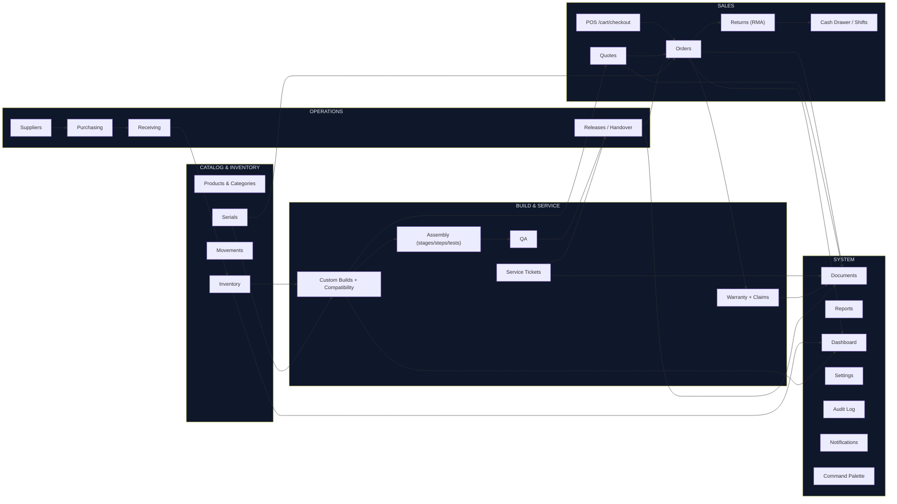

# DPC NEXUS — Complete System Documentation

**System:** DPC NEXUS — PC Retail, Custom Build & IT Operations Platform
**Business:** Dream PC Build & IT Solutions
**Document Status:** Complete — verified against the current codebase
**Documentation Date:** 2026-08-16
**Scope:** Full system analysis covering architecture, every module, every workflow, every state machine, every business rule, every calculation, role-based access, cross-module relationships, edge cases, limitations, and the planned backend path.

> **Status legend used throughout this document**
> - **IMPLEMENTED** — fully functional in the running demo.
> - **PARTIALLY IMPLEMENTED** — usable, with known simplifications.
> - **DEMO-ONLY** — works, but is simulated (no backend, no real security, no real payments).
> - **SIMULATED** — behavior approximated with demo data / client-side logic.
> - **OPTIONAL-FUTURE** — not implemented; proposed for later releases.
> - **NOT IMPLEMENTED** — described in the architecture spec but absent from the demo.

---

## Table of Contents

1. [Executive Summary](#1-executive-summary)
2. [System Purpose](#2-system-purpose)
3. [Scope](#3-scope)
4. [Roles and Capabilities](#4-roles-and-capabilities)
5. [System Architecture](#5-system-architecture)
6. [Module Inventory and Status](#6-module-inventory-and-status)
7. [Data Model (Entity Overview)](#7-data-model-entity-overview)
8. [Demo Data and Persistence](#8-demo-data-and-persistence)
9. [Cross-Module State Synchronization](#9-cross-module-state-synchronization)
10. [Financial Calculations and VAT](#10-financial-calculations-and-vat)
11. [Authentication and Authorization (Demo)](#11-authentication-and-authorization-demo)
12. [App Shell, Navigation and Keyboard](#12-app-shell-navigation-and-keyboard)
13. [Command Palette](#13-command-palette)
14. [Dashboard](#14-dashboard)
15. [Point of Sale (POS)](#15-point-of-sale-pos)
16. [Cart and Checkout](#16-cart-and-checkout)
17. [Orders](#17-orders)
18. [Quotes](#18-quotes)
19. [Customers](#19-customers)
20. [Products and Catalog](#20-products-and-catalog)
21. [Categories](#21-categories)
22. [Inventory Management](#22-inventory-management)
23. [Inventory Movements](#23-inventory-movements)
24. [Serial Numbers](#24-serial-numbers)
25. [Custom Builds](#25-custom-builds)
26. [Build Compatibility Engine](#26-build-compatibility-engine)
27. [Build Pricing and Quotation](#27-build-pricing-and-quotation)
28. [Assembly (Build Ops / Kanban)](#28-assembly-build-ops--kanban)
29. [QA and Testing](#29-qa-and-testing)
30. [Services (Repair Tickets)](#30-services-repair-tickets)
31. [Warranty](#31-warranty)
32. [Warranty Claims](#32-warranty-claims)
33. [Returns (RMA)](#33-returns-rma)
34. [Purchasing](#34-purchasing)
35. [Suppliers](#35-suppliers)
36. [Receiving (Goods Receipts)](#36-receiving-goods-receipts)
37. [Cash Drawer and Shifts](#37-cash-drawer-and-shifts)
38. [Releases and Handover](#38-releases-and-handover)
39. [Documents](#39-documents)
40. [Reports](#40-reports)
41. [Settings](#41-settings)
42. [Audit Log](#42-audit-log)
43. [Notifications](#43-notifications)
44. [Business Rules and Validations](#44-business-rules-and-validations)
45. [State Machines and Transitions](#45-state-machines-and-transitions)
46. [Cross-Module Workflows](#46-cross-module-workflows)
47. [Edge Cases and Failure Handling](#47-edge-cases-and-failure-handling)
48. [Testing and Verification](#48-testing-and-verification)
49. [Known Limitations and Demo Scope](#49-known-limitations-and-demo-scope)
50. [Future Backend (Supabase) Architecture](#50-future-backend-supabase-architecture)
51. [Current vs Planned Architecture Comparison](#51-current-vs-planned-architecture-comparison)
52. [Final System Map](#52-final-system-map)
53. [Problems Solved](#53-problems-solved)
54. [Functional Module Inventory (Final Scope)](#54-functional-module-inventory-final-scope)
55. [Security Model (RLS + RPCs)](#55-security-model-rls--rpcs)
56. [Final Traceability Matrix](#56-final-traceability-matrix)

---

## 1. Executive Summary

DPC NEXUS is a frontend-first demonstration and working prototype of a complete PC retail, custom-build, service, and operations platform for Dream PC Build & IT Solutions. It is built with **TanStack Start + TanStack Router (file-based routing), React 19, TypeScript, Vite, Tailwind CSS v4, Radix UI, Recharts, Sonner toasts, and lucide-react icons**.

The system implements, end-to-end in the browser:

- **Sales**: point of sale, cart/checkout, orders, quotes.
- **Catalog & inventory**: products, categories, stock, movements, serial numbers.
- **Custom builds**: component picker with a compatibility rules engine, build pricing, assembly kanban, testing, QA, and release.
- **Services & after-sales**: repair tickets, warranty and claims, returns (RMA).
- **Operations**: purchasing, suppliers, receiving, cash drawer/shifts, releases.
- **System**: dashboard, reports, documents, settings, audit log, notifications, command palette.

This is the **reduced, production-oriented scope**. Consultations, tasks, and the staff roster were removed from the application entirely (their intake and assignment needs are covered by build fields and the auth-user identity, respectively), and the remaining modules were simplified to what the business actually uses. The scope classification for every module is documented in Section 54.

All data lives in two in-memory stores persisted to `localStorage`. There is **no backend, no database, no real payment gateway, and no real authentication** — these are simulated for demonstration. A separate specification (`docs/DPC-NEXUS-SUPABASE-DATABASE-ARCHITECTURE.md`) defines the intended production backend, which this document references as the planned future state.

**Overall status: IMPLEMENTED as an interactive demo.** Every screen and workflow described below is reachable and functional in the running app. The most significant constraint is that state is single-browser only and authorization is UI-level only.

---

## 2. System Purpose

DPC NEXUS exists to give Dream PC Build & IT Solutions a single operational console that covers the entire customer journey and internal workflow of a PC retail and IT service business:

1. **Capture demand** — quotes and POS sales (build intake is captured on the build record itself).
2. **Sell accurately** — VAT-correct pricing (12% Philippine VAT), discounts, service line items, multiple payment methods.
3. **Build custom PCs safely** — component compatibility validation, assembly tracking, testing, and QA sign-off.
4. **Serve after sales** — repair tickets, warranties, warranty claims, and returns.
5. **Manage stock** — products, on-hand/reserved/damaged/sold inventory, serial-number tracking, low-stock alerts, purchasing and receiving.
6. **Run operations** — cash drawer shifts, releases/handover, documents.
7. **Gain visibility** — dashboard, reports, audit log, notifications.

The demo proves the end-to-end product flow and the data shapes needed before a real backend is attached. The entity types are deliberately written to mirror the planned Supabase schema so the data layer can be swapped for a real API later without rewriting the UI.

---

## 3. Scope

### 3.1 In scope (current demo)

- All modules listed in Section 6, implemented as interactive routes under the authenticated app shell.
- UI-level role-based access control (menu filtering + direct-URL blocking).
- Full CRUD for the core entities described in Section 7.
- Cross-module workflows (build → quote → order → assembly → release; service → release; sale → warranty).
- Calculations: VAT 12%, discounts, service totals, change, shift cash expectations, inventory valuation.
- Build compatibility rules engine.
- Persistence in `localStorage` with schema-versioning.

### 3.2 Out of scope (current demo)

- Real authentication / user accounts / passwords (client-side only).
- Real payments (GCash, bank, card are simulated as selected methods only).
- Multi-user, multi-browser, or multi-device synchronization.
- Real backend, database, row-level security, or server-side API.
- Warehouse scanner / barcode hardware integration.
- Email/SMS notifications.
- Receipt printing to hardware; documents are printable views only.
- Tax invoices / BIR compliance documents.
- Consultations, tasks, and staff-roster modules (deferred/removed; see Sections 49 and 54).

### 3.3 Backend scope (planned, see Section 50)

The Supabase architecture document defines the production database: 33 tables, enums/state machines, inventory/serial architecture, RLS, and ~31 transactional RPCs. It is a specification, not yet implemented.

---

## 4. Roles and Capabilities

### 4.1 Roles

Four roles exist in the domain types (`src/lib/types.ts`, `Role`):

| Role | Short Name | Landing Page (`homeFor`) | Typical Work |
|---|---|---|---|
| `owner` | Owner | `/dashboard` | Everything, incl. costs, audit, settings |
| `admin` | Admin | `/dashboard` | Everything except `audit`; workshop operations |
| `cashier` | Cashier | `/pos` | POS, orders, quotes, customers, products, returns, shifts, releases, documents |
| `inventory` | Inventory Staff | `/inventory` | Products, inventory, adjustments, orders, purchasing, receiving, returns, documents |

Workshop work (builds, assembly, QA, services, warranty) is performed by **admin** and **owner** roles; `technician`/`qaStaff` fields on builds and service tickets record the acting user's identity (name), not a separate role.

### 4.2 Capability matrix

Defined in `src/lib/permissions.ts` (`matrix`). Full matrix:

| Capability | owner | admin | cashier | inventory |
|---|---|---|---|---|
| `pos` | ✓ | ✓ | ✓ | – |
| `orders` | ✓ | ✓ | ✓ | ✓ |
| `quotes` | ✓ | ✓ | ✓ | – |
| `customers` | ✓ | ✓ | ✓ | – |
| `products` | ✓ | ✓ | ✓ | ✓ |
| `inventory` | ✓ | ✓ | – | ✓ |
| `inventory.adjust` | ✓ | ✓ | – | ✓ |
| `builds` | ✓ | ✓ | – | – |
| `builds.qa` | ✓ | ✓ | – | – |
| `assembly` | ✓ | ✓ | – | – |
| `services` | ✓ | ✓ | – | – |
| `warranty` | ✓ | ✓ | – | – |
| `reports` | ✓ | ✓ | – | – |
| `settings` | ✓ | ✓ | – | – |
| `costs` | ✓ | ✓ | – | – |
| `purchasing` | ✓ | ✓ | – | ✓ |
| `receiving` | ✓ | ✓ | – | ✓ |
| `returns` | ✓ | ✓ | ✓ | ✓ |
| `shifts` | ✓ | ✓ | ✓ | – |
| `releases` | ✓ | ✓ | ✓ | – |
| `documents` | ✓ | ✓ | ✓ | ✓ |
| `audit` | ✓ | – | – | – |

**Status: IMPLEMENTED (UI-level only).** The capability matrix drives three behaviors:
- Sidebar/topbar menu visibility (`can(role, item.cap)`).
- Direct-URL blocking in `src/routes/_app.tsx` via `capForPath(pathname)` + `can(role, cap)`; unauthorized navigation is redirected to the role's `homeFor` landing page with an error toast.
- Reports hide cost data unless the role holds `costs`.

**Important warning (documented in code):** this is not security. Real authorization must be enforced server-side (RLS / API guards) once a backend is connected.

### 4.3 Access control mapping (`capForPath`)

Path prefixes map to capabilities so dynamic routes inherit their section's requirement:

`/dashboard→orders`, `/pos→pos`, `/orders→orders`, `/quotes→quotes`, `/returns→returns`, `/shifts→shifts`, `/products→products`, `/inventory→inventory`, `/serials→inventory`, `/builds→builds`, `/assembly→assembly`, `/purchasing→purchasing`, `/suppliers→purchasing`, `/receiving→receiving`, `/customers→customers`, `/services→services`, `/warranty→warranty`, `/releases→releases`, `/documents→documents`, `/reports→reports`, `/settings→settings`, `/audit→audit`.

---

## 5. System Architecture

### 5.1 Technology stack

| Layer | Technology | Usage |
|---|---|---|
| Meta-framework | TanStack Start | Server/client entry, deployment target |
| Routing | TanStack Router (file-based) | 40 route files under `src/routes/` |
| UI | React 19 + TypeScript | All screens |
| Styling | Tailwind CSS v4 | Design system, dark console theme |
| Components | Radix UI primitives (`src/components/ui/*`) | Select, dialog, tabs, dropdowns, etc. |
| Charts | Recharts | Dashboard/reports charts |
| Toasts | Sonner | Notifications & error feedback |
| Icons | lucide-react | Iconography |
| State | React Context + `useReducer`-style patches | Two stores (main + ops) |
| Persistence | `localStorage` | Two versioned keys |
| Motion | Custom `motion.ts` (`ScrollProgress`, `Reveal`, `AnimatedCounter`) | Entrance/ambient animations |
| Errors | `error-capture.ts`, `error-page.ts`, `lovable-error-reporting.ts` | Boundary handling & reporting |

### 5.2 High-level architecture



### 5.3 Store separation

The demo deliberately keeps two independent stores to mirror the two halves of the business domain:

| | Main Store | Ops Store |
|---|---|---|
| File | `src/lib/store.tsx` | `src/lib/ops-store.tsx` |
| Storage key | `dpc-nexus-demo-v1` | `dpc-nexus-ops-v1` |
| Schema version | `3` | `3` |
| Provider | `StoreProvider` | `OpsProvider` |
| Hook | `useStore()` | `useOps()` |
| Scope | Catalog, inventory, sales, builds, services, warranty, audit, notifications, cart | Suppliers, POs, receipts, returns, shifts, build-ops (assembly), releases |

The two stores are linked by **build status events** (`build-sync.ts`) and **release completion propagation** (`release-complete.ts`), described in Section 9.

### 5.4 Persistence model

- On app load each provider reads its `localStorage` key; if `schemaVersion` matches, the snapshot is merged over the seeded baseline; if it mismatches, the stale key is removed and seed data is used.
- Every state change re-serializes the whole snapshot to `localStorage` (demo-scale data; acceptable for a demo, not for production).
- Corrupt or full storage falls back to in-memory operation without crashing.
- `resetDemoData()` / `resetOpsData()` restore the seed baseline.

### 5.5 App shell

`src/routes/_app.tsx` renders: scroll progress indicator, `AppSidebar`, `AppTopbar`, a routed `<Outlet>`, and the `CommandPalette`. The shell enforces the demo auth gate and per-role URL blocking (Section 11), smooth-scrolls on navigation, and installs global keyboard shortcuts (Section 12).

---

## 6. Module Inventory and Status

Every route module in the application, with status:

| # | Module | Route(s) | Primary Capability | Status |
|---|---|---|---|---|
| 1 | Login / sign-in | `/` (`src/routes/index.tsx`) | – | IMPLEMENTED (demo auth) |
| 2 | App shell | `/_app` | – | IMPLEMENTED |
| 3 | Dashboard | `/dashboard` | orders | IMPLEMENTED |
| 4 | Point of Sale | `/pos` | pos | IMPLEMENTED |
| 5 | Orders list | `/orders` | orders | IMPLEMENTED |
| 6 | Order detail | `/orders/$orderId` | orders | IMPLEMENTED |
| 7 | Quotes list | `/quotes` | quotes | IMPLEMENTED |
| 8 | Quote detail | `/quotes/$quoteId` | quotes | IMPLEMENTED |
| 9 | Returns list | `/returns` | returns | IMPLEMENTED |
| 10 | Return (RMA) detail | `/returns/$returnId` | returns | IMPLEMENTED |
| 11 | Cash drawer / shifts | `/shifts` | shifts | IMPLEMENTED |
| 12 | Shift detail | `/shifts/$shiftId` | shifts | IMPLEMENTED |
| 13 | Products list | `/products` | products | IMPLEMENTED |
| 14 | Product detail | `/products/$productId` | products | IMPLEMENTED |
| 15 | Inventory list | `/inventory` | inventory | IMPLEMENTED |
| 16 | Inventory detail | `/inventory/$productId` | inventory | IMPLEMENTED |
| 17 | Serial numbers | `/serials` | inventory | IMPLEMENTED |
| 18 | Custom builds list | `/builds` | builds | IMPLEMENTED |
| 19 | Build detail | `/builds/$buildId` | builds | IMPLEMENTED |
| 20 | Assembly kanban | `/assembly` | assembly | IMPLEMENTED |
| 21 | Purchasing (POs) | `/purchasing` | purchasing | IMPLEMENTED |
| 22 | Purchase order detail | `/purchasing/$poId` | purchasing | IMPLEMENTED |
| 23 | Suppliers list | `/suppliers` | purchasing | IMPLEMENTED |
| 24 | Supplier detail | `/suppliers/$supplierId` | purchasing | IMPLEMENTED |
| 25 | Receiving list | `/receiving` | receiving | IMPLEMENTED |
| 26 | Receipt detail | `/receiving/$receiptId` | receiving | IMPLEMENTED |
| 27 | Customers list | `/customers` | customers | IMPLEMENTED |
| 28 | Customer detail | `/customers/$customerId` | customers | IMPLEMENTED |
| 29 | Services list | `/services` | services | IMPLEMENTED |
| 30 | Service ticket detail | `/services/$ticketId` | services | IMPLEMENTED |
| 31 | Warranty list | `/warranty` | warranty | IMPLEMENTED |
| 32 | Warranty detail | `/warranty/$warrantyId` | warranty | IMPLEMENTED |
| 33 | Warranty claim detail | `/warranty/claims/$claimId` | warranty | IMPLEMENTED |
| 34 | Releases list | `/releases` | releases | IMPLEMENTED |
| 35 | Release detail | `/releases/$releaseId` | releases | IMPLEMENTED |
| 36 | Documents | `/documents` | documents | IMPLEMENTED |
| 37 | Reports | `/reports` | reports | IMPLEMENTED |
| 38 | Settings | `/settings` | settings | IMPLEMENTED |
| 39 | Audit log | `/audit` | audit | IMPLEMENTED |
| 40 | Notifications | (topbar panel) | – | IMPLEMENTED |
| 41 | Command palette | (shell overlay) | – | IMPLEMENTED |

### 6.1 Feature-status matrix

| Feature group | Status | Notes |
|---|---|---|
| POS, cart, checkout, order timeline | IMPLEMENTED | Payments simulated |
| Quotes & quote→order conversion | IMPLEMENTED | No email send |
| Products, categories, inventory, movements, serials | IMPLEMENTED | Stock adjustments simulated |
| Custom builds + compatibility engine | IMPLEMENTED | Browser rules engine |
| Assembly kanban, testing, QA, release | IMPLEMENTED | Cross-store sync via events |
| Service tickets | IMPLEMENTED | Status/cost simulation |
| Warranty + claims | IMPLEMENTED | Auto-created on serialized sales |
| Returns (RMA) | IMPLEMENTED | Restock flag + one-time guard |
| Purchasing, suppliers, receiving | IMPLEMENTED | Posts stock on receipt completion |
| Cash drawer shifts | IMPLEMENTED | Expected cash = formula |
| Documents, audit | IMPLEMENTED | Demo-level |
| Reports, dashboard, notifications | IMPLEMENTED | Derived live from state |
| Real auth, payments, email/SMS, hardware, multi-user | NOT IMPLEMENTED | See Section 49 |

---

## 7. Data Model (Entity Overview)

All entity shapes are defined in `src/lib/types.ts` (core) and `src/lib/ops-types.ts` (operations). They intentionally mirror the Supabase schema in `docs/DPC-NEXUS-SUPABASE-DATABASE-ARCHITECTURE.md`.

### 7.1 Core entities (`types.ts`)

| Entity | Fields (abridged) | Purpose |
|---|---|---|
| `User` | id, name, email, role, initials, password* | Demo accounts (*plaintext, DEMO ONLY) |
| `Category` | id, name, archived, createdAt, key | Product grouping; stable `key` used by build slots |
| `Product` | id, sku, name, brand, categoryId, productType, price, cost, serialTracked, warrantyMonths, location, supplier, specs, isService, archived | Catalog item (product / service / bundle) |
| `ProductSpecs` | socket, memoryType, wattage, tdp, formFactor, +freeform | Input to the compatibility engine |
| `InventoryItem` | productId, onHand, reserved, damaged, sold, reorderPoint | Stock counters |
| `SerialNumber` | id, serial, productId, status, orderId, buildId, customerId, warrantyUntil | Unit-level tracking |
| `InventoryMovement` | id, productId, type, qty, at, actor, reference, note | Stock ledger |
| `Customer` | id, name, email, phone, type, address, since, status, notes | Customer master |
| `Order` | id, customerId, customerName, type, status, items, subtotal, discount, tax, serviceTotal, total, payment, createdAt, buildId, quoteId, notes, timeline, cashier | Sale/order document |
| `OrderItem` | productId, name, sku, qty, unitPrice, serials | Order line |
| `Payment` | id, method, amount, at, reference, tendered, change | Payment capture |
| `Quote` | id, customerId, customerName, status, items, discount, serviceTotal, subtotal, tax, total, createdAt, expiresAt, buildId, orderId, preparedBy | Quotation document |
| `Build` | id, customerId, customerName, purpose, budget, status, components, services, technician, createdAt, orderId, quoteId, qa, qaResult | Custom PC build |
| `BuildComponent` | slot, productId, qty | Build part |
| `ServiceTicket` | id, customerId, customerName, device, issue, diagnosis, status, technician, parts, labor, estimatedCost, actualCost, createdAt, timeline | Repair/service job |
| `Warranty` | id, customerId, customerName, productId, productName, serial, orderId, purchasedAt, expiresAt, status | Serial-linked warranty |
| `WarrantyClaim` | id, warrantyId, reason, status, createdAt, resolution, resolutionNote, timeline | Claim against a warranty |
| `AuditLog` | id, actor, role, action, entity, at | Activity trail |
| `AppNotification` | id, title, body, priority, at, read, kind | In-app alerts |
| `CartLine` | productId, qty, serials | POS cart line |

### 7.2 Operations entities (`ops-types.ts`)

| Entity | Fields (abridged) | Purpose |
|---|---|---|
| `Supplier` | id, name, contact, email, phone, address, terms, leadTimeDays, categories, status, rating, notes | Vendor master |
| `PurchaseOrder` | id, supplierId, supplierName, status, lines, total, createdAt, expectedAt, receivedAt, createdBy, notes | Purchase order |
| `PurchaseLine` | productId, name, sku, qty, received, unitCost | PO line |
| `GoodsReceipt` | id, purchaseOrderId, supplierId, supplierName, status, lines, receivedBy, receivedAt, notes | Goods receipt |
| `ReceivingLine` | productId, name, sku, expected, received, damaged, serials | Receipt line |
| `ReturnRequest` | id, orderId, customerId, customerName, productId, productName, serial, qty, reason, condition, resolution, refundMethod, refundAmount, status, inspectedBy, inspectionNotes, notes, restock, restockedAt | RMA |
| `Shift` | id, cashier, status, openedAt, closedAt, openingCash, adjustments, countedCash, tenders, refunds, notes | Cash drawer shift |
| `CashAdjustment` | id, kind (cash_in/out), amount, reason, at, actor | Drawer adjust |
| `BuildOps` | buildId, stage, assembly[], tests[], technician, qaStaff, notes, qaSignedAt | Assembly/testing state per build |
| `AssemblyStage` | id, label, group (sales/assembly/validation/handover) | Stage definition |
| `ReleaseRecord` | id, kind (build/service/order), refId, customerName, method, scheduledAt, status, releasedBy, receivedBy, releasedAt, completedAt, notes | Handover/pickup |

### 7.3 ID strategy (demo)

- Orders `DPC-<counter>` (counter starts at 10483), Quotes `QT-<counter>`, Builds `BUILD-<counter>`, Services `SRV-<counter>`.
- Ops IDs: PO `<counter>` prefixed (`PO-147`-style), Receipts `GR-<counter>`, Returns `RMA-<counter>`, Releases `REL-<counter padded>`, shifts use counters.
- Warranty IDs derive from the order + line + serial: `WR-<orderId>-<line>-<serial>`.
- Serial/internal IDs use `Math.random().toString(36)` snippets (demo only).

---

## 8. Demo Data and Persistence

### 8.1 Seed data sources

| File | Contents |
|---|---|
| `src/lib/demo-data.ts` | 4 demo users, 17 categories, 30 products, 6 customers, 9 orders, 6 quotes, 6 builds, 5 services, 6 warranties, 2 claims, generated serials, movements, audit logs, notifications, sales/hours series for charts |
| `src/lib/ops-data.ts` | Suppliers, purchase orders, goods receipts, returns, shifts, buildOps (assembly records), releases, company profile |

All seed data is deep-cloned with `structuredClone` on seed so the live state never mutates the module-level constants.

### 8.2 Lifecycle

1. `seed()` builds the initial snapshot from demo data.
2. Hydration effect reads `localStorage`; version match → merge; mismatch → clear & reseed.
3. Any `patch` re-persists the entire snapshot.
4. `resetDemoData()` / `resetOpsData()` restore seeds (available from settings).
5. Corrupt/overflow storage is swallowed so the demo keeps running in memory.

### 8.3 Demo users & passwords

Demo accounts live in `demoUsers`; the login page shows the working password for the selected role. Passwords are plaintext placeholders — DEMO-ONLY.

---

## 9. Cross-Module State Synchronization

The main and ops stores must stay consistent even though they persist independently. Three mechanisms bridge them:

### 9.1 Build status ↔ assembly stage map (`build-state.ts`)

A bidirectional mapping keeps the sales-facing build `status` and the workshop-facing assembly `stage` aligned:



- `STAGE_TO_STATUS` covers every stage; `STATUS_TO_STAGE` intentionally omits `draft`/`cancelled` so those states are never overwritten by stage events.
- `stageForStatus` falls back to the current stage when a status has no stage mapping.

### 9.2 Build status event bus (`build-sync.ts`)

`emitBuildStatus(buildId, status)` notifies listeners; `onBuildStatus(listener)` subscribes. Used so the ops store can advance its build ops when the main store changes a build's status (e.g., `convertQuoteToOrder` → `parts_reserved`, `finalizeQa` pass → `ready`, release → `released`).

### 9.3 Release completion propagation (`release-complete.ts`)

When a release is completed (`completeRelease`), `completeReleaseSource` updates the source entity so the handover stays consistent across both stores:

| Release kind | Source update |
|---|---|
| `build` | `setBuildStatus(refId, "released")` |
| `service` | `setServiceStatus(refId, "released")` |
| `order` | `updateOrderStatus(refId, "completed")` |

**Status: IMPLEMENTED (demo).** A real backend would perform these updates in a single transaction.

---

## 10. Financial Calculations and VAT

### 10.1 Currency and formatting

`src/lib/format.ts` formats in `en-PH` locale:
- `money(n)` — PHP, 0 decimals.
- `moneyExact(n)` — PHP, 2 decimals.
- `num(n)` — thousands separator.
- Date/time helpers: `dateShort`, `dateTime`, `timeOnly`, `relative`, `daysUntil`.

### 10.2 VAT rate

```ts
export const VAT_RATE = 0.12;   // 12% Philippine VAT
```

### 10.3 `computeTotals` (the core pricing function)

`src/lib/store.tsx`:

```
gross        = Σ (qty × unitPrice)  for product lines
net          = max(0, gross + serviceTotal − discount)
subtotal     = round(net / (1 + VAT_RATE), 2)
tax          = round(net − subtotal, 2)
total        = net
```

Notes:
- Services are priced VAT-inclusive like everything else; service total is summed from service-line quantities.
- Discount is applied against the combined product+service gross, floor at zero.
- `subtotal` = net amount excluding VAT; `tax` = VAT portion; `total` = net (VAT-inclusive).

### 10.4 Where calculations are applied

| Context | Function / location |
|---|---|
| POS checkout | `completeSale` → `computeTotals(productItems, cartDiscount, serviceTotal)` |
| Quotes | `createQuote` / `quoteFromBuild` → `computeTotals` |
| Quote→order conversion | totals carried from the quote |
| Shift cash expectation | `expectedCash(shift, cashSales, cashRefunds)` = openingCash + cashSales + Σ(adjustments) − refunds (`ops-store.tsx`) |
| Reports | inventory valuation = Σ(onHand × price / cost); margins from `orders` |
| Returns | `refundAmount` recorded manually on the RMA |

---

## 11. Authentication and Authorization (Demo)

### 11.1 Sign-in flow (`src/routes/index.tsx`)

1. User selects a role profile among **owner, admin, cashier, inventory**.
2. Enters the password; `signInAs(role, password)` compares against the demo account in `demoUsers`.
3. On success, redirects to `homeFor(role)`: cashier → `/pos`, inventory → `/inventory`, otherwise → `/dashboard`.
4. On failure, shows an inline error; the demo password is printed under the form.

### 11.2 Session

- `user` is stored in the main store snapshot (so a sign-in survives refresh via `localStorage`).
- `signOut()` clears the user; the shell redirects to `/`.
- While not hydrated/no user, the shell renders an "INITIALIZING DPC NEXUS…" splash and blocks children.

### 11.3 Authorization enforcement

- **Menu filtering**: sidebar and topbar render only items the role can use.
- **URL guarding**: `_app.tsx` watches the pathname; if `capForPath` returns a capability the role lacks, a toast fires and the user is redirected to their landing page.
- **Report costs**: cost columns/values render only when `can(role, "costs")`.

**Status: DEMO-ONLY.** Not real security (see Section 49).

---

## 12. App Shell, Navigation and Keyboard

### 12.1 Layout

- `AppSidebar` — grouped navigation (Sales, Inventory & Build, Customers & Service, Operations, Analytics, System), each item gated by capability; brand header; collapse toggle.
- `AppTopbar` — breadcrumb (from `nav-config`), global search, notifications bell + dropdown panel, user chip, keyboard hints, mobile nav.
- `ScrollProgress` — top scroll indicator.
- Route content in `<main>` keyed by pathname (re-triggers entrance animation per navigation).

### 12.2 Navigation groups (`src/components/app/nav-config.tsx`)

| Group | Items |
|---|---|
| Overview | Dashboard |
| Sales | Point of Sale, Orders, Quotes, Returns, Cash Drawer |
| Inventory & Build | Products, Inventory, Serial Numbers, Custom Builds, Assembly, Purchasing, Suppliers, Receiving |
| Customers & Service | Customers, Services, Warranty, Releases |
| Operations | Documents |
| Analytics | Reports |
| System | Settings, Audit Log |

### 12.3 Keyboard shortcuts

| Key | Action |
|---|---|
| `Ctrl/⌘+K` | Toggle command palette |
| `F1` | Go to `/pos` |
| `F2` | Focus POS search (or open palette) |

---

## 13. Command Palette

`src/components/app/command-palette.tsx` — an overlay search that lists every navigation item (filtered by the current role's capabilities) plus a set of quick actions (open POS, create order, go to a module). Selecting an entry navigates via TanStack Router. **Status: IMPLEMENTED.**

---

## 14. Dashboard

Route: `/dashboard` (capability: orders). **Status: IMPLEMENTED.**

Contents (derived live from store state):
- KPI tiles: today's revenue, orders today, open service tickets, builds in progress, pending returns, low-stock alerts.
- Charts: 14-day daily sales series and 12 hourly buckets (08:00–19:00, Recharts).
- Live operational overview: sales, builds, inventory alerts, and recent activity.
- A "Builds on the bench" widget showing builds mid-assembly (with their current stage).
- Low-stock derived by `onHand - reserved <= reorderPoint`.

---

## 15. Point of Sale (POS)

Route: `/pos` (capability: pos). **Status: IMPLEMENTED.**

### 15.1 Layout and behavior

- Product grid with category tabs / search (`data-pos-search` supports `F2` focus) and brand grouping.
- Click to add to cart; quantity stock-guard enforced at add time (see Section 44).
- Cart panel shows lines, service items, discount control, customer selector, held-cart management.
- Checkout opens the payment dialog: method selection (cash / GCash / bank / card), tendered amount + change for cash, optional reference for non-cash, optional notes.
- Live totals always computed with `computeTotals`.

### 15.2 Checkout pipeline (`completeSale`)

1. Build items from cart; separate service lines from product lines.
2. Compute totals with `computeTotals`.
3. Create `Order` id `DPC-<counter>`, status `paid`, payment record, timeline.
4. Decrement inventory (`onHand -= qty`, `sold += qty`) and append `sold` movements per line.
5. For serial-tracked lines, mark matching in-stock serials as `sold` with `orderId`, `customerId`, and `warrantyUntil`.
6. Auto-create a `Warranty` for each sold serial (`expiresAt = sale date + warrantyMonths`).
7. Clear cart, increment order counter, push a `payment` notification and an audit log.
8. Return the new order (screen navigates to the order detail).

**Status: IMPLEMENTED.** Payment capture is simulated — no gateway is contacted.

---

## 16. Cart and Checkout

### 16.1 Cart operations (`store.tsx`)

| Operation | Behavior |
|---|---|
| `addToCart` | Adds qty; rejects archived products; rejects qty above available stock for non-services |
| `setCartQty` | Sets qty; qty ≤ 0 removes line |
| `removeCartLine` | Removes a line |
| `clearCart` | Empties cart, resets discount and customer |
| `setCartDiscount` | Sets non-negative cart-wide discount |
| `setCartCustomer` | Attaches customer for the transaction |
| `holdCart` | Saves cart as `HOLD-<n>` with timestamp; clears working cart |
| `resumeHeldCart` | Restores a held cart (lines + customer); removes it from held list |
| `setCartLineSerials` | Assigns specific serials to a serial-tracked line |

### 16.2 Payment methods

`PaymentMethod = "cash" | "gcash" | "bank" | "card"`. Cash captures `tendered` and `change`; non-cash captures `reference`.

**Status: IMPLEMENTED (simulated payments).**

---

## 17. Orders

Routes: `/orders` (list), `/orders/$orderId` (detail). Capability: orders. **Status: IMPLEMENTED.**

### 17.1 List

- Search by ID/customer/cashier, status filter, date range.
- Row → detail navigation; status badges.

### 17.2 Detail

- Header: order id, status badge, customer & cashier, timeline.
- Items table with quantities, unit prices, serials.
- Totals breakdown: subtotal (ex-VAT), discount, service total, VAT, total.
- Payment panel: method, amount, tendered/change, reference.
- **Status transitions** (`updateOrderStatus`): advances status and re-labels the active timeline event, appends a new active event, writes an audit log.
- Refunds are simulated locally — no payment gateway or automatic inventory reversal.

### 17.3 Order types

`retail` (POS), `custom_build` (via quote conversion with a `buildId`), `service` (contains service lines).

---

## 18. Quotes

Routes: `/quotes` (list), `/quotes/$quoteId` (detail). Capability: quotes. **Status: IMPLEMENTED.**

### 18.1 Creation and pricing

- Manual quote: pick customer, lines, discount, service total, expiry (in days).
- From build: `quoteFromBuild(buildId)` turns build components into quote lines, sums `build.services` amounts into `serviceTotal`, computes totals, defaults expiry to 14 days, sets `buildId`.
- `createQuote` writes an audit log.

### 18.2 Quote lifecycle

`draft → sent → pending → approved → rejected | expired | converted`.

| Action | Behavior |
|---|---|
| `setQuoteStatus` | Moves status; writes audit log |
| `convertQuoteToOrder` | Creates a `pending` order (type `custom_build` if the quote has a build, else `retail`), marks quote `converted` + links `orderId` |
| On conversion | Reserves inventory (`reserved += qty`) for all lines; marks matching in-stock serials `reserved` with `orderId`; sets the linked build status to `parts_reserved` and emits a build-status event |
| On `approved` with a build | Notifies the build channel (high priority) |

---

## 19. Customers

Routes: `/customers` (list), `/customers/$customerId` (detail). Capability: customers. **Status: IMPLEMENTED.**

- Customer record: name, email, phone, type (individual/business), address, since, status (active/inactive), notes.
- `createCustomer` assigns id/counter, default active status, writes audit log.
- Detail shows profile, recent orders, quotes, services, warranties, and active claims for that customer.
- Walk-in transactions use a pseudo-customer "Walk-in Customer" (customerId `null`).

---

## 20. Products and Catalog

Routes: `/products` (list), `/products/$productId` (detail). Capability: products. **Status: IMPLEMENTED.**

### 20.1 Product fields

sku, name, brand, categoryId, `productType` (product / service / bundle), description, `price`, `cost`, `serialTracked`, `warrantyMonths`, `location`, `supplier`, `specs` (socket, memoryType, wattage, tdp, formFactor + freeform), `isService`, `archived`.

### 20.2 CRUD

| Action | Behavior |
|---|---|
| `createProduct` | Validates SKU uniqueness; creates inventory record (onHand, reorderPoint); writes audit log |
| `updateProduct` | Patches fields; can adjust onHand/reorderPoint; audit log |
| `archiveProduct` / `reactivateProduct` | Toggles archived; archived items can't be added to cart |
| `deleteProduct` | Removes product (demo); guard rails against deletion when referenced |

### 20.3 Detail view

- Catalog info + specs.
- Stock summary snapshot (live inventory).
- Recent movements (last 20).
- Cross-link to the inventory detail page.

**Status: IMPLEMENTED.** Bundles are typed but their composition editing is not fully built (see Section 49).

---

## 21. Categories

Managed within the products module. **Status: IMPLEMENTED.**

- `createCategory(name)` — unique-name validation, audit log.
- `updateCategory(name)` — rename (semantic `key` preserved so build-slot logic is not broken by renames).
- `archiveCategory` / `reactivateCategory` — toggle visibility.
- Categories carry an optional stable `key` (e.g. `cpu`, `motherboard`, `ram`, `gpu`, `psu`, `case`, `storage`) that the compatibility engine and build-slot resolution depend on.

---

## 22. Inventory Management

Routes: `/inventory` (list), `/inventory/$productId` (detail). Capability: inventory (adjustments: `inventory.adjust`). **Status: IMPLEMENTED.**

### 22.1 Stock counters

Each `InventoryItem` tracks `onHand`, `reserved`, `damaged`, `sold`, `reorderPoint`.

- **Available** = `onHand − reserved` (used by POS stock guard, build reservation, low-stock alerts).
- **Low stock** = available ≤ reorderPoint (dashboard + inventory list alert).

### 22.2 Adjustments

`adjustStock(productId, delta, note)` adjusts onHand (delta can be negative) and records an `adjusted` movement with actor and note. Gated by `inventory.adjust` capability.

### 22.3 Movement lifecycle

Stock is touched by: POS sale (`sold`), quote→order conversion (`reserved`), receiving completion (`received`), manual adjust (`adjusted`), RMA restock (`returned`), damaged entries (`damaged`).

---

## 23. Inventory Movements

`InventoryMovement` is the stock ledger. `MovementType = received | reserved | sold | adjusted | damaged | returned`.

Every movement records `productId`, `qty`, `at`, `actor`, optional `reference` (e.g., order id, PO id, receipt id), and `note`.

Movement history is displayed on product and inventory detail pages (last 20). **Status: IMPLEMENTED.**

---

## 24. Serial Numbers

Route: `/serials`. Capability: inventory. **Status: IMPLEMENTED.**

### 24.1 Serial statuses

`SerialStatus = in_stock | reserved | installed | sold | rma`.

| Status | Meaning |
|---|---|
| `in_stock` | Available to sell |
| `reserved` | Held for a pending order (set on quote→order conversion) |
| `installed` | Fitted into a build (demo supports the state; wiring is partial) |
| `sold` | Sold; carries `orderId`, `customerId`, `warrantyUntil` |
| `rma` | Returned; awaiting resolution |

### 24.2 Operations

| Operation | Behavior |
|---|---|
| `registerSerials` | Registers new serials as `in_stock`; dedupes against known serials; audit log; returns count added |
| `updateSerial` | Patches status/orderId/buildId/customerId/warrantyUntil; audit log |
| `availableSerialsOf` | Lists in-stock serials for a product (used at POS to assign serials per line) |
| POS sale | Sold serials get `warrantyUntil` = sale + product `warrantyMonths`, and a `Warranty` row is created |

---

## 25. Custom Builds

Routes: `/builds` (list), `/builds/$buildId` (detail). Capability: builds. **Status: IMPLEMENTED.**

### 25.1 Build lifecycle

```
draft → quoted → approved → parts_reserved → assembly → testing → ready → released
        (cancelled at any pre-release point)
```

### 25.2 Build creation

`createBuild` starts at `draft`, seeds three service line items (Assembly ₱2,500 · Windows installation ₱1,000 · Cable management ₱500), assigns the technician as the acting user's name (or "Unassigned" if no session), and seeds the QA checklist from demo data with all results `null`.

### 25.3 Component management

- `addBuildComponent(buildId, slot, productId, qty)` — adds or increments a component under its semantic slot (CPU, Motherboard, RAM, GPU, Storage, PSU, Case, Cooling, Fans, Software, Accessories).
- `removeBuildComponent` / `setBuildComponentQty` — remove / set quantity (floor 1).
- All component mutations write audit logs.

### 25.4 Compatibility

Compatibility is checked live against the component list (see Section 26), with severity badges (error/warning/info) and slot highlighting.

### 25.5 Build services

`BuildService { label, amount }` rows are added to the build; their sum feeds `serviceTotal` when quoting.

### 25.6 Status actions

- `setBuildStatus` — updates status, emits a build-status event, writes audit log; when `ready`, pushes a high-priority `build` notification ("Build ready for release").
- Quote from build, convert to order (sets `parts_reserved`), QA finalize, release (Section 38).

---

## 26. Build Compatibility Engine

`src/lib/compatibility.ts` — **Status: IMPLEMENTED (browser rules engine, DEMO-ONLY).**

### 26.1 Rules

| Rule | Severity | Condition |
|---|---|---|
| Socket mismatch | error | CPU `socket` ≠ Motherboard `socket` |
| Memory type mismatch | error | Motherboard `memoryType` ≠ any RAM `memoryType` |
| PSU insufficient | error | CPU+GPU TDP > PSU wattage |
| PSU headroom tight | warning | CPU+GPU TDP within 20% of PSU wattage |
| Form factor mismatch | error | mITX case with ATX/mATX board |
| Tight form factor fit | warning | mATX case with ATX board |
| Missing essential part | info | Missing CPU / Motherboard / RAM / PSU / Case / Storage |

### 26.2 Output

`CompatibilityIssue { severity, title, detail, slots[] }`; slots are highlighted in the build UI so the operator can see which components conflict.

---

## 27. Build Pricing and Quotation

`quoteFromBuild(buildId)` (Section 18.1):

- Lines from components (unit price = current product price).
- `serviceTotal` = Σ build service amounts.
- `computeTotals(lines, 0, serviceTotal)` → VAT-correct quote.
- Quote defaults to `draft`, 14-day expiry, note "Quotation for <purpose>.".

**Status: IMPLEMENTED.**

---

## 28. Assembly (Build Ops / Kanban)

Route: `/assembly`. Capability: assembly. **Status: IMPLEMENTED.**

### 28.1 Stages

13 assembly stages across 4 groups (`ASSEMBLY_STAGES` in `ops-types.ts`):

| Group | Stages |
|---|---|
| sales | quote, approved, parts_reserved |
| assembly | assembly, cable_management, bios, os_install, drivers |
| validation | testing, qa |
| handover | ready, release, released |

### 28.2 Kanban board

- Columns group builds by stage; cards show build id, customer, technician, stage progress bar.
- Filters: search (build id/customer/technician), technician select.
- Quick technician assignment on the card (writes to both stores via `updateBuild` + `assignBuildStaff`).

### 28.3 Build Ops state (`BuildOps`)

Per build: `stage`, `assembly[]` (9 default steps: CPU installed, Cooler mounted, RAM installed, Storage installed, Motherboard seated, PSU installed, GPU installed, Cable management, Front panel wiring), `tests[]` (CPU/GPU stress, Memory, Thermal, Stability), `technician`, `qaStaff`, `qaSignedAt`, `notes`.

- `defaultBuildOps(buildId)` initializes a fresh record at `quote`.
- `upsertOps` lazily creates a record when the first action touches a build.
- `stageProgress(stage)` = `(index+1)/13 × 100`.

### 28.4 Stage transitions

`setBuildStage(buildId, stage)` updates the ops record only. The main-store status stays aligned through `STAGE_TO_STATUS` when status is changed from the main store, and the event bus propagates status changes the other direction. The UI reconciles both views.

---

## 29. QA and Testing

### 29.1 Test results

`setTestResult(buildId, label, result, reading)` records pass/fail plus an optional reading per test.

### 29.2 QA checklist (main store)

`Build.qa` is a `QaCheck[]` of hardware/testing items; `toggleQaCheck` marks each passed/failed; `finalizeQa(buildId, result)`:

- `pass` → build status `ready` + notification (normal) + emits `ready` build event.
- `fail` → records `qaResult: fail`, keeps current status, pushes a `critical` notification.

### 29.3 QA sign-off (ops store)

`signQa(buildId, qaStaff)` stamps `qaStaff`, `qaSignedAt`, and auto-advances the stage to `ready` **only if every test passed**.

**Status: IMPLEMENTED (dual-store, demo).**

---

## 30. Services (Repair Tickets)

Routes: `/services` (list), `/services/$ticketId` (detail). Capability: services. **Status: IMPLEMENTED.**

### 30.1 Data

`device`, `issue`, `diagnosis`, `technician`, `parts[]` (`ServicePart: productId, name, qty, price`), `labor`, `estimatedCost`, `actualCost`, `timeline`.

### 30.2 Lifecycle

`received → diagnosing → waiting_customer → waiting_parts → in_repair → ready → released | cancelled`.

| Action | Behavior |
|---|---|
| `createService` | Creates ticket at `received`; audit log |
| `setServiceStatus` | Advances status; when `ready` a `service` notification fires; audit log |
| `updateService` | Updates diagnosis/labor/actualCost/technician/notes |
| `addServicePart` / `removeServicePart` | Manage parts list (deduped by product) |
| Release | Via releases module → sets `released` (Section 38) |

### 30.3 Cost capture

`estimatedCost` set at intake; `actualCost` captured by the acting workshop user; both simulated locally — no technician notifications or payment processing.

---

## 31. Warranty

Route: `/warranty` (list) + `/warranty/$warrantyId` (detail). Capability: warranty. **Status: IMPLEMENTED.**

### 31.1 Creation

- Auto-created at POS checkout for every serial-tracked item sold: `expiresAt = purchasedAt + warrantyMonths`, status `active`, linked to order + customer + serial.

### 31.2 Statuses

`WarrantyStatus = active | expiring | expired | void`.

- `expiring` / `expired` are shown as stored statuses; the warranty list and reports also derive live "expiring soon" / "expired" counts from `daysUntil(expiresAt)`.
- `void` results from claim resolution or manual action.

### 31.3 Detail

Shows product, serial, order link, purchase/expiry dates, status, and linked claims. Users can raise a claim from the warranty (Section 32).

---

## 32. Warranty Claims

Route: `/warranty/claims/$claimId`. Capability: warranty. **Status: IMPLEMENTED.**

### 32.1 Lifecycle

`open → in_review → approved | rejected → closed`.

| Action | Behavior |
|---|---|
| `createClaim(warrantyId, reason)` | Opens a claim; timeline seeded; audit log |
| `updateClaim(claimId, patch, label)` | Advances status, records `resolution` + `resolutionNote`, appends timeline; audit log |

### 32.2 Timeline

`ClaimEvent { label, at, actor }` documents each reviewer action.

---

## 33. Returns (RMA)

Routes: `/returns` (list), `/returns/$returnId` (detail). Capability: returns. **Status: IMPLEMENTED.**

### 33.1 Lifecycle

`requested → inspection → approved | rejected → refunded | replaced` (via `refunded`/`replaced` from approved).

### 33.2 Data captured

Order, customer, product, optional serial, qty, `reason`, `condition` (sealed / used_good / used_damaged / defective), `resolution` (refund / replacement / repair / none), `refundMethod`, `refundAmount`, `restock` flag, inspection notes.

### 33.3 Settlement behavior

- `setReturnStatus(id, status, patch)` advances the RMA; when settled as `refunded`/`replaced`:
  - If `restock` and not already restocked, inventory is adjusted back (`returned` movement) and `restockedAt` is stamped — the one-time guard prevents double-adjustment if a user re-settles an already-restocked RMA.
  - If `rejected`, it closes with no refund and no inventory adjustment.
- Refund method/amount are recorded for the shift's expected-cash reconciliation.

---

## 34. Purchasing

Routes: `/purchasing` (list), `/purchasing/$poId` (detail). Capability: purchasing. **Status: IMPLEMENTED.**

### 34.1 Purchase order lifecycle

`draft → submitted → confirmed → partial → received | cancelled`.

### 34.2 CRUD

- `createPurchaseOrder(supplierId, lines, expectedAt, notes)` — creates PO with supplier snapshot, computes total from `qty × unitCost`, id from PO counter; audit log.
- `setPoStatus` — advances status; `received` typically follows a completed receipt.

### 34.3 PO detail

- Lines with `qty`, `received` so far, `unitCost`.
- Status-aware actions; a received PO can no longer be re-received.

---

## 35. Suppliers

Routes: `/suppliers` (list), `/suppliers/$supplierId` (detail). Capability: purchasing. **Status: IMPLEMENTED.**

- Fields: contact, email, phone, address, terms, leadTimeDays, categories, status (active/inactive), rating, notes.
- `createSupplier` / `updateSupplier` CRUD with audit logging.
- Detail shows supplier profile and their POs/receipts.

---

## 36. Receiving (Goods Receipts)

Routes: `/receiving` (list), `/receiving/$receiptId` (detail). Capability: receiving. **Status: IMPLEMENTED.**

### 36.1 Flow

1. `startReceipt(purchaseOrderId)` — creates a `GoodsReceipt` at `in_progress`, pre-filling lines with `expected` = PO line qty.
2. `updateReceiptLine(receiptId, productId, patch)` — record `received`, `damaged`, `serials[]`.
3. `completeReceipt(receiptId, onStock, onSerials)` — finalizes the receipt:
   - Posts `received` movements to inventory (`onHand += received`) via the main store callback.
   - Registers received serials via `onSerials`.
   - Marks receipt `completed` (or `discrepancy` when received ≠ expected or damaged > 0).
   - Sets the PO to `partial`/`received` based on line fulfillment.
   - Audit log.

**Status: IMPLEMENTED.** No warehouse scanner integration; serial capture is manual.

### 36.2 Receipt statuses

`in_progress → completed | discrepancy`.

---

## 37. Cash Drawer and Shifts

Routes: `/shifts` (list), `/shifts/$shiftId` (detail). Capability: shifts. **Status: IMPLEMENTED (simulated reconciliation).**

### 37.1 Shift lifecycle

`open → closed`.

- `openNewShift(openingCash, cashier)` — opens a shift.
- `addCashAdjustment(shiftId, {kind: cash_in|cash_out, amount, reason})` — records `cash_in` (+) / `cash_out` (−) adjustments; actor/at stamped.
- `closeShift(shiftId, countedCash, tenders, refunds, notes)` — records counted cash, payment-method tender breakdown, refunds; sets `closed`.

### 37.2 Expected cash

`expectedCash(shift, cashSales, cashRefunds)` = `openingCash + cashSales + Σ(adjustments) − refunds`.

The shift detail compares expected vs counted to show variance (demo values entered by the cashier at close).

---

## 38. Releases and Handover

Routes: `/releases` (list), `/releases/$releaseId` (detail). Capability: releases. **Status: IMPLEMENTED.**

### 38.1 Release lifecycle

`scheduled → released → completed`.

| Action | Behavior |
|---|---|
| `createRelease` | Creates record for kind `build` / `service` / `order`, method `pickup` / `delivery`, scheduled time; id `REL-<n>` |
| `markReleaseReleased` | Stamps `releasedBy` + `releasedAt` (only from `scheduled`) |
| `completeRelease` | Stamps `receivedBy` + `completedAt` (only from `released`); then calls `completeReleaseSource` to advance the source entity (Section 9.3) |

### 38.2 Handover consistency

Completing a release flips: build → `released`, service → `released`, order → `completed` — across both stores.

---

## 39. Documents

Route: `/documents`. Capability: documents. **Status: IMPLEMENTED (printable views).**

### 39.1 Generated documents

| Document | Source |
|---|---|
| Receipt / official-receipt style print | Paid orders (method, reference, tendered/change, cashier) |
| Sales order | Orders incl. pending |
| Quotation | Quotes with totals and expiry |
| Service worksheet | Service tickets (device, diagnosis, technician) |
| Warranty card | Warranty records |

Documents render as clean, print-friendly layouts (CSS `@media print`), each with a print button. Documents are derived views only — there is no stored document entity (the production backend has no documents table).

---

## 40. Reports

Route: `/reports`. Capability: reports (cost data gated by `costs`). **Status: IMPLEMENTED (derived live).**

### 40.1 Report areas

| Area | Content |
|---|---|
| Sales | Revenue/order counts over range (default last 30 days); sales series chart |
| Margin | Gross margin; **cost data visible only with `costs` capability** |
| Inventory | Dead stock (no sales in range), units on hand, retail value, cost value (cost gated) |
| Cashier performance | Orders and revenue per cashier |
| Service output | Workshop/service metrics |

All values are computed live from the store (orders, inventory, products) — no stored aggregates.

---

## 41. Settings

Route: `/settings`. Capability: settings. **Status: IMPLEMENTED.**

- Company profile (name, address, contact — seeded from `ops-data.company`).
- Demo data controls: **Reset demo data** (main store) and **Reset ops data** (ops store) buttons.
- Preferences: sidebar collapse state; demo-specific options.
- Note: changes persist to `localStorage`.

---

## 42. Audit Log

Route: `/audit`. Capability: audit (owner only). **Status: IMPLEMENTED.**

- `AuditLog { actor, role, action, entity, at }`.
- Written by every meaningful store action (sales, quotes, builds, services, warranty, returns, stock, serials, settings, auth).
- Ops-store actions that lack their own audit write entries via the main store's `audit(action, entity)` helper so the log is centralized.
- Screen: filterable table (entity, actor, action), reverse-chronological.

---

## 43. Notifications

Topbar bell + dropdown. **Status: IMPLEMENTED.**

- `AppNotification { title, body, priority (critical/high/normal), at, read, kind }`.
- Kinds: `stock`, `quote`, `build`, `warranty`, `service`, `payment`.
- Triggered by: payment completed, build ready for release, QA passed/failed, quote approved, service ready, low stock.
- `markAllNotificationsRead()` clears the unread badge.

---

## 44. Business Rules and Validations

A consolidated, non-exhaustive inventory of the rules enforced by the codebase:

### 44.1 Catalog & pricing

1. VAT is 12% (constant `VAT_RATE`), applied as VAT-inclusive pricing via `computeTotals`.
2. `subtotal` (ex-VAT), `tax`, and `total` are always rounded to 2 decimals.
3. Discount is non-negative and never drives `net` below zero.
4. Service line items are excluded from `gross` but added as `serviceTotal` (VAT-inclusive) into `net`.
5. SKU uniqueness is enforced on product creation.

### 44.2 POS / cart

6. Archived products cannot be added to the cart.
7. Non-service quantities cannot exceed available stock at add time (`onHand − reserved`).
8. Serial-tracked lines can have explicit serials assigned; `availableSerialsOf` only returns `in_stock` serials.
9. Serial registration dedupes against all known serials (case-insensitive).
10. `setCartQty` with qty ≤ 0 removes the line; component quantities floor at 1.

### 44.3 Orders & quotes

11. Quote→order conversion reserves inventory and serials (`reserved += qty`; serials → `reserved`) and marks the linked build `parts_reserved`.
12. Order status transitions append timeline events and audit logs; the previous active event is marked done.
13. Order types are derived: build-backed → `custom_build`, service lines → `service`, else `retail`.

### 44.4 Builds & assembly

14. Compatibility engine severity rules (Section 26) — socket, memory type, PSU wattage vs CPU+GPU TDP, form factor, missing essentials.
15. `draft`/`cancelled` build statuses are never overwritten by stage-driven status updates (`STATUS_TO_STAGE` omissions + `statusForStage` returning undefined).
16. QA can only auto-advance to `ready` when every test passed (`signQa`).
17. `finalizeQa` with fail keeps the build's current status and raises a critical notification.
18. Default build services are seeded (Assembly, Windows install, Cable management) on every new build.

### 44.5 Returns

19. RMA restock is applied once (`restockedAt` guard) so re-settling never double-adjusts inventory.
20. Rejected RMAs close with no refund and no inventory adjustment.

### 44.6 Receiving & purchasing

21. Completing a receipt posts `received` movements; damaged units are recorded separately and trigger a `discrepancy` status.
22. PO status reflects line fulfillment (`partial` vs `received`).
23. Only `scheduled` releases can be marked `released`; only `released` releases can be `completed`.

### 44.7 Shifts

24. Expected cash = `openingCash + cashSales + Σ adjustments − cashRefunds`; variance is shown at close.

### 44.8 Access

25. Capability matrix gates menus, direct URLs, and cost visibility (Sections 4, 11).
26. Login requires a role selection and the correct demo password (`signInAs`).

---

## 45. State Machines and Transitions

### 45.1 Order

```
pending → paid → processing → assembly → testing → ready → completed
                    └────────────── cancelled / refunded
```

`updateOrderStatus` advances freely (demo); release completion sets `completed`.

### 45.2 Quote

```
draft → sent → pending → approved → converted
                 └────────→ rejected / expired
```

### 45.3 Build

```
draft → quoted → approved → parts_reserved → assembly → testing → ready → released
                                                                  (any point) → cancelled
```

### 45.4 Service ticket

```
received → diagnosing → waiting_customer → in_repair → ready → released
              │            │               │
              └────────────┴── waiting_parts ───┘            (any point) → cancelled
```

### 45.5 Warranty claim

```
open → in_review → approved → closed
             └────→ rejected → closed
```

### 45.6 Warranty

`active → expiring → expired` (derived by date); `void` via claim/manual action.

### 45.7 Serial

`in_stock → reserved → sold` (with orderId/customerId/warrantyUntil) · `→ installed` (build) · `→ rma` (return); sold serials may return via `in_stock`? No — returns record a `returned` movement and the serial is set to `rma`.

### 45.8 Purchase order

```
draft → submitted → confirmed → partial → received
                          └──────────────→ cancelled
```

### 45.9 Goods receipt

`in_progress → completed | discrepancy`.

### 45.10 Return request

```
requested → inspection → approved → refunded | replaced
                     └──→ rejected
```

### 45.11 Shift

`open → closed`.

### 45.12 Release

`scheduled → released → completed`.

### 45.13 Assembly stage (build ops)

```
quote → approved → parts_reserved → assembly → cable_management → bios → os_install → drivers → testing → qa → ready → release → released
```

Grouped: sales (1–3) · assembly (4–8) · validation (9–10) · handover (11–13).

---

## 46. Cross-Module Workflows

### 46.1 Custom-build sale (full journey)



### 46.2 POS sale → warranty

```
POS cart → completeSale → order (paid) + stock sold + serials sold + warranty auto-created
```

### 46.3 Service → release

```
service ticket → ready → createRelease(kind=service) → complete → service released
```

### 46.4 Procurement → stock

```
PO (draft→confirmed) → startReceipt → updateReceiptLine → completeReceipt → inventory received + serials registered + PO partial/received
```

### 46.5 RMA → stock & drawer

```
return requested → inspection → approved → restock (returned movement, once) + refund recorded → reconciles against shift expected cash
```

### 46.6 Build → QA failure path

```
...testing → finalizeQa(fail) → status unchanged + critical notification → workshop fixes → re-test → pass → ready
```

---

## 47. Edge Cases and Failure Handling

| Edge case | Handling in code |
|---|---|
| Stale/corrupt localStorage | Schema-version mismatch or parse error → drop key, re-seed; app keeps running |
| localStorage full/unavailable | Persistence effect swallows errors; demo continues in memory |
| Add archived product to cart | Rejected with toast |
| Add more than available stock | Rejected; message shows available count |
| Discount pushing net below zero | `Math.max(0, …)` clamps |
| Unknown product id in lookups | Safe `undefined` returns + empty states on detail screens ("Product not found", etc.) |
| Build stage change for a build with no ops record | `upsertOps` lazily creates a default `BuildOps` |
| Status-driven build update hitting draft/cancelled | Stage map intentionally omits those states; never overwritten |
| Quote conversion reserving more serials than available | Loops reserve only while `rem > 0` and serial is `in_stock` |
| Re-settling an already-restocked RMA | `restockedAt` guard prevents double stock adjustment |
| Completing receipt with damaged/partial lines | Receipt → `discrepancy`; PO → `partial` |
| Marking release released/completed out of order | Guarded — only legal transitions apply |
| QA sign-off with failing tests | Stage stays; not auto-advanced to ready |
| Signing in with wrong password | Inline error; no session change |
| Direct URL to restricted module | Redirect to role landing + toast |
| Cost data to non-owner/admin | Hidden from reports |
| Product missing from detail page | Empty state; no crash |
| Walk-in customer (null customerId) | Order uses "Walk-in Customer" label; warranty customerId "walk-in" |

---

## 48. Testing and Verification

### 48.1 What exists

- `e2e-verify.mjs` — a node verification script that exercises the demo stores' core functions (totals math, cart guards, order creation, quote conversion, build status events, RMA restock guard, release completion propagation) by simulating store logic.
- The project has been verified by a prior completion report (`docs/DPC-NEXUS-completion-report.md`).

### 48.2 How to verify manually

1. `npm run dev` → open the app.
2. Sign in as each role and confirm the landing page and sidebar scope.
3. Run a POS sale (serial-tracked item) → confirm order, stock decrement, serial `sold`, warranty created.
4. Convert a quote → confirm `reserved` inventory/serials and build `parts_reserved`.
5. Run a build through assembly → QA pass → release → confirm build `released` / order `completed`.
6. Complete a receipt → confirm stock `received` and serials registered.
7. Settle an RMA with restock → confirm single `returned` movement even if re-settled.

### 48.3 Automated verification status

**PARTIALLY IMPLEMENTED.** The script verifies core logic; there is no CI pipeline, no unit-test framework, and no UI test suite configured in the project.

---

## 49. Known Limitations and Demo Scope

| # | Limitation | Classification |
|---|---|---|
| 1 | No backend, database, or API — all state is browser-local | DEMO-ONLY |
| 2 | No real authentication; plaintext demo passwords; UI-level permission checks only | DEMO-ONLY |
| 3 | Payments (cash/GCash/bank/card) are simulated — no gateway, no real money movement | SIMULATED |
| 4 | Single user at a time; no multi-device or multi-browser sync | DEMO-ONLY |
| 5 | No email/SMS notifications; in-app only | NOT IMPLEMENTED |
| 6 | No hardware integrations (barcode scanners, receipt printers, cash drawer) | NOT IMPLEMENTED |
| 7 | No BIR/OR compliance or official tax invoice generation | NOT IMPLEMENTED |
| 8 | Bundle products typed but bundle composition editing not fully implemented | PARTIALLY IMPLEMENTED |
| 9 | `installed` serial status is supported in the type system but build-assignment wiring is partial | PARTIALLY IMPLEMENTED |
| 10 | Refunds on orders are simulated; no automatic inventory reversal | SIMULATED |
| 11 | Reports are derived live; no stored aggregates or export (CSV/PDF) | PARTIALLY IMPLEMENTED |
| 12 | Versioned localStorage schema; whole-snapshot writes (fine for demo, not for scale) | DEMO-ONLY |
| 13 | Compatibility engine is a lightweight rules set, not a full parts database | DEMO-ONLY |
| 14 | No automated CI/test pipeline or UI test suite | PARTIALLY IMPLEMENTED |
| 15 | Real authorization (RLS/API guards) required before production | NOT IMPLEMENTED |
| 16 | No multi-store/multi-location support | OPTIONAL-FUTURE |
| 17 | No loyalty/membership programs | OPTIONAL-FUTURE |
| 18 | No e-commerce/web storefront integration | OPTIONAL-FUTURE |
| 19 | No mobile apps | OPTIONAL-FUTURE |

Consultations, tasks, and the staff roster are **deferred/removed** (not demo limitations) — intake and assignment needs are covered by build fields and the acting user's identity (see Section 54).

---

## 50. Future Backend (Supabase) Architecture

The production backend is fully specified in `docs/DPC-NEXUS-SUPABASE-DATABASE-ARCHITECTURE.md` (2,068 lines). Summary:

### 50.1 Tables (33)

- **Core (20 tables):** categories, products, inventory_items, serial_numbers, customers, orders, order_items, order_payments, order_timeline_events, quotations, quote_items, builds, build_components, build_services, build_ops, service_tickets, service_parts, warranties, warranty_claims, inventory_movements.
- **Operations (9 tables):** suppliers, purchase_orders, purchase_order_lines, goods_receipts, goods_receipt_lines, return_requests, shifts, cash_adjustments, releases.
- **System (4):** company_profile, notifications, audit_logs, id_sequences.

Tables removed from the earlier 46-table design include `serial_number_events`, `inventory_reservations`, `order_item_serials`, `refunds`, `service_timeline_events`, `claim_timeline_events`, `consultations`, `ops_tasks`, `staff_members`, `shift_tenders`, `build_qa_checks`, `build_assembly_steps`, `build_test_results`.

### 50.2 Key architectural decisions (per spec)

- **Single source of truth for inventory** with `inventory_movements` ledger and counters on `inventory_items`; available = onHand − reserved.
- **Serial traceability** through RPC-validated transitions + `audit_logs` (replacing the removed `serial_number_events` table).
- **Enum-backed state machines** for orders, builds, services, claims, warranties, serials, quotes, POs, receipts, returns, shifts, releases (Section 7 of the spec).
- **RLS + Supabase Auth** for the authz that the demo fakes with capabilities.
- **Damaged handling** flagged as a MUST-fix area (movements vs separate damaged count).
- **ID strategy** documented (prefixed human-readable IDs via `id_sequences`).
- **~31 transactional RPCs** own every money/stock/serial mutation; no direct client updates to those tables.

**Status: NOT IMPLEMENTED (specification only).** The demo's `types.ts`/`ops-types.ts` were written to mirror this schema so the swap is UI-transparent.

---

## 51. Current vs Planned Architecture Comparison

| Concern | Current (demo) | Planned (Supabase) |
|---|---|---|
| Data storage | `localStorage` × 2 keys | PostgreSQL via Supabase |
| Multi-user | No | Yes (Auth + RLS) |
| Authorization | UI capability matrix | Server-enforced RLS / API guards |
| Payments | Simulated method selection | Real payment provider integration |
| State machines | Duplicated maps + event bus between two stores | Single DB state machine + transactions |
| Inventory truth | In-memory counters + movements array | Movement ledger + counters |
| Serial tracking | Status field | RPC-validated transitions + audit |
| Releases | `completeReleaseSource` fan-out | Single transaction |
| Persistence | Whole-snapshot writes | Row-level CRUD via API facade |
| Notifications | In-app only | Server-generated notifications table + push/email |
| Hardware | None | Scanners, receipt printers (optional) |

---

## 52. Final System Map



### 52.1 Closing statement

DPC NEXUS is a complete, runnable demonstration of the reduced, production-oriented operations platform for Dream PC Build & IT Solutions. Every module, workflow, state machine, and business rule described in this document was verified against the current codebase. The application is ready for business-flow demos, walkthroughs, and UX validation, and it provides a precise, typed blueprint — mirrored in the Supabase architecture specification — for the production backend that will replace the demo's localStorage and simulated services.

---

## 53. Problems Solved

Every retained feature solves a real business problem. This is the justification map (folded from the scope-reduction architecture; problems map to the modules in Sections 6–43 and to the traceability matrix in Section 56).

| # | Business problem | Solution in DPC NEXUS | Module |
|---|---|---|---|
| P1 | Employees manually track stock; mistakes are common | Centralized inventory with on-hand/reserved/damaged counters, append-only movement ledger, low-stock + out-of-stock detection, reorder point | Inventory |
| P2 | Sales are hard to track and reconcile | POS checkout records order, items (snapshot), payment, cashier, timestamp; order history is immutable | POS / Orders |
| P3 | Cash drawer mismatches are undiscovered until too late | Shift open/close with opening cash, expected cash formula, counted cash, variance, adjustments | Shifts |
| P4 | Custom builds are monitored through word of mouth | Build record with components, compatibility checks, workshop assignment, assembly stages, tests, QA, ready/release | Custom Builds / Assembly |
| P5 | Quoting builds and business sales is inconsistent | Quotations with item/service totals, VAT, expiry, approve/reject, convert-to-order preserving pricing | Quotes |
| P6 | Warranty and returns are untraceable | Warranty auto-created on serialized sale; claims with status/resolution; returns with inspection and restock | Warranty / Returns |
| P7 | Stock is purchased without visibility | Simplified purchasing (suppliers + POs) and receiving with received/damaged capture and automatic stock update | Purchasing / Receiving |
| P8 | Service jobs (repairs) are not tracked | Service ticket with device, issue, diagnosis, workshop assignment, parts + labor, cost, ready/release | Services |
| P9 | Serialized goods can't be traced after sale | Serial numbers with lifecycle (in_stock → reserved → sold → rma), order/warranty linkage | Inventory / Serials |
| P10 | Owner has poor visibility into daily business | Dashboard KPIs, sales reports, low-stock, pending builds/services/releases | Dashboard / Reports |
| P11 | Who did what is unknown; fraud/errors are hard to investigate | Append-only audit log of sales, inventory, financial and admin actions | Audit |
| P12 | Employee permissions are unclear | Role-based access (4 roles) enforced in DB via RLS + RPCs | Roles / Security |
| P13 | Customers and their history are fragmented | Customer master linked to orders, quotes, builds, services, warranties | Customers |
| P14 | Handover of finished units is chaotic | Release/handover record (scheduled → released → completed) linked to build/service/order | Releases |
| P15 | Receipts/quotes must be provided to customers | Derived printable documents (receipt, invoice, quotation, service receipt, release) | Documents |

---

## 54. Functional Module Inventory (Final Scope)

### 54.1 Module classification (production scope)

| # | Frontend module (route) | Classification | Notes |
|---|---|---|---|
| 1 | Login / sign-in (`/`) | KEEP | 4 roles provisioned; UI offers operator profiles |
| 2 | App shell, sidebar, topbar | KEEP | Navigation filtered by capability |
| 3 | Command palette + shortcuts | KEEP | Navigation helper |
| 4 | Dashboard (`/dashboard`) | SIMPLIFY | Business-critical KPIs only |
| 5 | POS (`/pos`) | KEEP | Primary feature |
| 6 | Orders (`/orders`, `/orders/$id`) | KEEP | Immutable sales history |
| 7 | Quotes (`/quotes`, `/quotes/$id`) | KEEP | |
| 8 | Returns (`/returns`, `/returns/$id`) | SIMPLIFY | Keep inspection/approve/reject/refund/replace/restock |
| 9 | Shifts (`/shifts`, `/shifts/$id`) | KEEP | Cash control |
| 10 | Products (`/products`, `/products/$id`) | KEEP | Dynamic catalog + categories |
| 11 | Inventory (`/inventory`, `/inventory/$id`) | KEEP | |
| 12 | Serials (`/serials`) | KEEP | |
| 13 | Builds (`/builds`, `/builds/$id`) | SIMPLIFY | Keep practical workflow only; intake folded into build fields |
| 14 | Assembly (`/assembly`) | SIMPLIFY | Stage/step/test/QA board |
| 15 | Purchasing (`/purchasing`, `/purchasing/$id`) | SIMPLIFY | Essential PO flow only |
| 16 | Suppliers (`/suppliers`) | KEEP | |
| 17 | Receiving (`/receiving`, `/receiving/$id`) | KEEP | |
| 18 | Customers (`/customers`, `/customers/$id`) | KEEP | |
| 19 | Services (`/services`, `/services/$id`) | SIMPLIFY | Ticket lifecycle + billing |
| 20 | Warranty + claims (`/warranty`, `/warranty/claims/$id`) | SIMPLIFY | |
| 21 | Releases (`/releases`, `/releases/$id`) | KEEP | Simple scheduled→released→completed |
| 22 | Documents (`/documents`) | KEEP | Derived printable views; no DB table |
| 23 | Reports (`/reports`) | SIMPLIFY | Client-derived; no aggregation tables |
| 24 | Settings (`/settings`) | SIMPLIFY | Company profile, VAT, receipts, users |
| 25 | Audit (`/audit`) | KEEP | Owner-only |
| 26 | Notifications (topbar) | KEEP | Lightweight in-app rows |
| 27 | Consultations (`/consultations`) | DEFER | Removed from app; intake folded into build fields |
| 28 | Tasks (`/tasks`) | DEFER | Removed from app |
| 29 | Staff (`/staff`) | DEFER | Removed; staff = auth users |
| 30 | Demo login profiles | REMOVE (in production) | Replaced by Supabase Auth |

### 54.2 KEEP / DEFER / REMOVE summary

**KEEP NOW**

- Auth (4 roles) + RLS + RPCs
- Dashboard, POS, Orders, Quotes, Customers
- Products + Categories (dynamic), Inventory + Movements, Serials
- Custom Builds + Assembly + QA, Services
- Warranty + Claims, Returns
- Suppliers, Purchasing, Receiving
- Shifts, Releases, Documents (derived), Reports, Settings, Audit, Notifications

**DEFER**

- Consultations module, Tasks module, Staff roster module
- Multi-location / multi-tenant, product variants, bundle editor, brands entity
- Enterprise reporting/BI, procurement suite, notification infrastructure
- Payment gateway, barcode/thermal hardware, customer portal, online ordering, accounting integration

**REMOVE**

- Documents as stored entity/table
- RBAC tables (roles in app_metadata)
- All tables/RPCs that only served removed features (Section 50)
- Multi-payment architecture
- Demo auth/login profiles in production (replaced by Supabase Auth)

### 54.3 Final numbers

| Metric | Value |
|---|---|
| Tables | **33** (was 46) |
| Client RPCs | **31** (was 42) + 1 internal helper + 1 scheduled job |
| Roles | **4** |
| Capabilities | **22** |
| Major workflows | **28** |
| Retained frontend modules | 26 (9 simplified) |
| Deferred/removed modules | 4 |

### 54.4 Frontend vs backend boundary

- Frontend retains the current screens and behaviors for retained modules.
- The two `localStorage` demo stores (`store.tsx`, `ops-store.tsx`) are replaced by a single API facade backed by Supabase (Phase 8 of the migration plan). Deferred modules and their routes/state/seed data are removed from the app.
- No UI redesign is required; the swap is data-layer only.

---

## 55. Security Model (RLS + RPCs)

The demo enforces a UI-only capability matrix (Section 4). Production moves authorization server-side. This section summarizes the planned model; the full per-table policy matrix and per-RPC detail live in `docs/DPC-NEXUS-SUPABASE-DATABASE-ARCHITECTURE.md` (§21 and §22).

### 55.1 Authentication

- **Supabase Auth** (email + password), JWT session via the Supabase client.
- **Role assignment:** stored in `auth.users.raw_app_meta_data.role`, set at user creation by the owner/admin via `rpc_create_user` (uses the Auth Admin API). Never client-controlled.
- **Enforcement:** every request evaluated by RLS policies (role from `auth.jwt()`) and SECURITY DEFINER RPCs that re-validate `auth.jwt() ->> 'role'` for critical mutations.

### 55.2 Authorization model

- Two layers — RLS row policies for reads/direct writes; SECURITY DEFINER RPCs with role checks for all critical mutations. Never rely on frontend permission flags for security.
- **Server-side actor identity:** RPCs derive actor from `auth.uid()`; display names resolved from `auth.users` (no client-supplied actor names).
- **Financial data protection:** cost column via column-level grants; audit owner-only; payment/refund mutations RPC-only.
- **Inventory mutation protection:** direct `UPDATE inventory_items` is not allowed for clients; all changes go through RPCs.
- **Prevention of client-side manipulation:** RPCs recompute totals server-side; order amounts immutable after payment; no client-supplied totals on checkout.
- **SQL injection:** all queries via PostgREST/RPC parameters; no string interpolation.
- **Deletion:** business records are never hard-deleted after creation (except drafts by owner); archiving is the retention mechanism.

### 55.3 Enforcement boundaries

| Boundary | Enforcement |
|---|---|
| Who can sell | cashier/owner/admin (`rpc_complete_sale`) |
| Who can change stock | owner/admin/inventory via `rpc_adjust_stock`, `rpc_complete_receipt`, part RPCs |
| Who sees costs | owner/admin (column-level; the demo products pages currently display cost to all roles — backend restricts it) |
| Who approves refunds/claims | owner/admin |
| Who runs the workshop (builds/assembly/QA/services) | owner/admin (acting user recorded on the record) |
| Who sees audit | owner |
| Who edits company settings | owner (VAT/receipt) |

### 55.4 RLS model

- Every table has RLS enabled. No `service_role` key in the client.
- Roles checked via `auth.jwt() ->> 'role'` (or `auth.uid()` for own-row tables).
- **Reads:** all staff can read operational data needed for their work (catalog, orders, stock) unless privileged (costs, audit).
- **Writes:** catalog/stock/financial mutations are RPC-only or restricted to specific roles; no unrestricted client UPDATE on money/inventory tables.
- **Own-row rules:** shifts (cashier owns own shift), notifications (`recipient_id = auth.uid()`).
- **Append-only:** `inventory_movements`, `order_timeline_events`, `audit_logs` — INSERT only.

Example policies (representative, not exhaustive):

| Table | SELECT | INSERT | UPDATE | DELETE |
|---|---|---|---|---|
| `products` | all staff | owner/admin/inventory | owner/admin/inventory | none (archive) |
| `inventory_items` | all staff | RPC only | RPC only | none |
| `orders` | all staff | RPC only | RPC only | none |
| `order_payments` | all staff | RPC only | RPC only | none |
| `audit_logs` | owner | trigger/RPC | none | none |
| `notifications` | own rows | system | own (read) | none |
| `company_profile` | all staff | owner | owner | none |
| `shifts` | all staff | RPC | RPC (own close) | none |

### 55.5 RPC inventory

**31 client RPCs** (reduced from 42) + 1 internal helper (`fn_next_display_id`) + 1 maintenance job (`update_warranty_statuses`). Every RPC is transactional, validates role and state transitions, and is documented in detail in the database architecture specification (§22).

| Area | RPCs |
|---|---|
| POS / sales | `complete_sale`, `add_payment`, `update_order_status`, `cancel_order` |
| Inventory | `adjust_stock`, `register_serials` |
| Quotes | `create_quote`, `set_quote_status`, `convert_quote_to_order` |
| Builds | `save_build`, `advance_build_stage`, `finalize_build_qa` |
| Services | `create_service_ticket`, `update_service_ticket` (fields + status), `add_service_part`, `remove_service_part`, `bill_service_ticket` |
| Warranty / returns | `create_warranty_claim`, `update_claim`, `create_return`, `settle_return` |
| Purchasing | `create_po`, `update_po_status`, `complete_receipt` |
| Shifts | `open_shift`, `close_shift`, `record_cash_adjustment` |
| Releases | `schedule_release`, `mark_release` |
| System | `create_user`, `upsert_company_profile` |

Key RPC behaviors:
- `complete_sale` — 10-step atomic checkout (validate cart → lock inventory rows in deterministic order → create order/items/payment → compute totals from `company_profile.tax_rate` → stock sold movements → serial sold + warranties → timeline → audit → shift linkage); idempotent via `client_request_id`.
- `convert_quote_to_order` — creates order, marks quote converted, reserves stock/serials, links build `parts_reserved`, atomic.
- `complete_receipt` — posts received/damaged stock, registers serials, updates PO to partial/received, marks receipt completed/discrepancy.
- `settle_return` — approves/rejects, records refund/replacement, applies one-time restock (guard), updates serial + order + shift accounting.
- `close_shift` — derives expected cash from linked payments/returns, records counted cash, computes variance.

---

## 56. Final Traceability Matrix

Frontend feature → business problem (Section 53) → module (Sections 6–43) → tables → RPC (Section 55.5) → RLS roles (Section 55) → workflow (this document).

| Frontend feature | Problem | Module | Tables | RPC | Roles | Workflow |
|---|---|---|---|---|---|---|
| Login / role profiles | P12 | Auth | auth.users (app_metadata) | `create_user` | owner/admin | §11 |
| Dashboard KPIs | P10 | Dashboard | (derived reads) | – | all | §14 |
| POS cart + checkout | P2 | POS | orders, order_items, order_payments, inventory_items, inventory_movements, serial_numbers, warranties, order_timeline_events | `complete_sale`, `add_payment` | cashier/owner/admin | §15–16 |
| Order list/detail + status | P2 | Orders | orders, order_items, order_payments, order_timeline_events | `update_order_status`, `cancel_order` | all (write: owner/admin/cashier) | §17 |
| Product CRUD | catalog | Products | products, categories, inventory_items, audit_logs | (RLS + trigger) | owner/admin/inventory | §20 |
| Category CRUD | catalog | Products | categories | (RLS + trigger) | owner/admin | §21 |
| Inventory + adjust | P1 | Inventory | inventory_items, inventory_movements, audit_logs | `adjust_stock` | owner/admin/inventory | §22 |
| Serials | P9 | Serials | serial_numbers | `register_serials`; `complete_sale` | owner/admin/inventory | §24 |
| Quotes | P5 | Quotes | quotations, quote_items, audit_logs | `create_quote`, `set_quote_status` | cashier/owner/admin | §18 |
| Quote → order | P5 | Orders | orders, order_items, quotations, inventory_items, serial_numbers, builds | `convert_quote_to_order` | cashier/owner/admin | §18 |
| Builds | P4 | Builds | builds, build_components, build_services, build_ops, audit_logs | `save_build`, `advance_build_stage`, `finalize_build_qa` | owner/admin | §25–27 |
| Assembly board | P4 | Assembly | build_ops, builds | `advance_build_stage`, `finalize_build_qa` | owner/admin | §28–29 |
| Releases | P14 | Releases | releases, builds, service_tickets, orders | `schedule_release`, `mark_release` | cashier/owner/admin | §38 |
| Services | P8 | Services | service_tickets, service_parts, inventory_items, inventory_movements, audit_logs | `create_service_ticket`, `update_service_ticket`, `add_service_part`, `remove_service_part`, `bill_service_ticket` | owner/admin (bill via POS also cashier) | §30 |
| Warranty + claims | P6 | Warranty | warranties, warranty_claims, serial_numbers, audit_logs | `create_warranty_claim`, `update_claim` | owner/admin | §31–32 |
| Returns | P6 | Returns | return_requests, inventory_items, inventory_movements, serial_numbers, orders, shifts | `create_return`, `settle_return` | cashier/inventory/owner/admin | §33 |
| Purchasing | P7 | Purchasing | suppliers, purchase_orders, purchase_order_lines, audit_logs | `create_po`, `update_po_status` | inventory/owner/admin | §34 |
| Receiving | P1/P7 | Receiving | goods_receipts, goods_receipt_lines, inventory_items, inventory_movements, serial_numbers, purchase_orders | `complete_receipt` | inventory/owner/admin | §36 |
| Shifts | P3 | Shifts | shifts, cash_adjustments, order_payments, return_requests | `open_shift`, `close_shift`, `record_cash_adjustment` | cashier/owner/admin | §37 |
| Reports | P10 | Reports | (derived reads incl. costs gate) | – | owner/admin (+costs) | §40 |
| Documents | P15 | Documents | derived from orders/quotes/POs/services/releases | – | cashier/owner/admin/inventory | §39 |
| Settings | – | Settings | company_profile | `upsert_company_profile` | owner (admin read) | §41 |
| Audit | P11 | Audit | audit_logs | (trigger/RPC) | owner | §42 |
| Notifications | P10 | Notifications | notifications | (system) | own rows | §43 |

---

*End of DPC NEXUS Complete System Documentation.*
