# DPC NEXUS — Supabase Database Architecture Specification

**System:** DPC NEXUS — PC Retail, Custom Build & IT Operations Platform
**Document Version:** 2.0 (Scope-Reduced Production Database Architecture)
**Date:** 2026-08-16
**Status:** Approved blueprint — documentation and architecture only; no schema, migrations, RPCs, or application code are changed by this document.
**Companion document:** `docs/DPC-NEXUS-COMPLETE-SYSTEM-DOCUMENTATION.md` (functional system, roles, workflows, migration phases 0–10). This document is the authoritative **database / backend** specification and does not duplicate functional sections.

> This is a **full rewrite** of the previous v1 specification. The v1 document described 46 tables, 42 RPCs, and deferred modules (consultations, tasks, staff, RBAC tables). This v2 document describes the **final reduced-scope backend**: **33 tables** (20 CORE + 9 OPERATIONS + 4 SYSTEM), **31 client RPCs** (+ 1 internal helper + 1 scheduled job), and **4 roles** (the `technician` role is removed; workshop work is performed by owner/admin, and `technician_id`/`qa_staff_id` remain auth-user FKs). Section 35 lists every change from v1.
> >
> > **Classification legend:** MUST · SHOULD · DEFERRED (see §2). All **backend improvements** over the current frontend behavior are explicitly marked as such; the current frontend remains the source of truth for existing behavior (see DOCUMENTATION.md §44).

---

## Table of Contents

1. Goals and Scope
2. Technology Baseline and Conventions
3. Table Inventory Overview
4. CORE Tables
5. OPERATIONS Tables
6. SYSTEM Tables
7. Relationships and ERD
8. Enums and State Machines
9. ID Strategy
10. Inventory Architecture
11. Serial Number Architecture
12. POS and Sales
13. Payments and Refunds
14. Custom Builds
15. Services
16. Warranty and Returns
17. Purchasing and Receiving
18. Shifts and Cash Drawer
19. Release and Handover
20. Auth, Roles and Security
21. RLS Matrix
22. RPC Architecture
23. Triggers and Scheduled Jobs
24. Audit Logging
25. Notifications
26. Company Settings
27. Reporting
28. Index Strategy
29. Constraints and Data Integrity
30. Transaction Safety and Concurrency
31. Frontend Migration Plan
32. Data Migration and Seed Strategy
33. Security Threat Model and Backup Recovery
34. Implementation Order, Traceability, Checklist and Consistency Audit
35. Changes From Previous Version (v1 → v2)

---

## 1. Goals and Scope

DPC Nexus is a POS, inventory, custom-build, service-center, warranty, and purchasing platform for Dream PC Build & IT Solutions. Today all data lives in the browser (`localStorage`) in two demo stores:

- Main store — `dpc-nexus-demo-v1` (schema version 3), `src/lib/store.tsx`
- Ops store — `dpc-nexus-ops-v1` (schema version 2), `src/lib/ops-store.tsx`

These two stores are bridged by pub/sub helpers (`build-sync.ts`, `build-state.ts`, `release-complete.ts`) and are not atomic or production-grade.

**Purpose of this document:**

- Provide the complete, production-grade Supabase/PostgreSQL design for the **reduced scope** defined in the companion document — nothing more.
- Guarantee every table and RPC maps to a **retained feature** (DOCUMENTATION.md §54, §50, §56). No table exists without a feature justification.
- Correct the structural weaknesses identified during the scope-reduction audit: string-based foreign keys, dual-store coupling, damaged-unit loss on receiving, hand-typed shift refunds, reservation leaks, client-side totals, non-idempotent checkout, missing FK for serial↔warranty.
- Provide a clear migration plan from the demo stores to Supabase (DOCUMENTATION.md §54; detailed in §31–§34 here).

**In scope:** authentication (4 roles), dynamic catalog, inventory + movements + serials, POS, orders, quotations, custom builds + assembly + QA, services, warranty + claims, returns, purchasing + suppliers + receiving, shifts, releases, dashboard + reports, settings, audit, lightweight notifications, derived printable documents.

**Out of scope (deferred/removed — justified in §3.3 and §35):** consultations module, tasks module, staff roster module, multi-location / multi-tenant, product variants, bundle composition editor, brands entity, documents as stored entity, RBAC tables, enterprise notifications, BI/aggregation tables, advanced procurement, manufacturing/ERP.

---

## 2. Technology Baseline and Conventions

The target backend is Supabase (PostgreSQL 15+ managed). The frontend remains TanStack Start + TanStack Router + React 19 + TypeScript.

- **Database:** PostgreSQL 15+ (Supabase managed).
- **App access:** Supabase Client (REST). All **writes** go through `SECURITY DEFINER` RPC functions.
- **Reads:** direct table `SELECT` through RLS-enabled tables.
- **Realtime:** Supabase Realtime for cross-terminal sync (two or more POS terminals).
- **Auth:** Supabase Auth (email/password) replaces the demo plaintext login (`src/routes/index.tsx`).
- **Roles:** stored in `auth.users.raw_app_meta_data.role`. There are **no RBAC tables** (justified in §20.3).

**Naming conventions:**

- Tables: plural snake_case — `orders`, `serial_numbers`, `inventory_movements`.
- Columns: snake_case.
- Primary keys: `uuid` default `gen_random_uuid()`, named `id`.
- Foreign keys: `<singular_parent>_id` — `order_id`, `product_id`, `warranty_id`.
- Foreign keys to `auth.users`: `actor_id uuid references auth.users(id)` (and role-specific names such as `cashier_id`, `technician_id`, `created_by_id`).
- Timestamps: `timestamptz`, named `created_at`, `updated_at`, or `at`.
- Money: `numeric(12,2)` — never float. PHP is the base currency; `company_profile.currency` is a display symbol only.
- Quantities: `integer` (never fractional).
- User-visible IDs (order number, PO number, ticket number, etc.): separate `display_id text` generated by the RPC layer (§9).
- All mutable tables carry `created_at` and `updated_at`.

**Classification legend used throughout:**

- **MUST** — required before Supabase go-live.
- **SHOULD** — do as soon as practical; does not block go-live.
- **DEFERRED** — intentionally not done in the current scope, with a stated reason.

Status columns are `text` with `CHECK` constraints (not native enum types) for easy evolution and Supabase client compatibility.

---

## 3. Table Inventory Overview

### 3.1 Final inventory — 33 tables

**CORE (20)** — primary sales and product data.

| # | Table | Feature it serves (companion module) |
|---|---|---|
| 1 | `categories` | Products — dynamic catalog |
| 2 | `products` | Products — dynamic catalog, POS, builds, services |
| 3 | `inventory_items` | Inventory — stock counters |
| 4 | `inventory_movements` | Inventory — append-only ledger |
| 5 | `serial_numbers` | Serials — serialized unit lifecycle |
| 6 | `customers` | Customers — customer master |
| 7 | `orders` | POS / Orders — sales orders |
| 8 | `order_items` | POS / Orders — order lines (snapshot) |
| 9 | `order_payments` | POS — payment capture |
| 10 | `order_timeline_events` | Orders — append-only order history |
| 11 | `quotations` | Quotes — sales quotations |
| 12 | `quote_items` | Quotes — quote lines |
| 13 | `builds` | Builds — custom-build sales entity |
| 14 | `build_components` | Builds — part composition by slot |
| 15 | `build_services` | Builds — priced services on a build |
| 16 | `build_ops` | Assembly / QA — build execution state |
| 17 | `service_tickets` | Services — service/repair tickets |
| 18 | `service_parts` | Services — parts consumed per ticket |
| 19 | `warranties` | Warranty — serial-linked warranty records |
| 20 | `warranty_claims` | Warranty — claims with resolution |

**OPERATIONS (9)** — ops-store purchasing, receiving, returns, cash, and handover.

| # | Table | Feature it serves |
|---|---|---|
| 21 | `suppliers` | Purchasing — supplier master |
| 22 | `purchase_orders` | Purchasing — purchase orders |
| 23 | `purchase_order_lines` | Purchasing — PO lines with received qty |
| 24 | `goods_receipts` | Receiving — goods receipts against a PO |
| 25 | `goods_receipt_lines` | Receiving — received vs damaged per line |
| 26 | `return_requests` | Returns — customer returns (RMA) |
| 27 | `shifts` | Shifts — cash drawer shifts |
| 28 | `cash_adjustments` | Shifts — cash in/out per shift |
| 29 | `releases` | Releases — release/handover records |

**SYSTEM (4)** — platform infrastructure.

| # | Table | Feature it serves |
|---|---|---|
| 30 | `company_profile` | Settings — singleton store settings + tax rate |
| 31 | `notifications` | Notifications — in-app notification rows |
| 32 | `audit_logs` | Audit — append-only audit trail |
| 33 | `id_sequences` | All entities — display-ID sequence store (function-managed) |

### 3.2 Counts vs v1

| Metric | v1 (previous) | v2 (this document) |
|---|---|---|
| Tables | 46 | **33** |
| Client RPCs | 42 | **31** (+ 1 internal helper + 1 scheduled job) |
| Roles | 5 | **4** (`technician` removed; workshop work by owner/admin) |
| State machines | 14 | **12** (consultation, task removed) |

### 3.3 Tables removed from the previous 46-table design

Removed in v2 (rationale in §35): `serial_number_events`, `inventory_reservations`, `order_item_serials`, `refunds`, `service_timeline_events`, `claim_timeline_events`, `consultations`, `ops_tasks`, `staff_members`, `shift_tenders`, `build_qa_checks`, `build_assembly_steps`, `build_test_results`.

Role and actor references: because `staff_members` is removed, every staff reference is an FK to **`auth.users(id)`** (display names are resolved from `auth.users`, never stored client-supplied strings).

---

## 4. CORE Tables

Each table specifies: purpose/why, columns, primary key, foreign keys, constraints, indexes, RLS (full policy matrix in §21), RPC interactions, and MUST classification. Display-name columns are marked `[display]` — they exist for quick display/copy; the real reference is the foreign key.

### 4.1 categories

**Why:** the catalog is fully dynamic — categories are database rows so any product line (custom builds, prebuilts, laptops, phones, CCTV, networking, LED, AV, FDAS, accessories, services, and future categories) can be added without code. Maps to `Category` (`src/lib/types.ts`).

- `id uuid PK`
- `name text NOT NULL`
- `key text` — stable semantic slug used by the build-slot logic; survives category renames; nullable (seed has categories without keys)
- `archived boolean NOT NULL DEFAULT false`
- `created_at timestamptz NOT NULL DEFAULT now()`, `updated_at timestamptz NOT NULL DEFAULT now()`

**Constraints:** `UNIQUE (name) WHERE archived = false` (partial unique index — active category names unique; archived names may repeat).
**Indexes:** `categories(name)`.
**RLS:** all staff read; owner/admin create/update/archive (no delete — archive is retention).
**RPC:** no dedicated RPC; direct RLS insert/update (trigger writes audit).
**MUST.**

### 4.2 products

**Why:** product master spanning the entire catalog. Maps to `Product`. `specs` is `jsonb` for clean query and rendering (frontend text parser import, §32).

- `id uuid PK`
- `name text NOT NULL`
- `sku text NOT NULL`
- `brand text NOT NULL DEFAULT 'Generic'` — plain text; **no brands table** (DEFERRED)
- `category_id uuid REFERENCES categories(id) ON DELETE SET NULL`
- `description text`
- `product_type text NOT NULL DEFAULT 'product' CHECK (product_type IN ('product','service','bundle'))` — `bundle` value allowed for legacy data only; no bundle composition (DEFERRED). `Product.isService` is derived from `product_type = 'service'` (not a separate column).
- `price numeric(12,2) NOT NULL CHECK (price >= 0)`
- `cost numeric(12,2) NOT NULL DEFAULT 0 CHECK (cost >= 0)` — privileged column (owner/admin only; column-level grant, §20; matches the `costs` capability)
- `serial_tracked boolean NOT NULL DEFAULT false`
- `warranty_months int NOT NULL DEFAULT 0 CHECK (warranty_months >= 0)`
- `location text` — shelf/warehouse string; no locations table (DEFERRED)
- `supplier_name text` — display; matched to `suppliers` during seed import (§32)
- `specs jsonb NOT NULL DEFAULT '{}'`
- `archived boolean NOT NULL DEFAULT false` — matches `Product.archived` / `Category.archived`
- `created_at`, `updated_at`

**Constraints:** `UNIQUE lower(sku)` (case-insensitive unique index); CHECK `price >= 0`, `cost >= 0`.
**Indexes:** `products(category_id)`, `products(sku)`, `products(archived)`.
**RLS:** all staff read; owner/admin/inventory create/update; no delete (archive).
**RPC/trigger:** `trg_inventory_init` creates the `inventory_items` row on INSERT (MUST); audit trigger records create/edit/archive.
**MUST.**

### 4.3 inventory_items

**Why:** one row per product is the single source of truth for stock counters. Maps to `InventoryItem` (`onHand`, `reserved`, `damaged`, `sold`, `reorderPoint`).

- `id uuid PK`
- `product_id uuid NOT NULL REFERENCES products(id) ON DELETE CASCADE UNIQUE`
- `on_hand int NOT NULL DEFAULT 0 CHECK (on_hand >= 0)`
- `reserved int NOT NULL DEFAULT 0 CHECK (reserved >= 0 AND reserved <= on_hand)`
- `sold int NOT NULL DEFAULT 0` — lifetime sold counter (display/statistics)
- `reorder_point int NOT NULL DEFAULT 0`
- `damaged int NOT NULL DEFAULT 0 CHECK (damaged >= 0)`
- `updated_at`

**Constraints:** `reserved <= on_hand` (MUST — anti-oversell layer 1).
**RLS:** read for all staff; **no client INSERT/UPDATE/DELETE** — all counter changes go through RPCs with `SELECT … FOR UPDATE` (§30).
**RPC:** `adjust_stock`, `complete_sale`, `convert_quote_to_order`, `advance_build_stage`, `add_service_part`/`remove_service_part`, `complete_receipt`, `settle_return`.
**MUST.**

### 4.4 inventory_movements

**Why:** append-only ledger of every stock change. Maps to `InventoryMovement`. Backend improvement (MUST): movement types are semantically normalized (§10.2) — the frontend used `adjusted` for ticket parts and `received` for positive adjustments; the DB uses `sold`/`returned`/`adjusted` correctly.

- `id uuid PK`
- `product_id uuid NOT NULL REFERENCES products(id) ON DELETE CASCADE`
- `type text NOT NULL CHECK (type IN ('received','reserved','sold','adjusted','damaged','returned'))`
- `qty int NOT NULL` — signed delta (+ received/returned, − reserved/sold/damaged)
- `on_hand_before int`, `on_hand_after int` — snapshot for audit
- `order_id uuid REFERENCES orders(id) ON DELETE SET NULL`
- `receipt_id uuid REFERENCES goods_receipts(id) ON DELETE SET NULL`
- `return_id uuid REFERENCES return_requests(id) ON DELETE SET NULL`
- `ticket_id uuid REFERENCES service_tickets(id) ON DELETE SET NULL`
- `actor_id uuid REFERENCES auth.users(id)`
- `reference text` — display reference (order/PO/ticket display id)
- `note text`
- `at timestamptz NOT NULL DEFAULT now()`

**Indexes:** `inventory_movements(product_id, at DESC)`, `inventory_movements(order_id)`, `inventory_movements(receipt_id)`.
**RLS:** read for all staff; INSERT-only via RPC/trigger (no UPDATE/DELETE policies).
**MUST.**

### 4.5 serial_numbers

**Why:** each serial-tracked unit is one row with a lifecycle. Maps to `SerialNumber`. Status transitions are **RPC-only**; lineage is recorded in `audit_logs` (replaces the removed `serial_number_events` table, §11.2).

- `id uuid PK`
- `product_id uuid NOT NULL REFERENCES products(id) ON DELETE CASCADE`
- `serial text NOT NULL`
- `status text NOT NULL CHECK (status IN ('in_stock','reserved','installed','sold','rma','returned'))`
- `order_id uuid REFERENCES orders(id) ON DELETE SET NULL` — set when sold (or reserved for a quote→order)
- `build_id uuid REFERENCES builds(id) ON DELETE SET NULL` — reserved for a build
- `customer_id uuid REFERENCES customers(id) ON DELETE SET NULL` — display on serials page
- `warranty_id uuid REFERENCES warranties(id) ON DELETE SET NULL` — real FK, not a string join (MUST)
- `warranty_until timestamptz` — matches `SerialNumber.warrantyUntil`
- `notes text`
- `created_at`, `updated_at`

**Constraints:** `UNIQUE (product_id, serial)` (MUST).
**Indexes:** `serial_numbers(product_id, status)`, `serial_numbers(order_id)`.
**RLS:** read all staff; RPC-only writes.
**RPC:** `register_serials`, `complete_sale`, `convert_quote_to_order`, `advance_build_stage`, `cancel_order`, `settle_return`, `complete_receipt`.
**MUST.**

### 4.6 customers

**Why:** customer master linked to orders, quotes, builds, services, warranties. Maps to `Customer`. The frontend "walk-in" pseudo-customer is regularized into a real row (MUST, §32.3).

- `id uuid PK`
- `name text NOT NULL`
- `email text`
- `phone text`
- `type text NOT NULL DEFAULT 'individual' CHECK (type IN ('individual','business'))`
- `address text`
- `is_walk_in boolean NOT NULL DEFAULT false`
- `since timestamptz NOT NULL DEFAULT now()`
- `status text NOT NULL DEFAULT 'active' CHECK (status IN ('active','inactive'))`
- `notes text`
- `created_at`, `updated_at`

**Indexes:** `customers(name)`, `customers(email)`, `customers(phone)`.
**RLS:** owner/admin all; cashier read+create+update; inventory read (matches demo capability matrix — inventory has no `customers` capability).
**MUST.**

### 4.7 orders

**Why:** sales orders across types (retail / custom_build / service). Maps to `Order`. Money/status is RPC-managed.

- `id uuid PK`
- `display_id text NOT NULL UNIQUE` — e.g. `DPC-2026-000123` (§9)
- `customer_id uuid REFERENCES customers(id) ON DELETE SET NULL`
- `customer_name text` — [display]
- `type text NOT NULL CHECK (type IN ('retail','custom_build','service'))`
- `status text NOT NULL DEFAULT 'pending' CHECK (status IN ('pending','paid','processing','assembly','testing','ready','completed','cancelled','refunded'))`
- `subtotal numeric(12,2) NOT NULL DEFAULT 0`
- `discount numeric(12,2) NOT NULL DEFAULT 0`
- `tax numeric(12,2) NOT NULL DEFAULT 0`
- `service_total numeric(12,2) NOT NULL DEFAULT 0`
- `total numeric(12,2) NOT NULL DEFAULT 0` — server-computed (backend improvement: no client-supplied totals)
- `build_id uuid REFERENCES builds(id) ON DELETE SET NULL`
- `quote_id uuid REFERENCES quotations(id) ON DELETE SET NULL`
- `cashier_id uuid REFERENCES auth.users(id)`
- `shift_id uuid REFERENCES shifts(id) ON DELETE SET NULL` — links the sale to the cashier's open shift for reconciliation (§18)
- `client_request_id uuid UNIQUE` — idempotency key for checkout (backend improvement, §30.3); NULL for non-checkout orders
- `notes text`
- `created_at`, `updated_at`

**Indexes:** `orders(customer_id)`, `orders(status)`, `orders(created_at DESC)`, `orders(cashier_id)`, `orders(shift_id)`.
**RLS:** read all staff; RPC-only writes.
**RPC:** `complete_sale`, `add_payment`, `update_order_status`, `cancel_order`, `bill_service_ticket`.
**MUST.**

### 4.8 order_items

**Why:** order lines snapshot name/SKU/price so later catalog edits never rewrite history. Maps to `OrderItem`.

- `id uuid PK`
- `order_id uuid NOT NULL REFERENCES orders(id) ON DELETE CASCADE`
- `product_id uuid REFERENCES products(id) ON DELETE SET NULL`
- `name text`, `sku text` — [display]
- `qty int NOT NULL CHECK (qty > 0)`
- `unit_price numeric(12,2) NOT NULL CHECK (unit_price >= 0)`
- `line_total numeric(12,2) NOT NULL`
- `serials jsonb NOT NULL DEFAULT '[]'` — [display] snapshot of serial strings for the receipt; the authoritative serial↔order link is `serial_numbers.order_id` (removed `order_item_serials`, §35)

**Index:** `order_items(order_id)`.
**RLS:** read all staff; RPC-only writes.
**MUST.**

### 4.9 order_payments

**Why:** payment capture. In the reduced scope the POS is single-payment: **one row per order**, created in the same transaction as the order. `add_payment` exists only to attach payment to an open (`pending`) order later; after payment the order is `paid` (§13).

- `id uuid PK`
- `order_id uuid NOT NULL REFERENCES orders(id) ON DELETE CASCADE`
- `method text NOT NULL CHECK (method IN ('cash','gcash','bank','card'))`
- `amount numeric(12,2) NOT NULL CHECK (amount > 0)`
- `tendered numeric(12,2)` — for cash
- `change numeric(12,2)` — server-computed `tendered − amount`
- `reference text` — GCash/bank/card reference or confirmation number
- `received_by uuid REFERENCES auth.users(id)`
- `shift_id uuid REFERENCES shifts(id) ON DELETE SET NULL` — for shift tenders/refunds
- `at timestamptz NOT NULL DEFAULT now()`

**Index:** `order_payments(order_id)`, `order_payments(shift_id)`.
**RLS:** read all staff; RPC-only writes.
**RPC:** `complete_sale`, `add_payment`.
**MUST.**

### 4.10 order_timeline_events

**Why:** append-only order status history. Maps to `Order.timeline` (`TimelineEvent`).

- `id uuid PK`
- `order_id uuid NOT NULL REFERENCES orders(id) ON DELETE CASCADE`
- `label text NOT NULL`
- `note text`
- `state text NOT NULL DEFAULT 'done' CHECK (state IN ('done','active','pending'))`
- `actor_id uuid REFERENCES auth.users(id)`
- `at timestamptz NOT NULL DEFAULT now()`

**Index:** `order_timeline_events(order_id, at)`.
**RLS:** read all staff; RPC/trigger-only insert (no UPDATE/DELETE).
**MUST.**

### 4.11 quotations

**Why:** sales quotations with pricing, expiry, and convert-to-order. Maps to `Quote`.

- `id uuid PK`
- `display_id text NOT NULL UNIQUE` — e.g. `QT-2026-000045`
- `customer_id uuid REFERENCES customers(id) ON DELETE SET NULL`
- `customer_name text` — [display]
- `status text NOT NULL DEFAULT 'draft' CHECK (status IN ('draft','sent','pending','approved','rejected','expired','converted'))`
- `subtotal`, `discount`, `service_total`, `tax`, `total` — all `numeric(12,2) NOT NULL DEFAULT 0` (server-computed)
- `build_id uuid REFERENCES builds(id) ON DELETE SET NULL`
- `order_id uuid REFERENCES orders(id) ON DELETE SET NULL` — set on conversion
- `expires_at timestamptz NOT NULL`
- `prepared_by_id uuid REFERENCES auth.users(id)`
- `notes text`
- `created_at`, `updated_at`

**Indexes:** `quotations(customer_id)`, `quotations(status)`.
**RLS:** owner/admin all; cashier create+read+update; inventory read.
**RPC:** `create_quote`, `set_quote_status`, `convert_quote_to_order`.
**MUST.**

### 4.12 quote_items

**Why:** quote lines (snapshot). Maps to `QuoteItem`.

- `id uuid PK`
- `quote_id uuid NOT NULL REFERENCES quotations(id) ON DELETE CASCADE`
- `product_id uuid REFERENCES products(id) ON DELETE SET NULL`
- `name text`, `sku text` — [display]
- `qty int NOT NULL CHECK (qty > 0)`
- `unit_price numeric(12,2) NOT NULL CHECK (unit_price >= 0)`

**Index:** `quote_items(quote_id)`.
**RLS:** owner/admin all; cashier create+read+update; inventory read.
**MUST.**

### 4.13 builds

**Why:** custom-build sales entity (differentiator). Maps to `Build`. The consultation intake folds into `purpose` + `notes` (consultations module DEFERRED).

- `id uuid PK`
- `display_id text NOT NULL UNIQUE` — e.g. `BUILD-2026-000007`
- `customer_id uuid REFERENCES customers(id) ON DELETE SET NULL`
- `customer_name text` — [display]
- `purpose text NOT NULL` — includes consultation intake
- `budget numeric(12,2) NOT NULL DEFAULT 0`
- `status text NOT NULL DEFAULT 'draft' CHECK (status IN ('draft','quoted','approved','parts_reserved','assembly','testing','ready','released','cancelled'))`
- `quote_id uuid REFERENCES quotations(id) ON DELETE SET NULL`
- `order_id uuid REFERENCES orders(id) ON DELETE SET NULL`
- `technician_id uuid REFERENCES auth.users(id)` — real FK, not a string (MUST)
- `qa_result text CHECK (qa_result IN ('pass','fail'))` — nullable
- `notes text`
- `created_at`, `updated_at`

**Indexes:** `builds(customer_id)`, `builds(status)`, `builds(technician_id)`.
**RLS:** owner/admin all (workshop work); cashier read; inventory read.
**RPC:** `save_build`, `advance_build_stage`, `finalize_build_qa`.
**MUST.**

### 4.14 build_components

**Why:** part composition by slot. Maps to `BuildComponent`.

- `id uuid PK`
- `build_id uuid NOT NULL REFERENCES builds(id) ON DELETE CASCADE`
- `slot text NOT NULL CHECK (slot IN ('CPU','Motherboard','RAM','GPU','Storage','PSU','Case','Cooling','Fans','Software','Accessories'))`
- `product_id uuid REFERENCES products(id) ON DELETE SET NULL`
- `qty int NOT NULL CHECK (qty > 0)`
- `UNIQUE (build_id, slot, product_id)`

**RLS:** as `builds`.
**RPC:** `save_build`.
**MUST.**

### 4.15 build_services

**Why:** priced services on a build (assembly, OS install, cable management, custom). Maps to `BuildService`.

- `id uuid PK`
- `build_id uuid NOT NULL REFERENCES builds(id) ON DELETE CASCADE`
- `label text NOT NULL`
- `amount numeric(12,2) NOT NULL CHECK (amount >= 0)`

**RLS:** as `builds`.
**RPC:** `save_build`.
**MUST.**

### 4.16 build_ops

**Why:** the **single source of build execution state**, replacing the dual-store coupling between `Build.status` (main store) and `BuildOps.stage` (ops store) — backend improvement (MUST). Maps to `BuildOps` and `Build.qa`. The v1 child tables `build_qa_checks`, `build_assembly_steps`, and `build_test_results` are **merged here** as JSONB arrays to co-locate execution state.

- `id uuid PK`
- `build_id uuid NOT NULL UNIQUE REFERENCES builds(id) ON DELETE CASCADE`
- `stage text NOT NULL DEFAULT 'quote' CHECK (stage IN ('quote','approved','parts_reserved','assembly','cable_management','bios','os_install','drivers','testing','qa','ready','release','released'))`
- `technician_id uuid REFERENCES auth.users(id)`
- `qa_staff_id uuid REFERENCES auth.users(id)`
- `qa_signed_at timestamptz`
- `assembly jsonb NOT NULL DEFAULT '[]'` — `[{label, done}]`
- `tests jsonb NOT NULL DEFAULT '[]'` — `[{label, result('pass'|'fail'|null), reading}]`
- `qa jsonb NOT NULL DEFAULT '[]'` — `[{label, group('hardware'|'testing'), passed}]`
- `notes text`
- `created_at`, `updated_at`

**Index:** `build_ops(stage)` (assembly queue).
**RLS:** owner/admin all (workshop work); others read.
**RPC:** `save_build` (create), `advance_build_stage`, `finalize_build_qa`.
**MUST.**

### 4.17 service_tickets

**Why:** service/repair tickets. Maps to `ServiceTicket`.

- `id uuid PK`
- `display_id text NOT NULL UNIQUE` — e.g. `SRV-2026-000032`
- `customer_id uuid NOT NULL REFERENCES customers(id)` — the frontend always has a customer
- `customer_name text` — [display]
- `device text NOT NULL`
- `issue text NOT NULL`
- `diagnosis text`
- `status text NOT NULL DEFAULT 'received' CHECK (status IN ('received','diagnosing','waiting_customer','waiting_parts','in_repair','ready','released','cancelled'))`
- `technician_id uuid REFERENCES auth.users(id)` — real FK, not a string (MUST)
- `labor numeric(12,2) NOT NULL DEFAULT 0 CHECK (labor >= 0)`
- `estimated_cost numeric(12,2) NOT NULL DEFAULT 0`
- `actual_cost numeric(12,2) CHECK (actual_cost >= 0)` — nullable
- `notes text`
- `created_at`, `updated_at`

**Indexes:** `service_tickets(customer_id)`, `service_tickets(status)`.
**RLS:** owner/admin all (workshop work); cashier/inventory read (service access is owner/admin-only in the demo capability matrix).
**RPC:** `create_service_ticket`, `update_service_ticket`, `bill_service_ticket`.
**MUST.**

### 4.18 service_parts

**Why:** parts consumed per ticket; add deducts stock, remove returns it (RPC, §15). Maps to `ServicePart`.

- `id uuid PK`
- `ticket_id uuid NOT NULL REFERENCES service_tickets(id) ON DELETE CASCADE`
- `product_id uuid REFERENCES products(id) ON DELETE SET NULL`
- `name text` — [display]
- `qty int NOT NULL CHECK (qty > 0)`
- `price numeric(12,2) NOT NULL CHECK (price >= 0)`
- `UNIQUE (ticket_id, product_id)` — edits upsert qty, no duplicate rows

**RLS:** as `service_tickets`.
**RPC:** `add_service_part`, `remove_service_part`.
**MUST.**

### 4.19 warranties

**Why:** serial-linked warranty records created at sale. Maps to `Warranty`. Backend improvement (MUST): `serial_number_id` is a real FK, not a string join.

- `id uuid PK`
- `customer_id uuid REFERENCES customers(id) ON DELETE SET NULL` — walk-in is a real customer row (§4.6)
- `customer_name text` — [display]
- `product_id uuid REFERENCES products(id) ON DELETE SET NULL`
- `product_name text` — [display]
- `serial_number_id uuid REFERENCES serial_numbers(id) ON DELETE SET NULL` — MUST: real FK
- `order_id uuid NOT NULL REFERENCES orders(id) ON DELETE CASCADE`
- `purchased_at timestamptz NOT NULL`
- `expires_at timestamptz NOT NULL`
- `status text NOT NULL DEFAULT 'active' CHECK (status IN ('active','expiring','expired','void'))` — maintained by the DB job `update_warranty_statuses`, not render-time only (§23)
- `created_at`, `updated_at`

**Indexes:** `warranties(customer_id)`, `warranties(serial_number_id)`, `warranties(status)`.
**RLS:** owner/admin all (workshop work); cashier read; inventory read.
**RPC:** `complete_sale` (auto-create), `update_claim` (void), `update_warranty_statuses` (job).
**MUST.**

### 4.20 warranty_claims

**Why:** claims with resolution. Maps to `WarrantyClaim`. Timeline via `audit_logs` (removed `claim_timeline_events`, §35).

- `id uuid PK`
- `display_id text NOT NULL UNIQUE` — e.g. `WC-2026-000021`
- `warranty_id uuid NOT NULL REFERENCES warranties(id) ON DELETE CASCADE`
- `reason text NOT NULL`
- `status text NOT NULL DEFAULT 'open' CHECK (status IN ('open','in_review','approved','rejected','closed'))`
- `resolution text CHECK (resolution IN ('replacement','repair','refund','store_credit'))`
- `resolution_note text`
- `created_at`, `updated_at`

**Index:** `warranty_claims(warranty_id)`.
**RLS:** owner/admin all (workshop work); cashier read; inventory read.
**RPC:** `create_warranty_claim`, `update_claim`.
**MUST.**

---

## 5. OPERATIONS Tables

### 5.1 suppliers

**Why:** supplier master for purchasing. Maps to `Supplier`.

- `id uuid PK`
- `name text NOT NULL`
- `contact text`
- `email text`
- `phone text`
- `address text`
- `terms text`
- `lead_time_days int NOT NULL DEFAULT 0`
- `categories text[] NOT NULL DEFAULT '{}'` — display names
- `status text NOT NULL DEFAULT 'active' CHECK (status IN ('active','inactive'))`
- `rating int NOT NULL DEFAULT 0 CHECK (rating BETWEEN 0 AND 5)`
- `notes text`
- `created_at`, `updated_at`

**RLS:** owner/admin read+create+update; inventory read+create+update; cashier read.
**RPC:** none (direct RLS writes + audit trigger).
**MUST.**

### 5.2 purchase_orders

**Why:** purchase orders. Maps to `PurchaseOrder`.

- `id uuid PK`
- `display_id text NOT NULL UNIQUE` — e.g. `PO-2026-000081`
- `supplier_id uuid NOT NULL REFERENCES suppliers(id)`
- `supplier_name text` — [display]
- `status text NOT NULL DEFAULT 'draft' CHECK (status IN ('draft','submitted','confirmed','partial','received','cancelled'))`
- `total numeric(12,2) NOT NULL DEFAULT 0` — server-computed from lines
- `expected_at timestamptz NOT NULL` — used for dashboard "overdue" (`daysUntil(expectedAt) < 0`)
- `received_at timestamptz`
- `created_by_id uuid REFERENCES auth.users(id)` — real FK, not a string (MUST)
- `notes text`
- `created_at`, `updated_at`

**Indexes:** `purchase_orders(supplier_id)`, `purchase_orders(status)`.
**RLS:** owner/admin read+create+update; inventory read+create+update; cashier read.
**RPC:** `create_po`, `update_po_status`, `complete_receipt` (status updates).
**MUST.**

### 5.3 purchase_order_lines

**Why:** PO lines with received qty. Maps to `PurchaseLine`.

- `id uuid PK`
- `po_id uuid NOT NULL REFERENCES purchase_orders(id) ON DELETE CASCADE`
- `product_id uuid REFERENCES products(id) ON DELETE SET NULL`
- `name text`, `sku text` — [display]
- `qty int NOT NULL CHECK (qty > 0)`
- `received int NOT NULL DEFAULT 0 CHECK (received >= 0 AND received <= qty)`
- `unit_cost numeric(12,2) NOT NULL CHECK (unit_cost >= 0)` — privileged (costs)

**Index:** `purchase_order_lines(po_id)`.
**RLS:** as `purchase_orders`.
**RPC:** `create_po`, `complete_receipt`.
**MUST.**

### 5.4 goods_receipts

**Why:** goods receipts against a PO. Maps to `GoodsReceipt`.

- `id uuid PK`
- `display_id text NOT NULL UNIQUE` — e.g. `GR-2026-000044`
- `po_id uuid NOT NULL REFERENCES purchase_orders(id)`
- `supplier_id uuid REFERENCES suppliers(id) ON DELETE SET NULL`
- `supplier_name text` — [display]
- `status text NOT NULL DEFAULT 'in_progress' CHECK (status IN ('in_progress','completed','discrepancy'))`
- `received_by_id uuid REFERENCES auth.users(id)` — real FK (MUST)
- `received_at timestamptz NOT NULL DEFAULT now()`
- `notes text`

**RLS:** owner/admin read+create+update; inventory read+create+update; others read.
**RPC:** `complete_receipt`.
**MUST.**

### 5.5 goods_receipt_lines

**Why:** receiving lines; **damaged units are captured and never lost** — backend improvement (MUST, §17.2). Maps to `ReceivingLine`.

- `id uuid PK`
- `receipt_id uuid NOT NULL REFERENCES goods_receipts(id) ON DELETE CASCADE`
- `po_line_id uuid REFERENCES purchase_order_lines(id) ON DELETE SET NULL`
- `product_id uuid REFERENCES products(id) ON DELETE SET NULL`
- `name text`, `sku text` — [display]
- `expected int NOT NULL CHECK (expected >= 0)`
- `received int NOT NULL CHECK (received >= 0)`
- `damaged int NOT NULL DEFAULT 0 CHECK (damaged >= 0)` — MUST: posted as movement type `damaged`
- `serials jsonb NOT NULL DEFAULT '[]'` — new serials registered on this line (validated by RPC)

**Index:** `goods_receipt_lines(receipt_id)`.
**RLS:** as `goods_receipts`.
**RPC:** `complete_receipt`.
**MUST.**

### 5.6 return_requests

**Why:** customer returns (RMA). Maps to `ReturnRequest`. Refund settlement lives here (no separate `refunds` table, §13.3).

- `id uuid PK`
- `display_id text NOT NULL UNIQUE` — e.g. `RMA-2026-000017`
- `order_id uuid NOT NULL REFERENCES orders(id)`
- `customer_id uuid REFERENCES customers(id) ON DELETE SET NULL`
- `customer_name text` — [display]
- `product_id uuid REFERENCES products(id) ON DELETE SET NULL`
- `product_name text` — [display]
- `serial_number_id uuid REFERENCES serial_numbers(id) ON DELETE SET NULL` — real FK, not a string (MUST)
- `qty int NOT NULL CHECK (qty > 0)`
- `reason text NOT NULL`
- `condition text NOT NULL CHECK (condition IN ('sealed','used_good','used_damaged','defective'))`
- `resolution text NOT NULL DEFAULT 'none' CHECK (resolution IN ('refund','replacement','repair','none'))`
- `refund_method text CHECK (refund_method IN ('cash','gcash','bank','card'))`
- `refund_amount numeric(12,2) NOT NULL DEFAULT 0`
- `status text NOT NULL DEFAULT 'requested' CHECK (status IN ('requested','inspection','approved','rejected','refunded','replaced'))`
- `inspected_by_id uuid REFERENCES auth.users(id)` — real FK (MUST)
- `inspection_notes text`
- `restock boolean NOT NULL DEFAULT true`
- `restocked_at timestamptz` — guard against double-restock (MUST; already present in the frontend, preserved in DB)
- `notes text`
- `created_at`, `updated_at`

**RLS:** owner/admin all; cashier read+create (intake); inventory read+update (inspection).
**RPC:** `create_return`, `settle_return`.
**MUST.**

### 5.7 shifts

**Why:** cash drawer shifts with reconciliation. Maps to `Shift`. Backend improvement (MUST, §18.2): refunds and tenders are **derived**, not hand-typed.

- `id uuid PK`
- `display_id text NOT NULL UNIQUE` — e.g. `SH-2026-000004`
- `cashier_id uuid NOT NULL REFERENCES auth.users(id)` — real FK (MUST)
- `status text NOT NULL DEFAULT 'open' CHECK (status IN ('open','closed'))`
- `opened_at timestamptz NOT NULL DEFAULT now()`
- `closed_at timestamptz`
- `opening_cash numeric(12,2) NOT NULL DEFAULT 0`
- `counted_cash numeric(12,2)` — recorded at close
- `tenders jsonb NOT NULL DEFAULT '{}'` — `{method: amount}` breakdown derived at close from linked payments (replaces `shift_tenders` table, §35)
- `refunds numeric(12,2) NOT NULL DEFAULT 0` — **derived** by `close_shift` from linked approved returns (kept as a column for display)
- `notes text`

**Constraints:** partial unique index `(cashier_id) WHERE status = 'open'` — one open shift per cashier (MUST).
**RLS:** owner/admin read+close-any; cashier create+read+close-own; inventory read.
**RPC:** `open_shift`, `close_shift`, `record_cash_adjustment`.
**MUST.**

### 5.8 cash_adjustments

**Why:** cash in/out per shift. Maps to `CashAdjustment`.

- `id uuid PK`
- `shift_id uuid NOT NULL REFERENCES shifts(id) ON DELETE CASCADE`
- `kind text NOT NULL CHECK (kind IN ('cash_in','cash_out'))`
- `amount numeric(12,2) NOT NULL CHECK (amount > 0)`
- `reason text NOT NULL`
- `actor_id uuid REFERENCES auth.users(id)`
- `at timestamptz NOT NULL DEFAULT now()`

**RLS:** owner/admin read+create; cashier create (own shift); inventory read.
**RPC:** `record_cash_adjustment`.
**MUST.**

### 5.9 releases

**Why:** release/handover records. Maps to `ReleaseRecord`. Bounded reference: `kind` selects exactly one target FK (CHECK-enforced), satisfying the "kind + ref_id" design in the companion (§10). The v1 polymorphic `ref_id` is replaced by three real FKs + CHECK.

- `id uuid PK`
- `display_id text NOT NULL UNIQUE` — e.g. `REL-2026-000031`
- `kind text NOT NULL CHECK (kind IN ('build','service','order'))`
- `build_id uuid REFERENCES builds(id) ON DELETE SET NULL`
- `service_ticket_id uuid REFERENCES service_tickets(id) ON DELETE SET NULL`
- `order_id uuid REFERENCES orders(id) ON DELETE SET NULL`
- `customer_id uuid REFERENCES customers(id) ON DELETE SET NULL`
- `customer_name text` — [display]
- `method text NOT NULL CHECK (method IN ('pickup','delivery'))`
- `scheduled_at timestamptz NOT NULL`
- `status text NOT NULL DEFAULT 'scheduled' CHECK (status IN ('scheduled','released','completed'))`
- `released_by_id uuid REFERENCES auth.users(id)`
- `received_by_id uuid REFERENCES auth.users(id)`
- `released_at timestamptz`
- `completed_at timestamptz`
- `notes text`
- `created_at`, `updated_at`

**Constraints (MUST):** `CHECK ( (kind = 'build' AND build_id IS NOT NULL AND service_ticket_id IS NULL AND order_id IS NULL) OR (kind = 'service' AND service_ticket_id IS NOT NULL AND build_id IS NULL AND order_id IS NULL) OR (kind = 'order' AND order_id IS NOT NULL AND build_id IS NULL AND service_ticket_id IS NULL) )`.
**Indexes:** `releases(status)`, `releases(build_id)`, `releases(service_ticket_id)`, `releases(order_id)`.
**RLS:** owner/admin all (workshop work); cashier read+create (schedule); inventory read.
**RPC:** `schedule_release`, `mark_release`.
**MUST.**

---

## 6. SYSTEM Tables

### 6.1 company_profile

**Why:** persists store settings that are currently component-local and reset on reload — backend improvement (MUST). Replaces the hardcoded `VAT_RATE = 0.12` in `src/lib/format.ts` with `tax_rate`.

- `id uuid PK DEFAULT '00000000-0000-0000-0000-000000000001'` — singleton
- `name text NOT NULL DEFAULT 'DPC Nexus'`
- `address text`
- `phone text`
- `email text`
- `tin text`
- `currency text NOT NULL DEFAULT 'PHP'`
- `tax_rate numeric(5,4) NOT NULL DEFAULT 0.12 CHECK (tax_rate >= 0 AND tax_rate <= 1)` — replaces the constant (MUST)
- `receipt_footer text`
- `logo_url text`
- `updated_by uuid REFERENCES auth.users(id)`
- `created_at`, `updated_at`

**Constraints (MUST):** `CHECK (id = '00000000-0000-0000-0000-000000000001')` (singleton).
**RLS:** read all staff; owner update (admin read-only for billing config).
**RPC:** `upsert_company_profile`.
**MUST.**

### 6.2 notifications

**Why:** lightweight in-app notifications. Maps to `AppNotification`.

- `id uuid PK`
- `recipient_id uuid NOT NULL REFERENCES auth.users(id) ON DELETE CASCADE`
- `title text NOT NULL`
- `body text`
- `priority text NOT NULL DEFAULT 'normal' CHECK (priority IN ('critical','high','normal'))`
- `kind text NOT NULL CHECK (kind IN ('stock','quote','build','warranty','service','payment'))`
- `read boolean NOT NULL DEFAULT false`
- `at timestamptz NOT NULL DEFAULT now()`

**Index:** `notifications(recipient_id, read)`.
**RLS:** own rows only (SELECT/UPDATE own; no DELETE policy beyond system).
**RPC:** system-written only; read/ack via direct own-rows RLS (v1's `rpc_mark_notification_read` removed — simpler, equally safe).
**MUST.**

### 6.3 audit_logs

**Why:** append-only audit trail. Maps to `AuditLog`; `actor` string becomes `actor_id` FK (MUST); `role` is snapshotted from `auth.users.raw_app_meta_data.role`.

- `id bigint GENERATED ALWAYS AS IDENTITY PRIMARY KEY`
- `actor_id uuid REFERENCES auth.users(id)`
- `role text` — snapshot of role at time of action
- `action text NOT NULL` — e.g. `order.completed`, `inventory.adjust`
- `entity_type text`
- `entity_id uuid`
- `details jsonb NOT NULL DEFAULT '{}'` — before/after snapshot
- `at timestamptz NOT NULL DEFAULT now()`

**Indexes:** `audit_logs(entity_type, entity_id)`, `audit_logs(at DESC)`, `audit_logs(actor_id)`.
**RLS:** owner SELECT only; INSERT via trigger/RPC only; no UPDATE/DELETE.
**RPC/trigger:** written by audit triggers and all transactional RPCs.
**MUST.**

### 6.4 id_sequences

**Why:** display-ID sequence store, managed only by the internal helper `fn_next_display_id` (§9).

- `kind text PK`
- `prefix text NOT NULL`
- `last_value bigint NOT NULL DEFAULT 0`

**RLS:** **no direct access** for any role (function-managed only).
**RPC:** internal `fn_next_display_id(kind, prefix)` only.
**MUST.**

---

## 7. Relationships and ERD

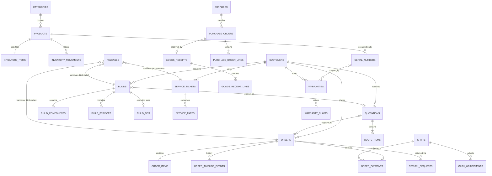

Relationship summary (for verification):

- `categories` 1:N `products` (nullable FK, `SET NULL`).
- `inventory_items` 1:1 `products`.
- `serial_numbers` N:1 `products`; N:1 `orders` (nullable); N:1 `builds` (nullable); N:1 `customers` (nullable); 1:1 `warranties` (nullable, both directions via `warranty_id`).
- `order_items` N:1 `orders`; serials derived via `serial_numbers.order_id` (no join table).
- `orders` N:1 `customers`; N:1 `builds`; N:1 `quotations`; N:1 `shifts`; N:1 `auth.users` (cashier).
- `order_payments` N:1 `orders`; N:1 `shifts`; N:1 `auth.users` (received_by).
- `quotations` N:1 `customers`; N:1 `builds`; 1:1 `orders` (converted).
- `builds` N:1 `customers`; `build_ops` 1:1 `builds`; `build_components`/`build_services` N:1 `builds`.
- `service_tickets` N:1 `customers`; `service_parts` N:1 `tickets`.
- `warranties` N:1 `orders`; N:1 `serial_numbers`; `warranty_claims` N:1 `warranties`.
- `purchase_orders` N:1 `suppliers`; `purchase_order_lines` N:1 `PO`; `goods_receipts` N:1 `PO`; `goods_receipt_lines` N:1 `receipts`.
- `return_requests` N:1 `orders`; N:1 `products`; N:1 `serial_numbers`.
- `shifts` N:1 `auth.users` (cashier); `cash_adjustments` N:1 `shifts`.
- `releases` has exactly one of `build_id`/`service_ticket_id`/`order_id` per `kind` (CHECK).

All FKs are real `uuid` foreign keys, never string joins. Display IDs are non-key human-readable labels (§9).

---

## 8. Enums and Status Machines

All statuses are `text` with CHECK constraints. Legal transitions are enforced inside RPCs; direct client UPDATE of a status is rejected by RLS (RPC-only writes on stateful tables).

### 8.1 Order status machine

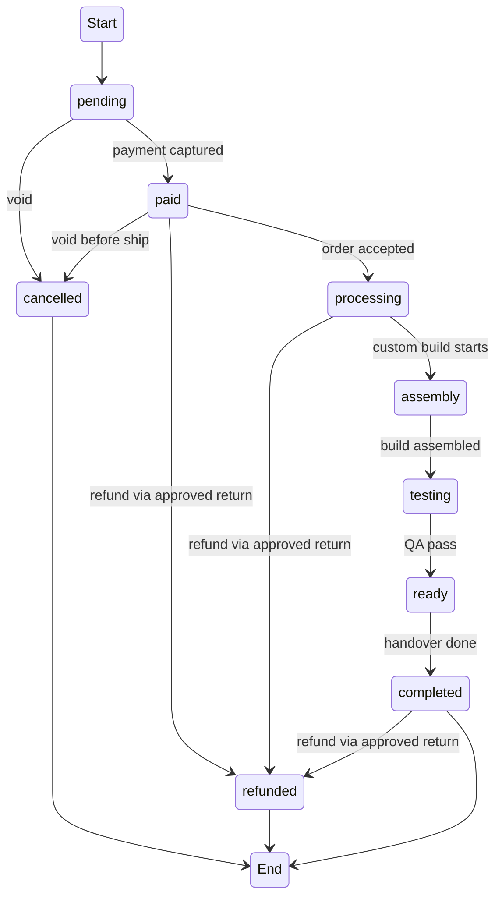

Legal transitions allowed in `update_order_status`: `pending→paid`, `paid→processing`, `processing→assembly|testing|ready`, `assembly→testing`, `testing→ready`, `ready→completed`, any pre-completed state → `cancelled`. `→refunded` only via `settle_return` (approved return), never a direct status flip.

### 8.2 Build status machine

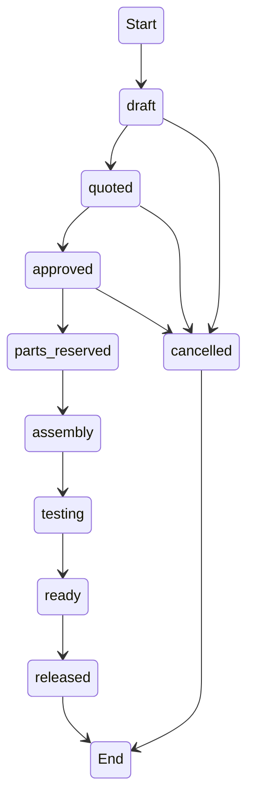

`build_ops.stage` is the execution-level detail (assembly → cable_management → bios → os_install → drivers → testing → qa). `builds.status` is the sales-level state. `advance_build_stage` advances both **in one transaction** (backend improvement: resolves dual-store sync).

### 8.3 Service ticket status machine

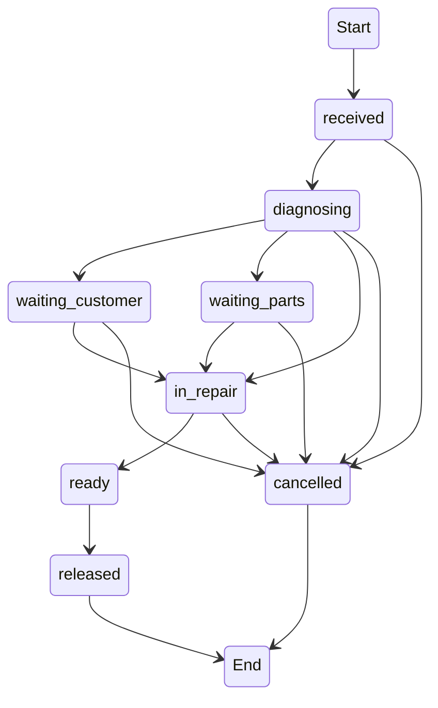

`cancelled` is always allowed until `released`. `ready → released` also happens via service billing (`bill_service_ticket`) or a release record.

### 8.4 Quote status machine

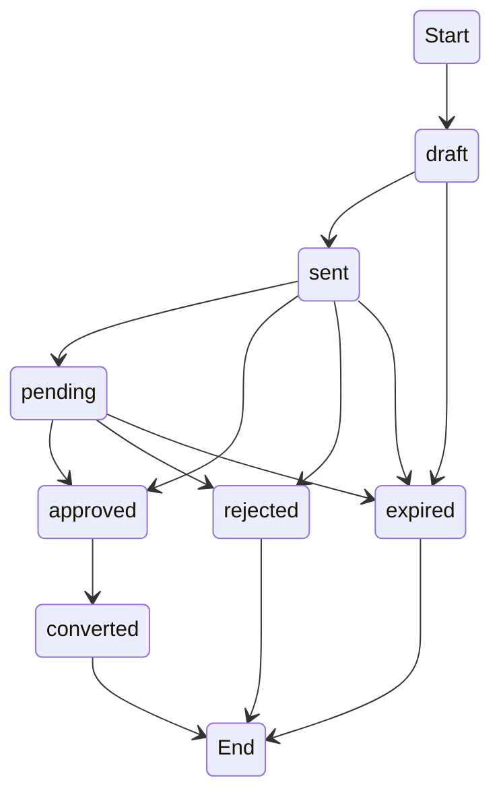

`draft/sent/pending → expired` is applied by the `update_warranty_statuses` job past `expires_at` (§23).

### 8.5 Warranty claim status machine

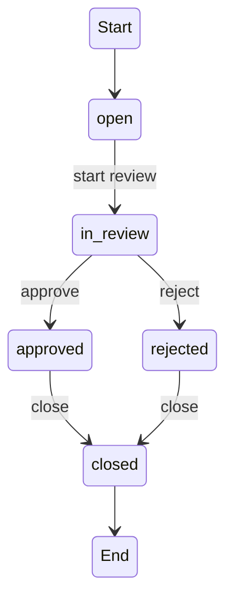

### 8.6 Warranty status machine

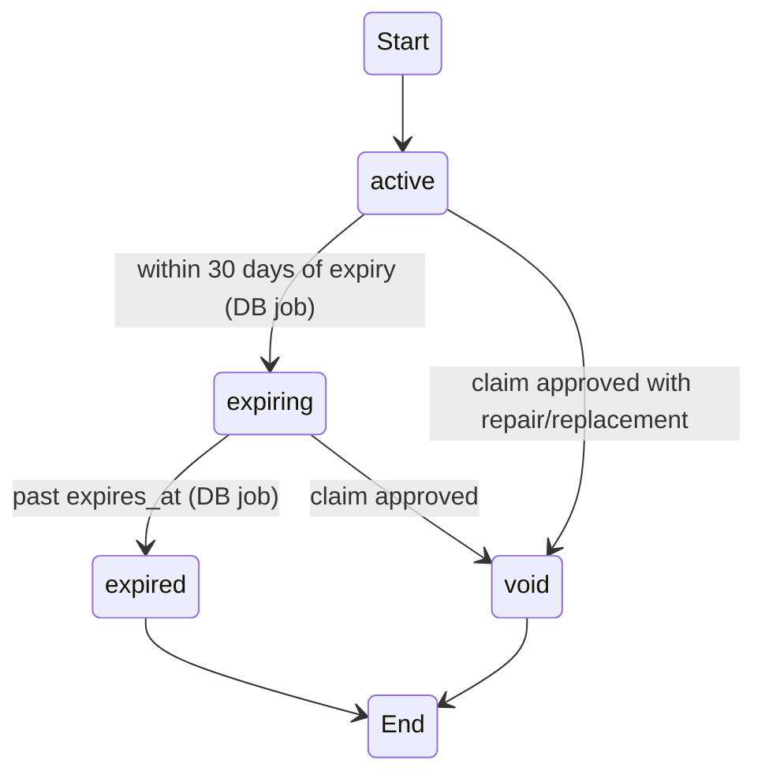

**MUST:** maintained by the DB scheduler, not render-time.

### 8.7 Serial status machine

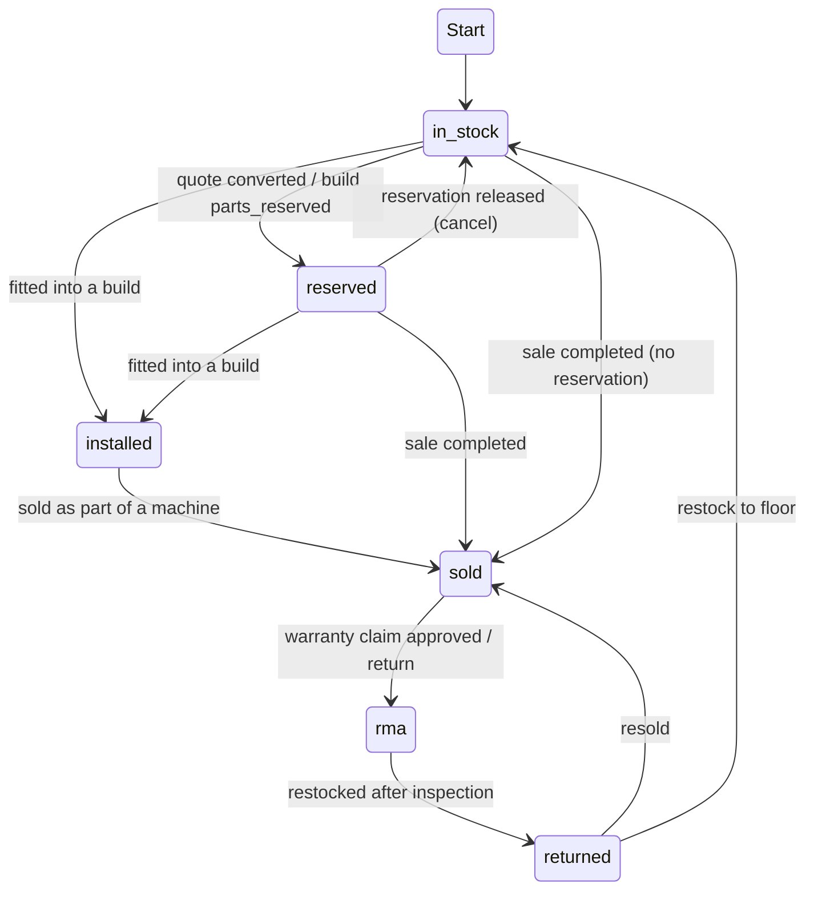

`installed` is an active frontend status (fitted into a build — emitted in seed data, rendered by `status-badge.tsx`, filterable on `/serials`; wiring is partial, see DOCUMENTATION.md §24.1). "Installed inside a machine" is additionally encoded via `build_components`. `returned` is a backend improvement: the frontend has no `returned` state today (returns restock via the return flow) — the backend adds it for serial RMA traceability.

### 8.8 Purchase order status machine

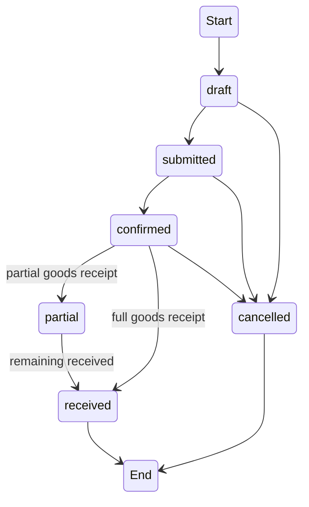

### 8.9 Goods receipt status machine

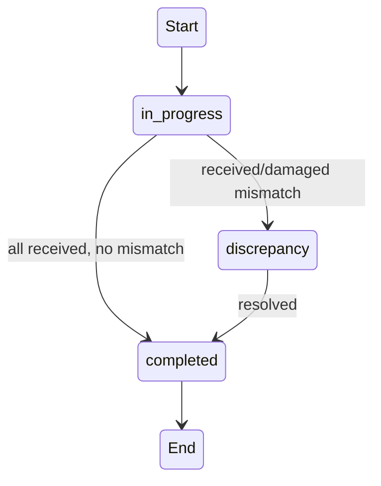

### 8.10 Return request status machine

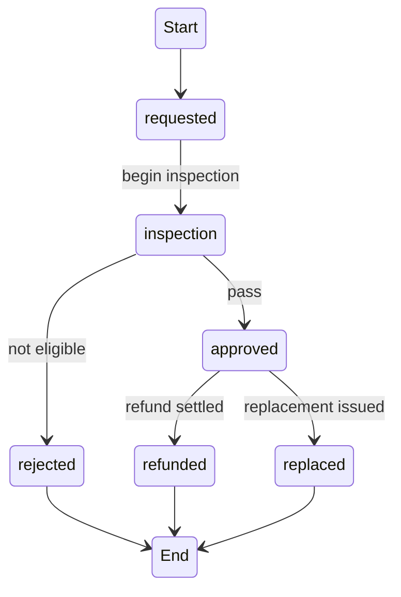

### 8.11 Shift status machine

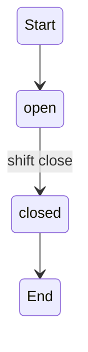

### 8.12 Release status machine

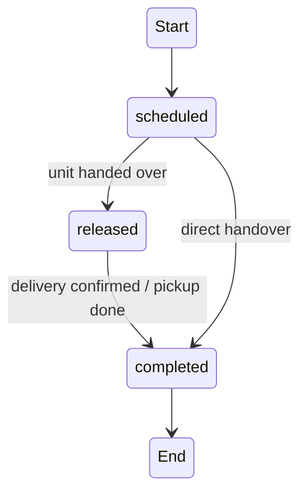

---

## 9. ID Strategy

Two-tier IDs:

- **Primary key** — `uuid` (internal), used by all relationships.
- **`display_id`** — human-readable `<PREFIX>-<YEAR>-<6-digit sequence>`, shown to users and on documents.

| Entity | Prefix | Example | Table |
|---|---|---|---|
| Order | `DPC` | DPC-2026-000123 | `orders` |
| Quotation | `QT` | QT-2026-000045 | `quotations` |
| Build | `BUILD` | BUILD-2026-000007 | `builds` |
| Service ticket | `SRV` | SRV-2026-000032 | `service_tickets` |
| Warranty record | `WR` | WR-2026-000009 | `warranties` |
| Warranty claim | `WC` | WC-2026-000021 | `warranty_claims` |
| Purchase order | `PO` | PO-2026-000081 | `purchase_orders` |
| Goods receipt | `GR` | GR-2026-000044 | `goods_receipts` |
| Return request | `RMA` | RMA-2026-000017 | `return_requests` |
| Shift | `SH` | SH-2026-000004 | `shifts` |
| Release | `REL` | REL-2026-000031 | `releases` |

These prefixes match those used by the current frontend (verified in `demo-data.ts` and `ops-data.ts`): `DPC-`, `QT-`, `BUILD-`, `SRV-`, `WR-`, `WC-`, `PO-`, `GR-`, `RMA-`, `SH-`, `REL-`. (The v1 `CONS-` prefix is dropped with the consultations module; `REF-` never existed in the frontend and is dropped with the `refunds` table.)

**Implementation:**

- `public.id_sequences (kind text PK, prefix text, last_value bigint)`.
- Internal helper `fn_next_display_id(kind, prefix)` increments `last_value` with a row lock inside the caller's transaction and returns `prefix-YEAR-#########` (6-digit padded).
- Customer-facing entities get their `display_id` from the RPC that creates them, inside the same transaction (never a client-supplied value).
- Physical serials keep the manufacturer serial (natural key `UNIQUE (product_id, serial)`); they are not renumbered.
- Never use UUID substrings for display — not readable and hard to verify by phone.

---

## 10. Inventory Architecture

### 10.1 Single source of truth

- `inventory_items` owns `on_hand`, `reserved`, `reorder_point`, `damaged`, `sold`.
- All writes go through RPCs that take `SELECT … FOR UPDATE` row locks before adjusting.
- `inventory_movements` is the append-only ledger; history is never edited.

### 10.2 Movement types (semantic normalization — backend improvement)

| type | qty sign | when | reference |
|---|---|---|---|
| `received` | + | completed goods receipt | `receipt_id` |
| `reserved` | − | quote→order conversion; build `parts_reserved` | `order_id` / `build_id` |
| `sold` | − | checkout, build release, service part consumed | `order_id` / `ticket_id` |
| `adjusted` | ± | manual adjustment | – |
| `damaged` | − | damaged units from receiving | `receipt_id` |
| `returned` | + | approved return restock; service part removed | `return_id` / `ticket_id` |

**MUST (backend improvement):** the frontend used `adjusted` for service parts and `received` for positive adjustments; the DB uses the semantically correct types so report aggregation is not confused. `received` is reserved for goods receipts; `returned` only for stock returns; `sold` for consumption or sales.

### 10.3 Available computation

- Query time: `on_hand − reserved`.
- Write time: CHECK `reserved <= on_hand` + RPC validation `qty_to_deduct <= on_hand − reserved` (anti-oversell). For serial-tracked items, availability = count of `serial_numbers` with `status = 'in_stock'`.

### 10.4 Low stock / reorder

- `inventory_items.reorder_point`; RPCs raise notification kind `stock` when `on_hand <= reorder_point` after a change.

### 10.5 Damaged handling (MUST fix — backend improvement)

The frontend `completeReceipt` posts only the good qty and loses damaged units. In `complete_receipt`:

- `received − damaged` → `on_hand` as movement type `received`.
- `damaged` → `damaged` counter as movement type `damaged`.
- Damaged units can be written off or re-added via `adjust_stock`.

---

## 11. Serial Number Architecture

### 11.1 Lifecycle

One row per serial-tracked unit. Status CHECK: `in_stock | reserved | installed | sold | rma | returned`.

### 11.2 Lineage (backend improvement — removed `serial_number_events`)

Every transition is validated in an RPC and recorded in `audit_logs` (`entity_type = 'serial_number'`, `details` carries `{from_status, to_status, order_id, note}`). The `/serials` page renders this from `audit_logs` joined to the serial. This preserves full traceability with one fewer table.

### 11.3 Warranty linkage (MUST)

`warranties.serial_number_id` is a real FK to `serial_numbers.id`; `serial_numbers.warranty_id` is the reverse link. No string join.

### 11.4 Warranty creation at sale

In `complete_sale`, for each serial-tracked item with `warranty_months > 0`:

- Create `warranties` (`purchased_at = now()`, `expires_at = now() + warranty_months`).
- Link `serial_numbers.warranty_id`.
- Raise notification when `status` becomes `expiring`.

### 11.5 Expiry (DB job)

Daily `update_warranty_statuses` job: `active → expiring` within 30 days; `active/expiring → expired` past `expires_at`; also `draft/sent/pending → expired` for quotations past `expires_at` (§23).

---

## 12. POS and Sales

### 12.1 Checkout flow (`complete_sale`) — backend improvement: atomic, idempotent, server-computed

Replaces `store.completeSale`. Single transaction:

1. Validate cart: every line has available stock (non-serial: `on_hand − reserved`; serial: the provided `in_stock` serials exist for that product).
2. Lock `inventory_items` rows in deterministic order (by `id`) to avoid deadlock.
3. Create `orders` (`paid`), `order_items` (with `serials` display snapshot), and `order_payments` (single payment) with **server-computed** totals from `company_profile.tax_rate`.
4. Non-serial items: post `sold` movements, decrement `on_hand`.
5. Serial items: set each `serial_numbers.status = 'sold'`, set `order_id`, link warranty, decrement `on_hand`.
6. Create warranties for items with `warranty_months > 0`.
7. Mark the order's/quote's/build's reserved stock as consumed (release the `reserved` counter; set serials `reserved → sold`).
8. Create `order_timeline_events` and `audit_logs`.
9. Link the payment to the cashier's open shift (`order_payments.shift_id`, `orders.shift_id`).
10. Idempotency: if `client_request_id` is provided and already exists on an `orders` row, return that order without re-applying (MUST, §30.3).

### 12.2 Cart on the frontend

`CartLine (productId, qty, serials)` remains transient client state, passed to the RPC as a JSONB array. Totals are computed server-side.

### 12.3 Order lifecycle

`update_order_status` validates legal transitions (§8.1), appends a timeline event, and posts audit. `cancel_order` releases reservations/stock for pre-paid orders and returns serials to `in_stock` (backend improvement: no reservation leaks).

### 12.4 Order types

- `retail` — direct checkout, no build.
- `custom_build` — has `build_id`; flow through `processing → assembly → testing → ready → completed`.
- `service` — has `service_total` from the ticket; checkout releases the ticket (§15.3).

---

## 13. Payments and Refunds

### 13.1 Payments

- One `order_payments` row per order (reduced scope; the POS is single-payment). Multi-payment architecture was removed (§35).
- `complete_sale` creates order + payment in one transaction.
- `add_payment` exists only for the open-order case (e.g., a build/service order created as `pending`, paid later): allowed while `orders.status = 'pending'` and no payment exists yet; after capture the order becomes `paid`.
- `received_by` is the acting cashier (`auth.uid()`); `shift_id` links to the shift for tenders/refunds.

### 13.2 Payment methods

- `cash | gcash | bank | card` (matches `PaymentMethod` in `src/lib/types.ts`).
- Cash: record `tendered` and server-computed `change`.
- GCash/bank/card: record `reference` (no real gateway — integration DEFERRED; method + reference recorded now).

### 13.3 Refunds (backend improvement — removed `refunds` table)

The frontend flipped `Order.status = "refunded"` with no refund entity and no stock/serial correction. In the reduced scope, refunds occur **only via approved returns** and are settled by `settle_return`:

1. Sets `return_requests.status = 'refunded'` (or `'replaced'`).
2. Records `refund_method` + `refund_amount` (validated ≤ paid amount for the returned qty).
3. Applies restock **once** (guard: `restocked_at` set; skip if already set) — non-serial `returned` movement; serial → `rma`/`returned` status.
4. Updates the order to `refunded` when fully returned.
5. Shift accounting: the refund is attributed to the shift via the linked payment/return for `close_shift`.

### 13.4 Service billing

`bill_service_ticket` produces an `orders` row of type `service` (labor + parts) that flows through POS payment; after payment the ticket is `released`.

### 13.5 Shift refunds (MUST fix — backend improvement)

`close_shift` derives `shifts.refunds` from linked approved `return_requests` (and cash adjustments), never from hand-typed totals.

---

## 14. Custom Builds

### 14.1 Build model

- `builds` = sales-level entity (customer, purpose incl. consultation intake, budget, components, services, status).
- `build_ops` = execution-level entity (stage, assembly steps, tests, QA, technician).
- **MUST (backend improvement):** the dual-store coupling (`Build.status` in main store vs `BuildOps.stage` in ops store, synced by pub/sub) is resolved — one transaction advances both.

### 14.2 Stage mapping

| `build_ops.stage` | `builds.status` |
|---|---|
| quote, approved | `approved` |
| parts_reserved | `parts_reserved` |
| assembly, cable_management, bios, os_install, drivers | `assembly` |
| testing, qa | `testing` |
| ready | `ready` |
| release, released | `released` |

### 14.3 Parts reservation (MUST fix — backend improvement)

Reservation is **atomic with the owning operation** (no `inventory_reservations` table, no leak):

- `convert_quote_to_order` / `advance_build_stage(parts_reserved)`: increments `inventory_items.reserved` (with lock + oversell check) and marks the required serials `reserved` (`serial_numbers.build_id` set).
- `cancel_order` / build cancel: releases the counter and returns serials to `in_stock`.
- Actual `on_hand` decrement happens only at checkout (`complete_sale`).

### 14.4 QA

`finalize_build_qa`: records assembly/test/QA arrays (in `build_ops`), sets `qa_result`/`qa_signed_at`, and on pass advances to `ready` (notification); on fail stays with critical notification. QA sign-off recorded server-side.

### 14.5 Build order conversion

`convert_quote_to_order` (or direct sale) sets `orders.build_id`; order items derive from `build_components` + `build_services`; the order starts at `processing`.

---

## 15. Services

### 15.1 Ticket lifecycle

`service_tickets` follows §8.3. Every transition is validated in `update_service_ticket` and recorded in `audit_logs` (removed `service_timeline_events`).

### 15.2 Parts consumption (MUST fix concurrency — backend improvement)

- `add_service_part` deducts stock with a row lock and posts a `sold` movement referencing the ticket; upserts into `service_parts` (UNIQUE per ticket+product).
- `remove_service_part` returns stock (`returned` movement) — preserves the frontend behavior "removed part returns to stock".

### 15.3 Diagnosis and billing

- `update_service_ticket` updates diagnosis, labor, estimated/actual cost (audit diff).
- `bill_service_ticket` builds the `service` order (labor + parts) and releases the ticket after payment.

### 15.4 Workshop assignment

`technician_id` is an FK to `auth.users(id)` (MUST) — it references the acting auth user's identity, not a role. Assignment posts a notification to the assigned user.

---

## 16. Warranty and Returns

### 16.1 Warranty creation

Created in `complete_sale` for serial-tracked items with `warranty_months > 0`; `expires_at = purchased_at + warranty_months`; `serial_number_id` FK (MUST).

### 16.2 Claim flow

- `create_warranty_claim` — creates a claim (`open`) + audit.
- `update_claim` — `open → in_review → approved|rejected → closed` with transition validation; records `resolution` + `resolution_note`.
  - Approved with `repair`/`replacement`: voids the warranty, sets serial → `rma`; replacement creates a return request or registers a replacement serial.
  - Approved with `refund`/`store_credit`: flows through `settle_return` on a return request.

### 16.3 Warranty status maintenance

`update_warranty_statuses` job (§23). `void` is the only manual transition (via claim approval).

### 16.4 RMA ↔ returns integration

`return_requests` with condition `defective` and resolution `replacement`/`refund` connect to claims via `serial_number_id`; serial status `rma` indicates the unit is out of stock and in the warranty process.

---

## 17. Purchasing and Receiving

### 17.1 Purchase orders

`create_po` creates PO + lines + `display_id`; `update_po_status` validates §8.8 transitions. `expected_at` drives dashboard "overdue".

### 17.2 Receiving (`complete_receipt`) — MUST fix damaged loss (backend improvement)

1. Creates `goods_receipts` (`completed` or `discrepancy`) + `goods_receipt_lines`.
2. Per line: `received − damaged` → `on_hand` (`received` movement); `damaged` → `damaged` counter (`damaged` movement).
3. Registers listed serials for serial-tracked products (`in_stock`) in the same transaction.
4. Updates `purchase_order_lines.received`; PO → `received` when complete, `partial` otherwise; receipt → `completed`/`discrepancy`.
5. Posts audit.

### 17.3 Supplier linkage

`products.supplier_name` (display) is matched to `suppliers` during seed import; POs use real `supplier_id`.

### 17.4 Backorder behavior

Short receipts keep the PO `partial`; the remaining qty remains on the line (`received < qty`). No split-shipment engine (DEFERRED).

---

## 18. Shifts and Cash Drawer

### 18.1 Shift opening

`open_shift` creates a shift with `opening_cash`. Partial unique index enforces one open shift per cashier (§5.7).

### 18.2 Shift close (`close_shift`) — MUST fix hand-typed refunds (backend improvement)

- Derives `shifts.tenders` from `order_payments` linked to the shift.
- Derives `shifts.refunds` from linked approved `return_requests`.
- `expected cash = opening_cash + cash sales + cash_in − cash_out − cash refunds`.
- Records `counted_cash`, computes variance. `tenders` is stored as JSONB on the shift (no `shift_tenders` table).

### 18.3 Cash adjustments

`record_cash_adjustment` — `cash_in`/`cash_out` with reason, linked to the shift, owner/admin/cashier (own shift).

---

## 19. Release and Handover

- `schedule_release` creates a `releases` row (`scheduled`) for a build/service/order (exactly one target per `kind`, CHECK-enforced).
- `mark_release` transitions `scheduled → released → completed` and syncs the parent: build → `released`, linked order → `completed` (when handed over). Direct handover may go `scheduled → completed`.
- Receipt/handover details (method, released_by, received_by, timestamps) recorded.

---

## 20. Auth, Roles and Security

### 20.1 Authentication

- Supabase Auth (email/password); session via the Supabase client.
- No own `users` table — use native `auth.users`. The demo plaintext login (`src/routes/index.tsx`) and the role-switcher (`app-sidebar.tsx`) are removed in production.

### 20.2 Roles

- Four roles in `auth.users.raw_app_meta_data.role`: `owner | admin | cashier | inventory`.
- Set **server-side at user creation** via `create_user` (Auth Admin API). Never client-controlled.
- The `technician` role is **removed** (decided during scope reduction). Workshop work (builds, assembly, QA, services, warranty) is performed by **owner/admin**; `technician_id`/`qa_staff_id` columns remain as FKs to `auth.users(id)` and record the acting user's identity, not a role.

### 20.3 Why no RBAC tables (DEFERRED)

There is no dynamic permission management; the capability matrix is stable (22 capabilities, DOCUMENTATION.md §54.5) and enforced by RLS + RPCs. RBAC tables return only if dynamic role editing becomes a real requirement.

### 20.4 Actor identity (MUST)

All actors are `actor_id uuid references auth.users(id)` derived from `auth.uid()` — no client-supplied actor/name strings. Display names resolve from `auth.users`.

### 20.5 Enforcement

- **Layer 1 (RLS):** row-level policies on reads and any permitted direct writes (§21).
- **Layer 2 (RPCs):** `SECURITY DEFINER` functions re-validate `auth.jwt() ->> 'role'` for every critical mutation, enforce state transitions, recompute totals, lock rows, and write audit.
- Never rely on frontend permission flags (`src/lib/permissions.ts`) for security — they are UI hints only.

---

## 21. RLS Matrix

Every table has RLS enabled. No `service_role` shortcut in the client. Policies use `auth.jwt() ->> 'role'` and `auth.uid()` (own rows). Summary (full per-table policies are generated from this matrix):

| Table group | owner | admin | cashier | inventory |
|---|---|---|---|---|
| `categories`, `products` | all | all | read | read + create + update |
| `inventory_items`, `serial_numbers` | read (writes RPC-only) | read (writes RPC-only) | read | read (writes RPC-only) |
| `inventory_movements`, `order_timeline_events` | read (append-only) | read (append-only) | read | read |
| `customers` | all | all | read + create + update | read |
| `orders`, `order_items`, `order_payments` | read (writes RPC-only) | read (writes RPC-only) | read (writes RPC-only) | read |
| `quotations`, `quote_items` | all | all | create + read + update | read |
| `builds`, `build_components`, `build_services`, `build_ops` | all (workshop) | all (workshop) | read | read |
| `service_tickets`, `service_parts` | all (workshop) | all (workshop) | read | read |
| `warranties`, `warranty_claims` | all (workshop) | all (workshop) | read | read |
| `return_requests` | all | all | read + create (intake) | read + update (inspection) |
| `suppliers`, `purchase_orders`, `purchase_order_lines` | read + create + update | read + create + update | read | read + create + update |
| `goods_receipts`, `goods_receipt_lines` | read + create + update | read + create + update | read | read + create + update |
| `shifts` | read + close-any | read + close-any | create + read + close-own | read |
| `cash_adjustments` | read + create | read + create | create (own shift) | read |
| `releases` | all | all | read + create (schedule) | read |
| `company_profile` | read + update | read | read | read |
| `notifications` | own rows only | own rows only | own rows only | own rows only |
| `audit_logs` | SELECT only | none | none | none |
| `id_sequences` | no direct access | no direct access | no direct access | no direct access |

**Enforcement notes:**

- Cashier cannot edit products/catalog; inventory cannot checkout or close shifts; cashier/inventory cannot read `audit_logs` or product `cost` (column-level grant to owner/admin only; the demo products pages currently display cost to all roles — the backend applies the owner/admin restriction).
- Workshop writes (builds, build_ops, service tickets, warranty claims) are owner/admin-only; the assigned user is recorded via `technician_id`/`qa_staff_id` FKs but gains no RLS role.
- All policies are `USING` + `WITH CHECK`; append-only tables have INSERT-only policies.
- Money/stock/serial tables have **no client UPDATE/DELETE** — mutations are RPC-only.
- The `service_role` key is never in the client bundle.

---

## 22. RPC Architecture

**31 client RPCs** + 1 internal helper (`fn_next_display_id`) + 1 scheduled job (`update_warranty_statuses`). Every client RPC:

- Is `SECURITY DEFINER` with `SET search_path = public`.
- Validates the caller role from `auth.jwt() ->> 'role'`.
- Enforces legal state transitions.
- Posts an `audit_logs` entry (actor from `auth.uid()`).
- Runs in a single transaction (rollback on any failure).
- Returns JSON including the new `display_id`/`id` for redirect.
- Is idempotent where relevant (via `client_request_id` or guard columns such as `restocked_at`).

### 22.1 POS and sales

| RPC | Purpose | Caller | Tables | Validation / security / failure / idempotency |
|---|---|---|---|---|
| `complete_sale` | Full atomic checkout (§12.1) | cashier, owner, admin | orders, order_items, order_payments, inventory_items, inventory_movements, serial_numbers, warranties, order_timeline_events, notifications, audit_logs | Validates cart stock; locks inventory in deterministic order; server totals; **idempotent via `client_request_id`**; rolls back on any failure |
| `add_payment` | Attach payment to an open `pending` order | cashier, owner, admin | order_payments, orders, shifts, audit_logs | Only while `status = 'pending'` and no payment exists; requires open shift for cash; sets order `paid` |
| `update_order_status` | Legal order transition + timeline + audit | owner, admin, cashier | orders, order_timeline_events, audit_logs | Validates §8.1 transitions; `→refunded` rejected here |
| `cancel_order` | Void order; release reservations/stock; restore serials | owner, admin | orders, inventory_items, inventory_movements, serial_numbers, order_timeline_events, audit_logs | Only pre-completed orders; releases reserved counters; idempotent (cancelled stays cancelled) |

### 22.2 Inventory and serials

| RPC | Purpose | Caller | Tables | Notes |
|---|---|---|---|---|
| `adjust_stock` | Manual adjustment with note | owner, admin, inventory | inventory_items, inventory_movements, audit_logs, notifications | Row lock; clamps ≥ 0; note required; movement type `adjusted` |
| `register_serials` | Register new serials for a product | owner, admin, inventory | serial_numbers, audit_logs | Dedupes `UNIQUE(product_id, serial)`; status `in_stock` |

### 22.3 Quotes

| RPC | Purpose | Caller | Tables | Notes |
|---|---|---|---|---|
| `create_quote` | Create quote + items + display_id | cashier, owner, admin | quotations, quote_items, audit_logs | Rejects empty line sets; totals server-computed |
| `set_quote_status` | Legal transition (§8.4) | cashier, owner, admin | quotations, audit_logs | `draft/sent/pending ↔ approved/rejected` |
| `convert_quote_to_order` | Create order from quote; mark converted; **reserve stock + serials atomically** | cashier, owner, admin | quotations, orders, order_items, inventory_items, inventory_movements, serial_numbers, builds, audit_logs | MUST fix reservation leak; cannot convert twice (status guard); on cancel, release |

### 22.4 Builds

| RPC | Purpose | Caller | Tables | Notes |
|---|---|---|---|---|
| `save_build` | Create/update build + components + services + build_ops | owner, admin | builds, build_components, build_services, build_ops, audit_logs | Compatibility flags returned to UI (errors can be overridden with confirmation) |
| `advance_build_stage` | Advance stage; sync `build_ops.stage` + `builds.status`; reserve parts at `parts_reserved` | owner, admin | build_ops, builds, inventory_items, inventory_movements, serial_numbers, audit_logs, notifications | One transaction (§14.2); reservation atomic |
| `finalize_build_qa` | Save tests/QA; set `qa_result`/`qa_signed_at`; pass → `ready` | owner, admin | build_ops, builds, notifications, audit_logs | Requires all hardware/testing checks answered |

### 22.5 Services

| RPC | Purpose | Caller | Tables | Notes |
|---|---|---|---|---|
| `create_service_ticket` | Create ticket + display_id | owner, admin | service_tickets, audit_logs | Service intake is owner/admin-only (matches demo capability matrix) |
| `update_service_ticket` | Update fields (diagnosis, labor, costs) + legal status transition (§8.3) | owner, admin | service_tickets, audit_logs | Merges v1 `update_ticket_status` + `update_ticket` into one entry point |
| `add_service_part` | Deduct stock (lock); upsert part; `sold` movement | owner, admin | service_parts, inventory_items, inventory_movements, audit_logs | Concurrency-safe |
| `remove_service_part` | Return stock; `returned` movement; delete part | owner, admin | service_parts, inventory_items, inventory_movements, audit_logs | Preserves frontend behavior |
| `bill_service_ticket` | Create `service` order (labor + parts); after payment release ticket | cashier, owner, admin | orders, order_items, order_payments, service_tickets, audit_logs | Reuses checkout payment flow |

### 22.6 Warranty and returns

| RPC | Purpose | Caller | Tables | Notes |
|---|---|---|---|---|
| `create_warranty_claim` | Create claim + display_id | owner, admin | warranty_claims, audit_logs | |
| `update_claim` | Status transition (§8.5) + resolution; void warranty / serial `rma` on repair/replacement | owner, admin | warranty_claims, warranties, serial_numbers, audit_logs, notifications | Merges v1 `update_claim_status` + `decide_claim` |
| `create_return` | Create return request (intake) | cashier, owner, admin, inventory | return_requests, audit_logs | Serial resolved to `serial_number_id` |
| `settle_return` | Approve/reject; record refund/replacement; **one-time restock**; update serial + order + shift accounting | owner, admin | return_requests, inventory_items, inventory_movements, serial_numbers, orders, audit_logs, notifications | Guard `restocked_at`; refund ≤ paid |

### 22.7 Purchasing and receiving

| RPC | Purpose | Caller | Tables | Notes |
|---|---|---|---|---|
| `create_po` | Create PO + lines + display_id | inventory, owner, admin | purchase_orders, purchase_order_lines, audit_logs | Total server-computed |
| `update_po_status` | Legal transition (§8.8) | inventory, owner, admin | purchase_orders, audit_logs | |
| `complete_receipt` | Full receiving (§17.2): stock + damaged + serials + PO/receipt status | inventory, owner, admin | goods_receipts, goods_receipt_lines, purchase_orders, purchase_order_lines, inventory_items, inventory_movements, serial_numbers, audit_logs | MUST fix damaged loss; idempotent per receipt |

### 22.8 Shifts

| RPC | Purpose | Caller | Tables | Notes |
|---|---|---|---|---|
| `open_shift` | Open shift with opening cash | cashier, owner, admin | shifts, audit_logs | One open shift per cashier (partial unique index) |
| `close_shift` | Derive tenders + refunds; record counted cash; compute variance | cashier (own), owner, admin | shifts, order_payments, return_requests, audit_logs | MUST fix hand-typed refunds |
| `record_cash_adjustment` | `cash_in`/`cash_out` on open shift | cashier (own), owner, admin | cash_adjustments, shifts, audit_logs | |

### 22.9 Releases

| RPC | Purpose | Caller | Tables | Notes |
|---|---|---|---|---|
| `schedule_release` | Create release record | cashier, owner, admin | releases, notifications, audit_logs | Validates kind/target match |
| `mark_release` | `released`/`completed`; sync parent status | cashier, owner, admin | releases, builds, service_tickets, orders, audit_logs | Direct handover supported |

### 22.10 System

| RPC | Purpose | Caller | Tables | Notes |
|---|---|---|---|---|
| `create_user` | Create staff auth account with role in `app_metadata` | owner, admin | auth.users (Auth Admin API), notifications | Never client-set role claims |
| `upsert_company_profile` | Update singleton profile (tax rate, receipt footer, etc.) | owner | company_profile, audit_logs | `updated_by` recorded |

### 22.11 Rules

- No generic table RPCs — every RPC is domain-specific for correct authorization and invariants.
- SECURITY DEFINER functions must `SET search_path = public` and check role first.
- All inputs validated (types, ranges, enum values) before any write.

---

## 23. Triggers and Scheduled Jobs

### 23.1 Triggers

| Trigger | Table(s) | Behavior |
|---|---|---|
| `trg_set_updated_at` | all mutable tables | Maintains `updated_at` |
| `trg_inventory_init` | `products` | After INSERT, creates the `inventory_items` row (MUST) |
| `trg_audit_master` | `categories`, `products`, `customers`, `suppliers`, `company_profile` | Writes `audit_logs` on INSERT/UPDATE (before/after snapshot); DELETE blocked by RLS |
| `trg_append_only_guard` | `audit_logs`, `inventory_movements`, `order_timeline_events` | Blocks UPDATE/DELETE (defense in depth beyond RLS) |
| `trg_company_singleton` | `company_profile` | Rejects a second row (MUST) |
| `trg_release_target` | `releases` | Validates `kind` matches exactly one target FK (MUST) |

### 23.2 Scheduled job (`pg_cron`)

`update_warranty_statuses` (daily):

- `warranties`: `active → expiring` within 30 days of `expires_at`; `active/expiring → expired` past `expires_at`.
- `quotations`: `draft/sent/pending → expired` past `expires_at`.
- Raises notifications on status change.

**MUST:** warranty status is maintained by this DB job, not render-time only.

---

## 24. Audit Logging

### 24.1 What is audited

- Every state-changing RPC (order, build, service, claim, return, PO, receipt, shift).
- Every stock movement (snapshot `on_hand_before`/`on_hand_after` on the movement row; `details` on audit).
- Every serial transition (replaces `serial_number_events`, §11.2).
- Admin actions: user creation, profile edits, catalog edits.

### 24.2 Schema and immutability

- `audit_logs (id identity, actor_id, role, action, entity_type, entity_id, details jsonb, at)`.
- `actor_id` from `auth.uid()`; `role` snapshotted.
- INSERT-only. No UPDATE/DELETE policies; trigger guards.

### 24.3 Audit UI

`/audit` (owner-only) selects `audit_logs` joined to `auth.users` for display names; filtering is server-side.

---

## 25. Notifications

### 25.1 Triggers

| When | kind | Recipients |
|---|---|---|
| Stock at or below reorder point | `stock` | owner, admin, inventory |
| Quote approved / converted | `quote` | owner, admin |
| Build ready / QA failed / stage change | `build` | owner, admin (workshop) |
| Warranty expiring / claim decision | `warranty` | owner, admin |
| Service ready / ticket assigned | `service` | owner, admin (workshop) |
| Payment / refund of interest | `payment` | owner, admin |

### 25.2 Schema and behavior

- Per-recipient rows; own-rows RLS; read/ack via direct RLS update (no RPC).
- Realtime channel on `notifications` gives instant bell updates across terminals.

---

## 26. Company Settings

### 26.1 Persistence (MUST fix — backend improvement)

The `/settings` profile is component-local and resets on reload; `VAT_RATE = 0.12` is hardcoded in `src/lib/format.ts:17`. Target: `company_profile` singleton persists name, address, phone, email, TIN, currency, `tax_rate` (replaces the constant), receipt footer, logo.

### 26.2 RPC and caching

- `upsert_company_profile` updates (owner).
- Frontend loads the profile at app boot into React context; tax computation uses `company_profile.tax_rate`.

---

## 27. Reporting

### 27.1 Phase 1 decision (SHOULD): client-side

Reports compute aggregates client-side from raw DB reads (orders, order_payments, inventory_movements, tickets), preserving the current UI/logic. No aggregation tables in this scope.

### 27.2 Later (DEFERRED until volume demands)

Materialized views (`mv_daily_sales`, `mv_revenue_by_category`, `mv_stock_movement_summary`) refreshed by a DB job.

### 27.3 Report inventory (from the frontend)

| Report | Data source |
|---|---|
| Sales summary | orders (types retail/custom_build/service) |
| Revenue by payment method | order_payments + shifts.tenders |
| Inventory valuation | products.cost × inventory_items.on_hand (costs gate) |
| Stock movement | inventory_movements |
| Service revenue | service_tickets (actual_cost, parts) |
| Warranty status | warranties |
| Shift report | shifts + cash_adjustments + order_payments |
| Purchasing | purchase_orders + goods_receipts |

---

## 28. Index Strategy

| Table | Index | Purpose |
|---|---|---|
| products | `lower(sku)` UNIQUE, `category_id`, `archived` | search, filter |
| inventory_items | `product_id` UNIQUE | 1:1 lookup |
| serial_numbers | `(product_id, status)`, UNIQUE `(product_id, serial)`, `order_id` | serial page, availability |
| inventory_movements | `(product_id, at DESC)`, `order_id`, `receipt_id` | detail page |
| customers | `name`, `email`, `phone` | search |
| orders | `customer_id`, `status`, `created_at DESC`, `cashier_id`, `shift_id`, UNIQUE `client_request_id` | list, dashboard, shift, idempotency |
| order_items | `order_id` | detail |
| order_payments | `order_id`, `shift_id` | detail, shift tenders |
| order_timeline_events | `(order_id, at)` | timeline |
| quotations | `customer_id`, `status` | list |
| builds | `customer_id`, `status`, `technician_id` | list |
| build_ops | `stage` | assembly queue |
| service_tickets | `customer_id`, `status` | list, queue |
| warranties | `customer_id`, `serial_number_id`, `status` | registry |
| warranty_claims | `warranty_id` | detail |
| purchase_orders | `supplier_id`, `status` | list |
| purchase_order_lines | `po_id` | detail |
| goods_receipts | `po_id`, `received_at` | list |
| goods_receipt_lines | `receipt_id` | detail |
| return_requests | `order_id`, `status` | list |
| shifts | `cashier_id`, `opened_at`, partial `(cashier_id) WHERE status='open'` | list, open-shift guard |
| cash_adjustments | `shift_id` | detail |
| releases | `status`, `build_id`, `service_ticket_id`, `order_id` | list, handover |
| notifications | `(recipient_id, read)`, `at DESC` | bell |
| audit_logs | `(entity_type, entity_id)`, `at DESC`, `actor_id` | audit page |
| id_sequences | `kind` PK | sequence |

**B-tree vs GIN:** most are B-tree (range, equality, sort). Array columns (`suppliers.categories`) use GIN only when `@>` queries appear (SHOULD, deferred otherwise).

---

## 29. Constraints and Data Integrity

### 29.1 NOT NULL and CHECK

- All money/quantity columns have CHECK (`>= 0` or `> 0`).
- All status columns CHECK to their enum values (§8).
- `products.sku` unique case-insensitive via `lower(sku)` unique index.
- `serial_numbers` `UNIQUE (product_id, serial)`.
- `order_payments.amount > 0`, `refund_amount >= 0`.

### 29.2 Cross-table invariants

| Invariant | Enforcement |
|---|---|
| `reserved <= on_hand` in inventory_items | CHECK |
| `on_hand` never negative | CHECK + RPC row lock |
| `qty_to_deduct <= on_hand − reserved` | RPC validation |
| One open shift per cashier | Partial unique index `shifts(cashier_id) WHERE status = 'open'` |
| Display ID uniqueness | UNIQUE per table |
| Singleton `company_profile` | CHECK fixed id |
| `releases.kind` matches exactly one target FK | CHECK (§5.9) |
| No duplicate serial per product | UNIQUE (product_id, serial) |
| Refund amount ≤ paid amount for returned qty | RPC validation in `settle_return` |
| Restock applied once | `restocked_at` guard + RPC check |
| No reservation leaks | reservation created/released inside owning RPCs (§14.3) |

### 29.3 Foreign key behaviors

- Product delete: `SET NULL` on history FKs (`order_items.product_id`, etc.); `CASCADE` only on child rows meaningless without the parent (e.g., `order_items` if an order were deleted — orders are never deleted in practice).
- Business records (`orders`, `quotations`, `builds`, `service_tickets`, `purchase_orders`, …) have **no DELETE policy** after creation — archiving/status is the retention mechanism.
- Draft records (draft quote, draft PO, draft build) may be deleted by the owner.

### 29.4 Soft vs hard delete

- Business entities: no DELETE policy except drafts.
- `categories`/`products`: archive flag; re-activation allowed.

---

## 30. Transaction Safety and Concurrency

### 30.1 Concurrency model

All writes are in a single transaction. Before adjusting `inventory_items`, issue `SELECT … FOR UPDATE` on all affected rows in deterministic order (sorted by `id`) to avoid deadlock. Display-ID increments happen inside the same transaction.

### 30.2 Oversell prevention

Two layers: CHECK constraints (`reserved <= on_hand`, `on_hand >= 0`) + RPC validation with row locks. No write can take `on_hand` below `reserved`, and no sale breaks available stock.

### 30.3 Idempotency (backend improvement — MUST)

- `complete_sale` accepts `client_request_id` (UUID generated by the client per checkout); `orders.client_request_id` UNIQUE — a replayed request returns the existing order instead of double-charging.
- `settle_return` guard `restocked_at` — a return cannot be restocked twice.
- `cancel_order` / status changes are idempotent (re-validating current state).

### 30.4 Multi-terminal operation

Supabase Realtime syncs UI; RLS + RPC enforce invariants even when two terminals write concurrently. Shift tenders and reservation changes are locked within close/advance transactions.

---

## 31. Frontend Migration Plan

### 31.1 Layer of change

1. Introduce `src/lib/api.ts` — typed async functions (getProducts, completeSale, …) calling Supabase RPC/tables.
2. Keep `src/lib/store.tsx` and `src/lib/ops-store.tsx` as facades with unchanged action signatures, backed by `api.ts` instead of localStorage.
3. Routes/components initially unchanged — data shape is preserved.
4. Slow reads migrate to TanStack Query for caching and sync.

### 31.2 Sequence (each verifiable against existing pages) — migration phase 8 (§34.1)

1. Auth (login page) — first.
2. Products, categories, customers (master data).
3. Inventory and serials.
4. POS checkout (`complete_sale`).
5. Quotations and conversion (fix reservation leak).
6. Purchasing, receiving, suppliers.
7. Service tickets.
8. Warranty and claims.
9. Builds and build_ops (resolve dual store).
10. Shifts and cash drawer.
11. Returns.
12. Releases, notifications.
13. Reports and audit.

### 31.3 Dual-store de-coupling (MUST)

`build-sync.ts`, `build-state.ts`, `release-complete.ts` are replaced by one build domain service calling `advance_build_stage`. `builds.status` and `build_ops.stage` are read from one join and updated in one transaction.

### 31.4 Constant removal (MUST)

- Replace `VAT_RATE = 0.12` (`src/lib/format.ts`) with `company_profile.tax_rate`.
- Remove the demo role-switcher and plaintext login.

### 31.5 Deferred modules

Consultations, tasks, and staff modules are **removed** from routes, state, nav, and seed in production (DOCUMENTATION.md §54.2). Their demo screens may remain in the demo build only if kept as a separate dev bundle; the production app does not include them.

### 31.6 Demo preservation

Keep the localStorage demo stores as a development-mode fallback when no Supabase project exists; `api.ts` selects the adapter (local vs supabase) by env flag.

---

## 32. Data Migration and Seed Strategy

### 32.1 Seed source

`src/lib/demo-data.ts` and `src/lib/ops-data.ts` are the seed source. Verified counts: 17 categories, 30 products, 6 customers, 9 orders, 6 quotes, 6 builds, 5 services, 6 warranties, 2 claims (plus ops: 5 suppliers, 6 POs, 2 receipts, 3 returns, 3 shifts, 3 releases). The migration script (Phase 8):

1. Creates `categories` and `products` (with `inventory_items` via trigger or explicit rows).
2. Creates `serial_numbers` from serial arrays.
3. Creates `customers` (incl. the walk-in row).
4. Creates `suppliers`.
5. Creates auth users + roles (Phase 0) and links `created_by`/`cashier`/`technician` FKs.
6. Creates `orders`, `order_items`, `order_payments`, `order_timeline_events` (with display IDs).
7. Creates `quotations`, `builds`, `build_components`, `build_services`, `build_ops`, `service_tickets`, `service_parts`, `warranties`, `warranty_claims`.
8. Creates `purchase_orders`, `goods_receipts`, `shifts`, `cash_adjustments`, `return_requests`, `releases`.
9. Creates the `company_profile` singleton.

The migration is idempotent: truncate + re-seed in development; delta import in production.

### 32.2 ID mapping

Demo string IDs (e.g., `prod_cpu_ryzen9`, `cus_001`) map to new UUIDs via a mapping table so relationships survive import.

### 32.3 No fake IDs (MUST)

- `customerId = "walk-in"` becomes a real customer row with `is_walk_in = true`.
- Every serial string in warranties/returns resolves to a real `serial_number_id`.
- All actor/technician/cashier strings become `auth.users` FKs.

### 32.4 Passwords and auth seed

No plaintext passwords. Phase 0 creates staff invites (Supabase Auth invite links); seed staff/auth rows link `user_id` after invites are accepted.

### 32.5 Environment

- Supabase CLI migrations for schema (versioned, idempotent).
- Separate seeds: development (`supabase/seed.sql`) vs production (small manual dataset).

---

## 33. Security Threat Model and Backup Recovery

### 33.1 Threat model

| Threat | Mitigation |
|---|---|
| Plaintext credentials in client code | Supabase Auth; remove demo login |
| Client-side role bypass | RLS + SECURITY DEFINER RPC role checks; never trust client claims |
| Oversell / negative stock | Row locks + CHECK constraints |
| Double-charge on network retry | `client_request_id` idempotency |
| Refund abuse | `settle_return` with amount validation + audit; owner/admin only |
| Fake actor strings | All actors are `actor_id` from `auth.uid()` |
| Tampered timestamps | All `at`/`created_at` DB-side defaults `now()` |
| RLS misconfiguration | RLS on every table; policy test suite (Supabase local) |
| SQL injection | Parameterized queries in all RPCs and client calls; no string concatenation |
| Data tampering by current/former employee | Append-only audit; no DELETE policies on business records |
| Serial/warranty string spoofing | Real FKs (`serial_number_id`), UNIQUE constraints |

### 33.2 Secrets and keys

- Supabase anon key is public (safe with RLS).
- `service_role` key never in the frontend bundle — backend/edge functions only.
- No secrets in git (`.env.local`, gitignored).

### 33.3 Backup and recovery

- Supabase automatic backups (daily), verified restore procedure.
- PITR for production.
- Scheduled `pg_dump` exports off-site.
- Recovery drill on staging before go-live.
- `id_sequences` included in backups (display-ID sequences must not reset).

### 33.4 Monitoring

- Supabase Logs for failed RPCs and RLS denials.
- Alerts on failed logins and 4xx spikes.

---

## 34. Implementation Order, Traceability, Checklist and Consistency Audit

### 34.1 Implementation order (migration phases 0–10)

| Phase | Work | Key deliverables |
|---|---|---|
| 0 | Setup + auth | Supabase project, migrations scaffolding, `company_profile`, `categories`, `products`, auth + roles, `id_sequences`, `create_user` |
| 1 | Core schema | `inventory_items`, `inventory_movements`, `serial_numbers`, triggers (inventory init, audit, updated_at) |
| 2 | Catalog + inventory APIs | product/category RLS CRUD, `adjust_stock`, `register_serials`, low-stock notifications |
| 3 | Customers + POS | `customers`, `orders`, `order_items`, `order_payments`, `order_timeline_events`, `complete_sale`, `add_payment`, `update_order_status`, `cancel_order` |
| 4 | Quotes + builds | `quotations`, `quote_items`, `builds`, `build_components`, `build_services`, `build_ops`; quote/build RPCs; compatibility seed |
| 5 | Services + warranty/returns | `service_tickets`, `service_parts`, `warranties`, `warranty_claims`, `return_requests`; service/warranty/return RPCs |
| 6 | Purchasing + receiving | `suppliers`, `purchase_orders`, `purchase_order_lines`, `goods_receipts`, `goods_receipt_lines`; PO/receipt RPCs |
| 7 | Shifts + releases + notifications + audit | `shifts`, `cash_adjustments`, `releases`, `notifications`, `audit_logs`; shift/release RPCs; `update_warranty_statuses` job |
| 8 | Frontend store migration | API facade replaces both demo stores; remove deferred modules from routes/nav/seed; migrate demo data |
| 9 | Testing | unit, DB, RPC, RLS, workflow, concurrency, role-permission, regression |
| 10 | Production hardening | backups/PITR, monitoring, Realtime, seed import, go-live checklist |

### 34.2 Traceability matrix

| Frontend module | Backend tables | RPC |
|---|---|---|
| POS checkout | orders, order_items, order_payments, inventory_items, inventory_movements, serial_numbers, warranties, order_timeline_events | `complete_sale`, `add_payment`, `cancel_order` |
| Orders | orders, order_items, order_payments, order_timeline_events | `update_order_status`, `cancel_order` |
| Quotes | quotations, quote_items, orders, inventory_items, serial_numbers, builds | `create_quote`, `set_quote_status`, `convert_quote_to_order` |
| Custom builds | builds, build_components, build_services, build_ops | `save_build`, `advance_build_stage`, `finalize_build_qa` |
| Assembly/QA | build_ops, builds | `advance_build_stage`, `finalize_build_qa` |
| Services | service_tickets, service_parts, inventory_items, inventory_movements | `create_service_ticket`, `update_service_ticket`, `add_service_part`, `remove_service_part`, `bill_service_ticket` |
| Warranty + claims | warranties, warranty_claims, serial_numbers | `create_warranty_claim`, `update_claim` |
| Returns | return_requests, inventory_items, inventory_movements, serial_numbers, orders, shifts | `create_return`, `settle_return` |
| Inventory + serials | products, inventory_items, inventory_movements, serial_numbers | `adjust_stock`, `register_serials` |
| Purchasing | suppliers, purchase_orders, purchase_order_lines | `create_po`, `update_po_status` |
| Receiving | goods_receipts, goods_receipt_lines, purchase_orders, inventory_movements, serial_numbers | `complete_receipt` |
| Shifts | shifts, cash_adjustments, order_payments, return_requests | `open_shift`, `close_shift`, `record_cash_adjustment` |
| Releases | releases, builds, service_tickets, orders | `schedule_release`, `mark_release` |
| Notifications | notifications | (system writes; own-rows RLS read) |
| Audit | audit_logs | (triggers/RPCs write; owner reads) |
| Settings | company_profile | `upsert_company_profile` |
| Reports | derived reads (orders, order_payments, inventory_movements, shifts, warranties) | – |
| Auth | auth.users (app_metadata.role) | `create_user` |

### 34.3 Final checklist before go-live

MUST:

- [ ] No string-based FKs for actor, serial, warranty, or customer fields.
- [ ] No dual-store coupling; single `build_ops` state machine.
- [ ] No reservation leaks; every reservation is fulfilled or released atomically.
- [ ] Damaged units captured on receiving (`damaged` movement).
- [ ] Refunds only via approved returns; one-time restock guard.
- [ ] Billable flow for service tickets (orders type `service`).
- [ ] Shift tenders and refunds derived at close, not hand-typed.
- [ ] Tax rate from `company_profile.tax_rate` (no hardcoded 0.12).
- [ ] Company profile persisted.
- [ ] Warranty status maintained by the DB job.
- [ ] Walk-in customer is a real row.
- [ ] All status transitions RPC-validated (no direct client UPDATE).
- [ ] RLS enabled on all 33 tables with correct per-role policies.
- [ ] Audit on all state-changing RPCs.
- [ ] No plaintext passwords; no demo role-switcher in production.
- [ ] End-to-end demo passes: checkout, quote convert, build stage, service release, warranty claim, PO/receipt, shift close, return/refund.

SHOULD:

- [ ] `client_request_id` idempotency tested under retry.
- [ ] GIN indexes if array queries appear.
- [ ] Materialized views for reports when volume demands.
- [ ] PITR + restore drill.

DEFERRED (not in phases 0–10):

- [ ] Multi-location / multi-tenant.
- [ ] Product variants, bundles composition, brands table.
- [ ] Documents/file storage.
- [ ] RBAC tables.
- [ ] Payment gateway, barcode/thermal hardware, email/SMS.

### 34.4 Final consistency audit

| Requirement (frontend) | Representation | Status |
|---|---|---|
| `Order.payment` single object | `order_payments` (one row) | Represented |
| `Order.timeline` array | `order_timeline_events` | Represented |
| `OrderItem.serials` array | `order_items.serials` (display) + `serial_numbers.order_id` (authoritative) | Represented |
| `Build.components` array | `build_components` | Represented |
| `Build.services` array | `build_services` | Represented |
| `Build.qa` array | `build_ops.qa` (jsonb) | Represented (merged) |
| `BuildOps.assembly` array | `build_ops.assembly` (jsonb) | Represented (merged) |
| `BuildOps.tests` array | `build_ops.tests` (jsonb) | Represented (merged) |
| `ServiceTicket.parts` array | `service_parts` | Represented |
| `ServiceTicket.timeline` array | `audit_logs` | Represented (moved) |
| `Claim.timeline` array | `audit_logs` | Represented (moved) |
| `Shift.tenders` record | `shifts.tenders` (jsonb) | Represented (merged) |
| `Shift.adjustments` array | `cash_adjustments` | Represented |
| `Supplier.categories` array | `text[]` column | Represented |
| `Product.specs` text parser | `jsonb` column | Represented (import parser) |
| Serial event history | `audit_logs` on `serial_number` | Represented (moved) |
| `SerialStatus.installed` | `installed` (kept) | Retained — active frontend status (fitted into a build); wiring partial (§8.7) |
| `Warranty.customerId = "walk-in"` | walk-in customer row | MUST fix — scheduled |
| `Warranty.serial` string join | `serial_number_id` FK | MUST fix — scheduled |
| `VAT_RATE` constant | `company_profile.tax_rate` | MUST fix — scheduled |
| Settings profile component-local | `company_profile` | MUST fix — scheduled |
| `expectedCash` client logic | `close_shift` variance computation | Represented (moved to RPC) |
| `convertQuoteToOrder` reservation leak | atomic reservation inside RPCs | MUST fix — scheduled |
| Documents register (browser print) | no table (derived views) | DEFERRED — derived |
| Bundle product type in form | `product_type` value only | DEFERRED composition |

**Conclusion:** every retained frontend requirement has a clean database representation. Deficiencies are classified as MUST-fix (with target phase) or DEFERRED (with reason). The design is ready for implementation.

---

## 35. Changes From Previous Version (v1 → v2)

### 35.1 Table changes

| v1 (46 tables) | v2 decision (33 tables) | Reason |
|---|---|---|
| 46 designed tables | 33 tables | Remove everything without a retained-feature justification |
| `serial_number_events` | Removed; serial transitions validated in RPCs + recorded in `audit_logs` | Traceability preserved with fewer tables; RPCs own the lifecycle |
| `inventory_reservations` | Removed; reservation = `inventory_items.reserved` + serial `reserved` managed atomically inside conversion/cancel/advance RPCs | Simpler; single shop, low concurrency; eliminates leak class |
| `order_item_serials` | Removed; serial↔order lineage via `serial_numbers.order_id` + `order_items.serials` display snapshot + `warranties.serial_number_id` | One-to-many serial-per-product order link suffices |
| `refunds` | Removed; refunds handled by `return_requests` settlement | Refunds only occur via approved returns in reduced scope |
| `service_timeline_events` | Removed; service history in `audit_logs` | Fewer tables; audit covers history |
| `claim_timeline_events` | Removed; claim history in `audit_logs` | Same |
| `build_qa_checks`, `build_assembly_steps`, `build_test_results` | Merged into `build_ops` (JSONB arrays) | Co-located execution state; matches frontend `BuildOps` shape |
| `shift_tenders` | Merged into `shifts` (tenders derived at close from linked payments) | Single source; no separate table |
| `consultations` table + module | DEFER (removed from scope) | Overlaps build intake; low value vs complexity |
| `ops_tasks` table + module | DEFER | Not essential to retained workflows |
| `staff_members` table + module | DEFER; staff = auth users (role) | Assignments reference `auth.users`; roster is garnish |
| `id_sequences` `CONS-` prefix | Prefix removed | Consultation entity removed |

### 35.2 RPC changes

| v1 (42 RPCs) | v2 decision (31 RPCs) | Reason |
|---|---|---|
| 42 RPCs | 31 RPCs | Removed RPCs for deleted features; merged status + update RPCs |
| `process_refund`, `void_refund` | Removed (refund in `settle_return`) | Single refund path |
| `reserve_parts`, `release_reservations`, `post_movement` | Removed (reservation inside conversion/cancel/advance; movement posts inside owning RPCs) | Atomic with the owning operation |
| `mark_notification_read` | Removed (direct RLS update on own rows) | Simpler |
| `update_ticket_status` + `update_ticket` | Merged into `update_service_ticket` | One entry point with transition validation |
| `update_claim_status` + `decide_claim` | Merged into `update_claim` | One entry point |
| `create_task`, `update_task` | Removed | Tasks module deferred |
| `save_build_qa`, `assign_build_technician` | Folded into `save_build` / `advance_build_stage` / `finalize_build_qa` | Fewer entry points |

### 35.3 Model and policy changes

| v1 | v2 | Reason |
|---|---|---|
| RLS: admin read-all audit | Audit SELECT owner-only | Frontend audit capability is owner-only |
| RLS: notifications via RPC | Direct own-rows RLS | Simpler, equally safe |
| `releases.ref_id` polymorphic | `build_id`/`service_ticket_id`/`order_id` + CHECK | Real FKs; bounded, validated |
| ID prefixes inconsistently documented | Single canonical table (§9) | Fix internal inconsistency |
| Multi-payment per order | One `order_payments` row per order | Frontend POS is single-payment |
| Client-side totals | Server-computed totals in RPCs | Financial integrity |
| Damaged units lost on receipt | Damaged counted + posted as `damaged` movement | MUST-fix inventory accuracy |
| Hand-typed shift refunds | Refunds derived from linked returns at close | MUST-fix shift accuracy |
| No checkout idempotency | `client_request_id` unique | MUST-fix double-charge on retry |
| `VAT_RATE` constant | `company_profile.tax_rate` | MUST-fix settings persistence |
| 5 roles incl. `technician` | **4 roles** (`owner | admin | cashier | inventory`) | `technician` role removed during scope reduction; workshop work by owner/admin; `technician_id`/`qa_staff_id` remain `auth.users` FKs recording the acting user's identity |

### 35.4 Status label

This document is the **current database architecture**. The previous v1 Supabase document is superseded. `docs/DPC-NEXUS-COMPLETE-SYSTEM-DOCUMENTATION.md` describes the as-built frontend demo and the reduced functional scope (roles, workflows, module classifications in §54, security model in §55, traceability in §56) that this document implements.

---

*End of DPC NEXUS SUPABASE DATABASE ARCHITECTURE SPECIFICATION (v2). Functional overview, roles, workflows, and migration phases: `docs/DPC-NEXUS-COMPLETE-SYSTEM-DOCUMENTATION.md`.*
