# DPC Nexus — Supabase Database Architecture Specification

Version 1.0
Status: Approved for implementation planning
Owner: DPC Nexus engineering
Scope: Documentation only. This document specifies the target Supabase / PostgreSQL backend. No application code is changed by this document.

---

## Table of Contents

1. Goals and Scope
2. Technology Baseline and Conventions
3. Table Inventory — CORE
4. Table Inventory — OPERATIONS
5. Table Inventory — SYSTEM and AUTH
6. Relationships and ERD
7. Enums and Status Machines
8. ID Strategy
9. Inventory Architecture
10. Serial Number Architecture
11. POS and Sales
12. Payments and Refunds
13. Custom Builds
14. Service Center
15. Warranty and RMA
16. Purchasing and Receiving
17. Shifts and Cash Drawer
18. Release and Handover
19. Staff, Auth and Security
20. RLS Matrix
21. RPC Architecture
22. Audit Logging
23. Timeline Events Architecture
24. Notifications
25. Company Settings
26. Reporting
27. Index Strategy
28. Constraints and Data Integrity
29. Transaction Safety
30. Frontend Migration Plan
31. Data Migration and Seed Strategy
32. Security Threat Model and Backup Recovery
33. Implementation Order, Traceability Matrix, Final Checklist and Consistency Audit

---

## 1. Goals and Scope

Ang DPC Nexus ay isang POS, inventory, custom-build, service-center, at warranty platform para sa isang PC retail business. Ngayon, lahat ng data ay nasa browser lamang (localStorage) gamit ang dalawang demo stores:

- Main store — `dpc-nexus-demo-v1` (schema version 3), `src/lib/store.tsx`
- Ops store — `dpc-nexus-ops-v1` (schema version 2), `src/lib/ops-store.tsx`

Ang dalawang store na ito ay pinagsasama lamang sa pamamagitan ng pub/sub at callback (`build-sync.ts`, `build-state.ts`, `release-complete.ts`). Hindi ito atomic at hindi pang-produksyon.

Layunin ng dokumentong ito:

- Magbigay ng kumpleto, production-grade na Supabase database design na pinanggalingan sa kung ano talaga ang ginagawa ng frontend ngayon.
- Sigurado na ang bawat feature ng frontend ay may malinis na representasyon sa database (walang naiimbentong bagay nang walang basehan).
- Iwasto ang mga problemang natuklasan sa architecture correction report: concurrency, string-based foreign keys, dual-store coupling, payment handling, serial lifecycle, at reservation leaks.
- Magbigay ng malinaw na plano ng paglipat (migration) mula demo store patungo sa Supabase.

Saklaw: Lahat ng core workflows — POS checkout, quotations, custom builds, service tickets, warranty claims, purchasing, receiving, returns, shifts, releases, tasks, consultations, notifications, audit, at reporting.

Hindi saklaw (deferred, justified sa Sections 4 at 5): multi-organization, multi-location, product variants, bundles as first-class products, brands table, document/file storage, at custom RBAC tables.

---

## 2. Technology Baseline and Conventions

Ang target backend ay Supabase, na nakabase sa PostgreSQL. Ang frontend ay mananatiling TanStack Start + TanStack Router + React 19 + TypeScript.

- Database: PostgreSQL 15+ (Supabase managed)
- Access mula sa app: Supabase Client (REST). Lahat ng writes ay dumadaan sa SECURITY DEFINER RPC functions.
- Reads: Direktang table SELECT sa pamamagitan ng RLS-enabled tables.
- Realtime: Supabase Realtime para sa cross-terminal sync (dalawa o higit pang POS terminals).
- Auth: Supabase Auth (email/password) bilang kapalit ng demo plaintext login sa `src/routes/index.tsx`.
- Roles: Nakaimbak sa `auth.users.raw_app_meta_data.role` (hindi sa hiwalay na RBAC tables — justified sa Section 19).

Naming conventions:

- Tables: plural snake_case — `orders`, `serial_numbers`, `inventory_movements`
- Columns: snake_case
- Primary keys: `uuid` default `gen_random_uuid()`, na tinatawag na `id`
- Foreign keys: `<singular_parent>_id` — `order_id`, `product_id`, `warranty_id`
- Foreign keys na tumuturo sa `auth.users`: `actor_id uuid references auth.users(id)`
- Timestamps: `timestamptz`, pangalan na `created_at`, `updated_at`, o `at`
- Money: `numeric(12,2)` — hindi kailanman float. Ang piso ang base currency; ang `company_profile.currency` ang display symbol lamang
- Quantities: `integer` (hindi fractional)
- IDs na ipinapakita sa user (order number, PO number, ticket number, at iba pa): hiwalay na `display_id text` na nabubuo ng RPC (Section 8)
- Lahat ng mutable tables ay may `created_at` at `updated_at`

Kumbensyon sa buong dokumento:

- MUST — kinakailangan bago ang Supabase go-live
- SHOULD — dapat gawin sa lalong madaling panahon; hindi humahadlang sa go-live
- DEFERRED — hindi ginagawa sa Phase 0 hanggang 13, may paliwanag kung bakit

## 3. Table Inventory — CORE

Ang core tables ay ang pangunahing sales at product data. Lahat ng column na naka-tag na `[display]` ay string lamang para sa quick display at copy — ang tunay na sanggunian ay ang foreign key.

### 3.1 categories

Pag-encode ng `Category` sa demo data (may `archived` flag at `key` slug, halimbawa `cpu`, `gpu`).

- `id uuid PK`
- `name text NOT NULL`
- `key text` — slug na ginagamit ng build-slot logic; nullable (may categories na walang key sa seed)
- `archived boolean NOT NULL DEFAULT false`
- `created_at`, `updated_at`

### 3.2 products

Pag-encode ng `Product` (name, sku, brand, categoryId, price, cost, serialTracked, warrantyMonths, location, supplier, specs, productType, active). Ang `specs` sa frontend ay isang text parser (name:value lines) — pinapanatili natin itong `jsonb` para sa malinis na query at pag-render.

- `id uuid PK`
- `name text NOT NULL`
- `sku text NOT NULL UNIQUE`
- `brand text NOT NULL DEFAULT 'Generic'` — plain text field; walang brands table (DEFERRED, Section 4)
- `category_id uuid REFERENCES categories(id) ON DELETE SET NULL`
- `description text`
- `product_type text NOT NULL CHECK (product_type IN ('product','service','bundle')) DEFAULT 'product'`
  - MUST: ang `bundle` ay hindi muna susuportahan bilang first-class product (DEFERRED). Ang product form ay may bundle selector ngunit walang bundle composition UI. Para hindi masira ang UX, i-store bilang `product_type` value ngunit walang composition table. Idokumento sa Section 33.
- `price numeric(12,2) NOT NULL CHECK (price >= 0)`
- `cost numeric(12,2) NOT NULL DEFAULT 0 CHECK (cost >= 0)`
- `serial_tracked boolean NOT NULL DEFAULT false`
- `warranty_months int NOT NULL DEFAULT 0 CHECK (warranty_months >= 0)`
- `location text` — istante o warehouse string; walang locations table (DEFERRED)
- `supplier_name text` — display; kung may supplier match sa seed, iregister bilang purchase line
- `specs jsonb NOT NULL DEFAULT '{}'`
- `archived boolean NOT NULL DEFAULT false` — katumbas ng `Product.archived` at `Category.archived` sa frontend
- `created_at`, `updated_at`

Tandaan: ang `Product.isService` sa frontend ay duplicate ng `product_type = 'service'` — hindi ito isasama bilang hiwalay na column.

Indexes: `products(category_id)`, `products(sku)`, `products(archived)`.

### 3.3 inventory_items

Isang row bawat product para sa per-product stock. Pinag-encode ng `InventoryItem` (onHand, reserved, reorderPoint, damaged).

- `id uuid PK`
- `product_id uuid NOT NULL REFERENCES products(id) ON DELETE CASCADE UNIQUE`
- `on_hand int NOT NULL DEFAULT 0 CHECK (on_hand >= 0)`
- `reserved int NOT NULL DEFAULT 0 CHECK (reserved >= 0 AND reserved <= on_hand)`
- `sold int NOT NULL DEFAULT 0` — katumbas ng `InventoryItem.sold` sa frontend
- `reorder_point int NOT NULL DEFAULT 0`
- `damaged int NOT NULL DEFAULT 0 CHECK (damaged >= 0)`
- `updated_at`

MUST: ang `on_hand` ay hindi maaaring bumaba sa ibaba ng `reserved` (constraint). Ang lahat ng pagbabago ay dumadaan sa `rpc_adjust_stock` o mga RPC na may row lock (Section 29).

### 3.4 serial_numbers

Pag-encode ng `SerialNumber` (id, productId, serial, status, orderId, soldAt, notes). Tandaan: ang `installed` status ay dead code sa frontend — HINDI ito isasama sa database. Ang tunay na lifecycle ay `in_stock` to `reserved` to `sold` to `rma` (may `returned` na maaaring ma-reuse). Tingnan ang Section 10.

- `id uuid PK`
- `product_id uuid NOT NULL REFERENCES products(id) ON DELETE CASCADE`
- `serial text NOT NULL`
- `status text NOT NULL CHECK (status IN ('in_stock','reserved','sold','rma','returned'))`
- `order_id uuid REFERENCES orders(id) ON DELETE SET NULL` — para sa sold at rma
- `build_id uuid REFERENCES builds(id) ON DELETE SET NULL` — naka-reserve para sa isang build
- `customer_id uuid REFERENCES customers(id) ON DELETE SET NULL` — ipinapakita sa serials page
- `warranty_id uuid REFERENCES warranties(id) ON DELETE SET NULL`
- `warranty_until timestamptz` — katumbas ng `SerialNumber.warrantyUntil` na itinatakda sa `completeSale`
- `last_event_id uuid REFERENCES serial_number_events(id)` — pointer sa pinakabagong event
- `notes text`
- `created_at`, `updated_at`

Indexes: `serial_numbers(product_id, status)`, `UNIQUE(product_id, serial)`, `serial_numbers(order_id)`.

### 3.5 serial_number_events

Immutable log ng bawat transition ng serial (pagreserve, sold, returned, rma). Wala ito sa frontend ngayon — bagong table na nagpapagana ng serial history na ipinapakita ng `/serials`.

- `id uuid PK`
- `serial_number_id uuid NOT NULL REFERENCES serial_numbers(id) ON DELETE CASCADE`
- `from_status text`
- `to_status text NOT NULL`
- `movement_id uuid REFERENCES inventory_movements(id)` — linkage sa stock movement
- `order_id uuid REFERENCES orders(id) ON DELETE SET NULL`
- `actor_id uuid REFERENCES auth.users(id)`
- `note text`
- `at timestamptz NOT NULL DEFAULT now()`

### 3.6 inventory_movements

Pag-encode ng `Movement` (type, productId, qty, at, actor, reference, note). Ngayon, ang `damaged` units mula sa receiving ay nawawala (`completeReceipt` ay nagpo-post lamang ng good qty) — MUST fix sa RPC `rpc_complete_receipt` (Section 21).

- `id uuid PK`
- `product_id uuid NOT NULL REFERENCES products(id) ON DELETE CASCADE`
- `type text NOT NULL CHECK (type IN ('received','reserved','sold','adjusted','damaged','returned'))`
- `qty int NOT NULL` — signed delta (+ received, - sold, - damaged)
- `on_hand_before int`
- `on_hand_after int` — snapshot para sa audit
- `order_id uuid REFERENCES orders(id) ON DELETE SET NULL`
- `receipt_id uuid REFERENCES goods_receipts(id) ON DELETE SET NULL`
- `actor_id uuid REFERENCES auth.users(id)`
- `reference text` — display ref (order id, PO id)
- `note text`
- `at timestamptz NOT NULL DEFAULT now()`

Indexes: `inventory_movements(product_id, at DESC)`, `inventory_movements(order_id)`.

### 3.7 inventory_reservations

Bagong table na sumasagot sa reservation leak. Ang `convertQuoteToOrder` sa frontend (`src/lib/store.tsx`) ay nag-iincrement ng `reserved` at nagmamarka ng serials na reserved, ngunit walang naglalabas nito — ito ang inaayos dito.

- `id uuid PK`
- `product_id uuid NOT NULL REFERENCES products(id) ON DELETE CASCADE`
- `source_type text NOT NULL CHECK (source_type IN ('quote','build','order'))`
- `source_id uuid` — quote_id, build_id, o order_id (polymorphic; na-enforce ng CHECK na nasa Section 28)
- `qty int NOT NULL CHECK (qty > 0)`
- `status text NOT NULL CHECK (status IN ('active','fulfilled','released','expired')) DEFAULT 'active'`
- `created_by uuid REFERENCES auth.users(id)`
- `created_at`
- `expires_at timestamptz`
- `released_at timestamptz`

MUST: ang bawat `active` reservation ay dapat ma-fulfill o ma-release. Ang `rpc_complete_sale` ay nagko-convert ng `active` reservations ng source order/quote/build sa `fulfilled`. Ang `rpc_cancel_quote` at `rpc_cancel_build` ay nagre-release.

Indexes: `inventory_reservations(product_id, status)`, `inventory_reservations(source_type, source_id)`.

### 3.8 customers

Pag-encode ng `Customer` (name, contact, email, type, address, since, status, notes). MAY customerId na `"walk-in"` sa frontend para sa warranty — dapat tanggalin at i-regularize (MUST). Ang walk-in ay magiging isang totoong row na may reserved display name na "Walk-in" at flag `is_walk_in = true`.

- `id uuid PK`
- `name text NOT NULL`
- `email text`
- `phone text`
- `type text NOT NULL CHECK (type IN ('individual','business')) DEFAULT 'individual'`
- `address text`
- `is_walk_in boolean NOT NULL DEFAULT false`
- `since timestamptz NOT NULL DEFAULT now()`
- `status text NOT NULL CHECK (status IN ('active','inactive')) DEFAULT 'active'`
- `notes text`
- `created_at`, `updated_at`

Indexes: `customers(name)`, `customers(email)`, `customers(phone)`.

### 3.9 orders

Pag-encode ng `Order` (type retail/custom_build/service, status, items, subtotal, discount, tax, serviceTotal, total, payment, timeline, cashier, notes). MUST: ang `cashier` string ay magiging `cashier_id uuid REFERENCES staff_members(id)` para sa tamang join (Section 19).

- `id uuid PK`
- `display_id text NOT NULL UNIQUE` — halimbawa `DPC-2026-000123` (Section 8)
- `customer_id uuid REFERENCES customers(id) ON DELETE SET NULL`
- `customer_name text` — [display]
- `type text NOT NULL CHECK (type IN ('retail','custom_build','service'))`
- `status text NOT NULL CHECK (status IN ('pending','paid','processing','assembly','testing','ready','completed','cancelled','refunded')) DEFAULT 'pending'`
- `subtotal numeric(12,2) NOT NULL DEFAULT 0`
- `discount numeric(12,2) NOT NULL DEFAULT 0`
- `tax numeric(12,2) NOT NULL DEFAULT 0`
- `service_total numeric(12,2) NOT NULL DEFAULT 0`
- `total numeric(12,2) NOT NULL DEFAULT 0`
- `build_id uuid REFERENCES builds(id) ON DELETE SET NULL`
- `quote_id uuid REFERENCES quotations(id) ON DELETE SET NULL`
- `notes text`
- `cashier_id uuid REFERENCES staff_members(id)`
- `created_at`, `updated_at`

Indexes: `orders(customer_id)`, `orders(status)`, `orders(created_at DESC)`, `orders(cashier_id)`.

### 3.10 order_items

Pag-encode ng `OrderItem` (productId, name, sku, qty, unitPrice, serials). Ang serials ay hiwalay na rows sa `order_item_serials` para sa malinis na relasyon (hindi array).

- `id uuid PK`
- `order_id uuid NOT NULL REFERENCES orders(id) ON DELETE CASCADE`
- `product_id uuid REFERENCES products(id) ON DELETE SET NULL`
- `name text`, `sku text` — [display]
- `qty int NOT NULL CHECK (qty > 0)`
- `unit_price numeric(12,2) NOT NULL CHECK (unit_price >= 0)`
- `line_total numeric(12,2) NOT NULL`

Index: `order_items(order_id)`.

### 3.11 order_item_serials

Bagong table (wala sa baseline list, ngunit kinakailangan para sa tamang N:N sa pagitan ng order items at serial numbers). Huwag gumamit ng array na `serials`.

- `id uuid PK`
- `order_item_id uuid NOT NULL REFERENCES order_items(id) ON DELETE CASCADE`
- `serial_number_id uuid NOT NULL REFERENCES serial_numbers(id) ON DELETE CASCADE`
- `UNIQUE(order_item_id, serial_number_id)`

### 3.12 order_timeline_events

Pag-encode ng `TimelineEvent` (label, at, actor, note, state) na nasa `Order.timeline`. Immutable append-only.

- `id uuid PK`
- `order_id uuid NOT NULL REFERENCES orders(id) ON DELETE CASCADE`
- `label text NOT NULL`
- `note text`
- `state text NOT NULL CHECK (state IN ('done','active','pending')) DEFAULT 'done'`
- `actor_id uuid REFERENCES auth.users(id)`
- `at timestamptz NOT NULL DEFAULT now()`

Index: `order_timeline_events(order_id, at)`.

### 3.13 order_payments

Pag-encode ng `Payment` (method, amount, at, reference, tendered, change). Ang isang order ay maaari nang magkaroon ng MULTIPLE payments (split payment) — tinatama ang single `Order.payment` ngayon.

- `id uuid PK`
- `order_id uuid NOT NULL REFERENCES orders(id) ON DELETE CASCADE`
- `method text NOT NULL CHECK (method IN ('cash','gcash','bank','card'))`
- `amount numeric(12,2) NOT NULL CHECK (amount > 0)`
- `tendered numeric(12,2)`
- `change numeric(12,2)`
- `reference text` — GCash o Bank reference number
- `received_by uuid REFERENCES staff_members(id)`
- `at timestamptz NOT NULL DEFAULT now()`

Index: `order_payments(order_id)`.

### 3.14 refunds

Bagong table. Ngayon ang frontend ay nag-flip lamang ng order status sa `refunded` nang walang refund entity at hindi itinatama ang `sold`/`on_hand` o serial status. Itatama ito sa `rpc_process_refund` (Section 21).

- `id uuid PK`
- `display_id text NOT NULL UNIQUE` — halimbawa `REF-2026-000012`
- `order_id uuid NOT NULL REFERENCES orders(id) ON DELETE CASCADE`
- `customer_id uuid REFERENCES customers(id)`
- `amount numeric(12,2) NOT NULL CHECK (amount > 0)`
- `method text CHECK (method IN ('cash','gcash','bank','card'))` — refund method
- `reason text NOT NULL`
- `status text NOT NULL CHECK (status IN ('draft','processed','voided')) DEFAULT 'draft'`
- `processed_by uuid REFERENCES staff_members(id)`
- `restock_required boolean NOT NULL DEFAULT false`
- `return_request_id uuid REFERENCES return_requests(id) ON DELETE SET NULL`
- `created_at`, `processed_at timestamptz`

### 3.15 quotations

Pag-encode ng `Quote` (status, items, discount, serviceTotal, subtotal, tax, total, createdAt, expiresAt, notes, buildId, orderId, preparedBy). Ang `preparedBy` ay magiging `prepared_by_id uuid REFERENCES staff_members(id)` (MUST).

- `id uuid PK`
- `display_id text NOT NULL UNIQUE` — halimbawa `QT-2026-000045`
- `customer_id uuid REFERENCES customers(id) ON DELETE SET NULL`
- `customer_name text` — [display]
- `status text NOT NULL CHECK (status IN ('draft','sent','pending','approved','rejected','expired','converted')) DEFAULT 'draft'`
- `subtotal`, `discount`, `service_total`, `tax`, `total` — lahat `numeric(12,2) NOT NULL DEFAULT 0`
- `build_id uuid REFERENCES builds(id) ON DELETE SET NULL`
- `order_id uuid REFERENCES orders(id) ON DELETE SET NULL` — itinatakda kapag na-convert
- `expires_at timestamptz NOT NULL`
- `prepared_by_id uuid REFERENCES staff_members(id)`
- `notes text`
- `created_at`, `updated_at`

Index: `quotations(customer_id)`, `quotations(status)`.

### 3.16 quote_items

Pag-encode ng `QuoteItem` (productId, name, sku, qty, unitPrice).

- `id uuid PK`
- `quote_id uuid NOT NULL REFERENCES quotations(id) ON DELETE CASCADE`
- `product_id uuid REFERENCES products(id) ON DELETE SET NULL`
- `name text`, `sku text` — [display]
- `qty int NOT NULL CHECK (qty > 0)`
- `unit_price numeric(12,2) NOT NULL CHECK (unit_price >= 0)`

### 3.17 builds

Pag-encode ng `Build` (purpose, budget, status, components, services, technician, qa, qaResult). MUST: `technician` nagiging `technician_id uuid REFERENCES staff_members(id)`.

- `id uuid PK`
- `display_id text NOT NULL UNIQUE` — halimbawa `BLD-2026-000007`
- `customer_id uuid REFERENCES customers(id) ON DELETE SET NULL`
- `customer_name text` — [display]
- `purpose text NOT NULL`
- `budget numeric(12,2) NOT NULL DEFAULT 0`
- `status text NOT NULL CHECK (status IN ('draft','consultation','quoted','approved','parts_reserved','assembly','testing','ready','released','cancelled')) DEFAULT 'draft'`
- `consultation_id uuid REFERENCES consultations(id) ON DELETE SET NULL`
- `quote_id uuid REFERENCES quotations(id) ON DELETE SET NULL`
- `order_id uuid REFERENCES orders(id) ON DELETE SET NULL`
- `technician_id uuid REFERENCES staff_members(id)`
- `qa_result text CHECK (qa_result IN ('pass','fail'))` — nullable
- `notes text`
- `created_at`, `updated_at`

Index: `builds(customer_id)`, `builds(status)`, `builds(technician_id)`.

### 3.18 build_components

Pag-encode ng `BuildComponent` (slot, productId, qty).

- `id uuid PK`
- `build_id uuid NOT NULL REFERENCES builds(id) ON DELETE CASCADE`
- `slot text NOT NULL CHECK (slot IN ('CPU','Motherboard','RAM','GPU','Storage','PSU','Case','Cooling','Fans','Software','Accessories'))`
- `product_id uuid REFERENCES products(id) ON DELETE SET NULL`
- `qty int NOT NULL CHECK (qty > 0)`
- `UNIQUE(build_id, slot, product_id)`

### 3.19 build_services

Pag-encode ng `BuildService` (label, amount). Bagong table — wala sa demo schema ang hiwalay na table.

- `id uuid PK`
- `build_id uuid NOT NULL REFERENCES builds(id) ON DELETE CASCADE`
- `label text NOT NULL`
- `amount numeric(12,2) NOT NULL CHECK (amount >= 0)`

### 3.20 build_qa_checks

Pag-encode ng `QaCheck` (label, group hardware/testing, passed).

- `id uuid PK`
- `build_id uuid NOT NULL REFERENCES builds(id) ON DELETE CASCADE`
- `label text NOT NULL`
- `group text NOT NULL CHECK (group IN ('hardware','testing'))`
- `passed boolean`
- `UNIQUE(build_id, label)`

### 3.21 build_ops

Pag-encode ng `BuildOps` (stage, assembly, tests, technician, qaStaff, notes, qaSignedAt) mula sa ops store. Ito ang NAG-IISANG pinagmumulan ng build execution state. Dito natin dini-desolve ang dual-store coupling sa pagitan ng `Build.status` at `BuildOps.stage` (MUST).

- `id uuid PK`
- `build_id uuid NOT NULL UNIQUE REFERENCES builds(id) ON DELETE CASCADE`
- `stage text NOT NULL CHECK (stage IN ('consultation','quote','approved','parts_reserved','assembly','cable_management','bios','os_install','drivers','testing','qa','ready','release','released')) DEFAULT 'consultation'`
- `technician_id uuid REFERENCES staff_members(id)`
- `qa_staff_id uuid REFERENCES staff_members(id)`
- `qa_signed_at timestamptz`
- `notes text`
- `updated_at`

Index: `build_ops(stage)`.

### 3.22 build_assembly_steps

Pag-encode ng `AssemblyStep` (label, done).

- `id uuid PK`
- `build_ops_id uuid NOT NULL REFERENCES build_ops(id) ON DELETE CASCADE`
- `label text NOT NULL`
- `done boolean NOT NULL DEFAULT false`
- `completed_at timestamptz`
- `UNIQUE(build_ops_id, label)`

### 3.23 build_test_results

Pag-encode ng `TestResult` (label, result pass/fail, reading).

- `id uuid PK`
- `build_ops_id uuid NOT NULL REFERENCES build_ops(id) ON DELETE CASCADE`
- `label text NOT NULL`
- `result text CHECK (result IN ('pass','fail'))`
- `reading text`
- `UNIQUE(build_ops_id, label)`

### 3.24 service_tickets

Pag-encode ng `ServiceTicket` (customerId, customerName, device, issue, diagnosis, status, technician, parts, labor, estimatedCost, actualCost, timeline, notes). MUST: `technician` nagiging `technician_id uuid REFERENCES staff_members(id)`.

- `id uuid PK`
- `display_id text NOT NULL UNIQUE` — halimbawa `SRV-2026-000032`
- `customer_id uuid NOT NULL REFERENCES customers(id)` — ang frontend ay laging may customer
- `customer_name text` — [display]
- `device text NOT NULL`
- `issue text NOT NULL`
- `diagnosis text`
- `status text NOT NULL CHECK (status IN ('received','diagnosing','waiting_customer','waiting_parts','in_repair','ready','released','cancelled')) DEFAULT 'received'`
- `technician_id uuid REFERENCES staff_members(id)`
- `labor numeric(12,2) NOT NULL DEFAULT 0 CHECK (labor >= 0)`
- `estimated_cost numeric(12,2) NOT NULL DEFAULT 0`
- `actual_cost numeric(12,2) CHECK (actual_cost >= 0)` — nullable
- `notes text`
- `created_at`, `updated_at`

Indexes: `service_tickets(customer_id)`, `service_tickets(status)`.

### 3.25 service_parts

Pag-encode ng `ServicePart` (productId, name, qty, price). Ang pag-add ay nagde-deduct ng stock; ang pag-remove ay nagre-return ng stock (RPC, Section 21).

- `id uuid PK`
- `ticket_id uuid NOT NULL REFERENCES service_tickets(id) ON DELETE CASCADE`
- `product_id uuid REFERENCES products(id) ON DELETE SET NULL`
- `name text` — [display]
- `qty int NOT NULL CHECK (qty > 0)`
- `price numeric(12,2) NOT NULL CHECK (price >= 0)`
- `UNIQUE(ticket_id, product_id)`

### 3.26 service_timeline_events

Pag-encode ng `ServiceTicket.timeline`. Append-only.

- `id uuid PK`
- `ticket_id uuid NOT NULL REFERENCES service_tickets(id) ON DELETE CASCADE`
- `label text NOT NULL`
- `note text`
- `state text NOT NULL CHECK (state IN ('done','active','pending')) DEFAULT 'done'`
- `actor_id uuid REFERENCES auth.users(id)`
- `at timestamptz NOT NULL DEFAULT now()`

### 3.27 warranties

Pag-encode ng `Warranty` (customerId, customerName, productId, productName, serial, orderId, purchasedAt, expiresAt, status). Ang status ay HINDI dapat i-compute lamang sa render — dapat itong i-maintain ng DB (scheduler o trigger na `update_expired_warranties`) para sa pag-render ng `/warranty`.

- `id uuid PK`
- `customer_id uuid REFERENCES customers(id) ON DELETE SET NULL` — ang walk-in ay nagiging totoong customer row (MUST)
- `customer_name text` — [display]
- `product_id uuid REFERENCES products(id) ON DELETE SET NULL`
- `product_name text` — [display]
- `serial_number_id uuid REFERENCES serial_numbers(id) ON DELETE SET NULL` — MUST: hindi string join
- `order_id uuid NOT NULL REFERENCES orders(id) ON DELETE CASCADE`
- `purchased_at timestamptz NOT NULL`
- `expires_at timestamptz NOT NULL`
- `status text NOT NULL CHECK (status IN ('active','expiring','expired','void')) DEFAULT 'active'`
- `created_at`, `updated_at`

Indexes: `warranties(customer_id)`, `warranties(serial_number_id)`, `warranties(status)`.

### 3.28 warranty_claims

Pag-encode ng `WarrantyClaim` (warrantyId, reason, status, resolution, resolutionNote, timeline).

- `id uuid PK`
- `display_id text NOT NULL UNIQUE` — halimbawa `CLM-2026-000021`
- `warranty_id uuid NOT NULL REFERENCES warranties(id) ON DELETE CASCADE`
- `reason text NOT NULL`
- `status text NOT NULL CHECK (status IN ('open','in_review','approved','rejected','closed')) DEFAULT 'open'`
- `resolution text CHECK (resolution IN ('replacement','repair','refund','store_credit'))`
- `resolution_note text`
- `created_at`, `updated_at`

Index: `warranty_claims(warranty_id)`.

### 3.29 claim_timeline_events

Pag-encode ng `ClaimEvent` (label, at, actor). Append-only.

- `id uuid PK`
- `claim_id uuid NOT NULL REFERENCES warranty_claims(id) ON DELETE CASCADE`
- `label text NOT NULL`
- `actor_id uuid REFERENCES auth.users(id)`
- `at timestamptz NOT NULL DEFAULT now()`

## 4. Table Inventory — OPERATIONS

Ang operations tables ay ang ops store data: purchasing, receiving, returns, shifts, consultations, tasks, staff, at releases.

### 4.1 suppliers

Pag-encode ng `Supplier` (name, contact, email, phone, address, terms, leadTimeDays, categories, status, rating, notes).

- `id uuid PK`
- `name text NOT NULL`
- `contact text`
- `email text`
- `phone text`
- `address text`
- `terms text`
- `lead_time_days int NOT NULL DEFAULT 0`
- `categories text[] NOT NULL DEFAULT '{}'` — array ng display names
- `status text NOT NULL CHECK (status IN ('active','inactive')) DEFAULT 'active'`
- `rating int NOT NULL DEFAULT 0 CHECK (rating BETWEEN 0 AND 5)`
- `notes text`
- `created_at`, `updated_at`

### 4.2 purchase_orders

Pag-encode ng `PurchaseOrder` (supplierId, supplierName, status, lines, total, createdAt, expectedAt, receivedAt, createdBy, notes). MUST: `createdBy` nagiging `created_by_id uuid REFERENCES staff_members(id)`.

- `id uuid PK`
- `display_id text NOT NULL UNIQUE` — halimbawa `PO-2026-000081`
- `supplier_id uuid NOT NULL REFERENCES suppliers(id)`
- `supplier_name text` — [display]
- `status text NOT NULL CHECK (status IN ('draft','submitted','confirmed','partial','received','cancelled')) DEFAULT 'draft'`
- `total numeric(12,2) NOT NULL DEFAULT 0`
- `expected_at timestamptz NOT NULL`
- `received_at timestamptz`
- `created_by_id uuid REFERENCES staff_members(id)`
- `notes text`
- `created_at`, `updated_at`

Indexes: `purchase_orders(supplier_id)`, `purchase_orders(status)`.

### 4.3 purchase_order_lines

Pag-encode ng `PurchaseLine` (productId, name, sku, qty, received, unitCost).

- `id uuid PK`
- `po_id uuid NOT NULL REFERENCES purchase_orders(id) ON DELETE CASCADE`
- `product_id uuid REFERENCES products(id) ON DELETE SET NULL`
- `name text`, `sku text` — [display]
- `qty int NOT NULL CHECK (qty > 0)`
- `received int NOT NULL DEFAULT 0 CHECK (received >= 0 AND received <= qty)`
- `unit_cost numeric(12,2) NOT NULL CHECK (unit_cost >= 0)`

### 4.4 goods_receipts

Pag-encode ng `GoodsReceipt` (purchaseOrderId, supplierId, supplierName, status, lines, receivedBy, receivedAt, notes). MUST: `receivedBy` nagiging `received_by_id uuid REFERENCES staff_members(id)`.

- `id uuid PK`
- `display_id text NOT NULL UNIQUE` — halimbawa `GR-2026-000044`
- `po_id uuid NOT NULL REFERENCES purchase_orders(id)`
- `supplier_id uuid REFERENCES suppliers(id) ON DELETE SET NULL`
- `supplier_name text` — [display]
- `status text NOT NULL CHECK (status IN ('in_progress','completed','discrepancy')) DEFAULT 'in_progress'`
- `received_by_id uuid REFERENCES staff_members(id)`
- `received_at timestamptz NOT NULL DEFAULT now()`
- `notes text`

### 4.5 goods_receipt_lines

Pag-encode ng `ReceivingLine` (productId, name, sku, expected, received, damaged, serials). MUST: ang damaged ay hindi mawawala — nagiging inventory movement type `damaged`.

- `id uuid PK`
- `receipt_id uuid NOT NULL REFERENCES goods_receipts(id) ON DELETE CASCADE`
- `po_line_id uuid REFERENCES purchase_order_lines(id) ON DELETE SET NULL`
- `product_id uuid REFERENCES products(id) ON DELETE SET NULL`
- `name text`, `sku text` — [display]
- `expected int NOT NULL CHECK (expected >= 0)`
- `received int NOT NULL CHECK (received >= 0)`
- `damaged int NOT NULL DEFAULT 0 CHECK (damaged >= 0)`
- `serials jsonb NOT NULL DEFAULT '[]'` — bagong serials na inirehistro sa line (na-validate ng RPC)

### 4.6 return_requests

Pag-encode ng `ReturnRequest` (orderId, customerId, customerName, productId, productName, serial, qty, reason, condition, resolution, refundMethod, refundAmount, status, inspectedBy, inspectionNotes, notes, restock, restockedAt). MUST: ang `serial` nagiging `serial_number_id`, ang `inspectedBy` nagiging `inspected_by_id`.

- `id uuid PK`
- `display_id text NOT NULL UNIQUE` — halimbawa `RTR-2026-000017`
- `order_id uuid NOT NULL REFERENCES orders(id)`
- `customer_id uuid REFERENCES customers(id) ON DELETE SET NULL`
- `customer_name text` — [display]
- `product_id uuid REFERENCES products(id) ON DELETE SET NULL`
- `product_name text` — [display]
- `serial_number_id uuid REFERENCES serial_numbers(id) ON DELETE SET NULL`
- `qty int NOT NULL CHECK (qty > 0)`
- `reason text NOT NULL`
- `condition text NOT NULL CHECK (condition IN ('sealed','used_good','used_damaged','defective'))`
- `resolution text NOT NULL CHECK (resolution IN ('refund','replacement','repair','none')) DEFAULT 'none'`
- `refund_method text CHECK (refund_method IN ('cash','gcash','bank','card'))`
- `refund_amount numeric(12,2) NOT NULL DEFAULT 0`
- `status text NOT NULL CHECK (status IN ('requested','inspection','approved','rejected','refunded','replaced')) DEFAULT 'requested'`
- `inspected_by_id uuid REFERENCES staff_members(id)`
- `inspection_notes text`
- `restock boolean NOT NULL DEFAULT true`
- `restocked_at timestamptz` — guard laban sa double-restock (mayroon na sa frontend, pinapanatili sa DB)
- `notes text`
- `created_at`, `updated_at`

### 4.7 shifts

Pag-encode ng `Shift` (cashier, status, openedAt, closedAt, openingCash, adjustments, countedCash, tenders, refunds, notes). MUST: `cashier` nagiging `cashier_id uuid REFERENCES staff_members(id)`.

- `id uuid PK`
- `display_id text NOT NULL UNIQUE` — halimbawa `SFT-2026-000004`
- `cashier_id uuid REFERENCES staff_members(id) NOT NULL`
- `status text NOT NULL CHECK (status IN ('open','closed')) DEFAULT 'open'`
- `opened_at timestamptz NOT NULL DEFAULT now()`
- `closed_at timestamptz`
- `opening_cash numeric(12,2) NOT NULL DEFAULT 0`
- `counted_cash numeric(12,2)` — naitala sa close
- `refunds numeric(12,2) NOT NULL DEFAULT 0` — hand-typed sa frontend; sa DB ito ay computed mula sa `refunds` rows (Section 12)
- `notes text`

MUST: huwag i-store ang `refunds` bilang manually typed field kung kaya — kalkulahin mula sa `refunds` na may `shift_id`. Itatago natin ang column para sa backward display compatibility sa Phase 12.

### 4.8 shift_tenders

Bagong table. Pag-encode ng payment-method breakdown na naitala sa close (`Shift.tenders`).

- `id uuid PK`
- `shift_id uuid NOT NULL REFERENCES shifts(id) ON DELETE CASCADE`
- `method text NOT NULL CHECK (method IN ('cash','gcash','bank','card'))`
- `amount numeric(12,2) NOT NULL CHECK (amount >= 0)`
- `expected numeric(12,2)` — expected cash para sa variance
- `UNIQUE(shift_id, method)`

### 4.9 cash_adjustments

Pag-encode ng `CashAdjustment` (kind, amount, reason, at, actor).

- `id uuid PK`
- `shift_id uuid NOT NULL REFERENCES shifts(id) ON DELETE CASCADE`
- `kind text NOT NULL CHECK (kind IN ('cash_in','cash_out'))`
- `amount numeric(12,2) NOT NULL CHECK (amount > 0)`
- `reason text NOT NULL`
- `actor_id uuid REFERENCES auth.users(id)`
- `at timestamptz NOT NULL DEFAULT now()`

### 4.10 consultations

Pag-encode ng `Consultation` (customerId, customerName, status, primaryUse, budget, targetResolution, workloads, preferences, existingHardware, upgradeOnly, consultant, recommendedBuildId, quoteId, notes). MUST: `consultant` nagiging `consultant_id uuid REFERENCES staff_members(id)`.

- `id uuid PK`
- `display_id text NOT NULL UNIQUE` — halimbawa `CON-2026-000011`
- `customer_id uuid NOT NULL REFERENCES customers(id)`
- `customer_name text` — [display]
- `status text NOT NULL CHECK (status IN ('new','requirements','recommended','quoted','won','lost')) DEFAULT 'new'`
- `primary_use text NOT NULL`
- `budget numeric(12,2) NOT NULL DEFAULT 0`
- `target_resolution text NOT NULL`
- `workloads text[] NOT NULL DEFAULT '{}'`
- `preferences text[] NOT NULL DEFAULT '{}'`
- `existing_hardware text[] NOT NULL DEFAULT '{}'`
- `upgrade_only boolean NOT NULL DEFAULT false`
- `consultant_id uuid REFERENCES staff_members(id)`
- `recommended_build_id uuid REFERENCES builds(id) ON DELETE SET NULL`
- `quote_id uuid REFERENCES quotations(id) ON DELETE SET NULL`
- `notes text`
- `created_at`, `updated_at`

### 4.11 ops_tasks

Pag-encode ng `OpsTask` (title, detail, assignee, priority, status, dueAt, createdAt, link). MUST: `assignee` nagiging `assignee_id uuid REFERENCES staff_members(id)`.

- `id uuid PK`
- `title text NOT NULL`
- `detail text`
- `assignee_id uuid REFERENCES staff_members(id)`
- `priority text NOT NULL CHECK (priority IN ('low','normal','high','urgent')) DEFAULT 'normal'`
- `status text NOT NULL CHECK (status IN ('todo','in_progress','blocked','done')) DEFAULT 'todo'`
- `due_at timestamptz NOT NULL`
- `link_kind text CHECK (link_kind IN ('build','service','order','receiving','qa','customer'))`
- `link_id uuid` — polymorphic link (na-enforce ng CHECK)
- `created_at`, `updated_at`

Index: `ops_tasks(assignee_id, status)`.

### 4.12 staff_members

Pag-encode ng `StaffMember` (name, initials, role, skills, shift, status, completed). Ito rin ang target ng lahat ng actor/name string na ginagawang FK. Ang `role` dito ay ang display role; ang security role ay nasa `auth.users.app_metadata`.

- `id uuid PK`
- `name text NOT NULL`
- `initials text`
- `role text NOT NULL` — display role (hal. `Owner`, `Admin`, `Cashier`, `Technician`, `Inventory`)
- `skills text[] NOT NULL DEFAULT '{}'`
- `shift text` — schedule label (hal. `AM`, `PM`)
- `status text NOT NULL CHECK (status IN ('available','busy','off')) DEFAULT 'available'`
- `completed int NOT NULL DEFAULT 0`
- `user_id uuid REFERENCES auth.users(id) ON DELETE SET NULL` — linking sa Supabase Auth account
- `created_at`, `updated_at`

### 4.13 releases

Pag-encode ng `ReleaseRecord` (kind, refId, customerName, method, scheduledAt, status, releasedBy, receivedBy, releasedAt, completedAt, notes). MUST: `releasedBy` at `receivedBy` nagiging `released_by_id` at `received_by_id`.

- `id uuid PK`
- `display_id text NOT NULL UNIQUE` — halimbawa `REL-2026-000031`
- `kind text NOT NULL CHECK (kind IN ('build','service','order'))`
- `ref_id uuid` — build_id, service_ticket_id, o order_id (polymorphic)
- `customer_id uuid REFERENCES customers(id) ON DELETE SET NULL`
- `customer_name text` — [display]
- `method text NOT NULL CHECK (method IN ('pickup','delivery'))`
- `scheduled_at timestamptz NOT NULL`
- `status text NOT NULL CHECK (status IN ('scheduled','released','completed')) DEFAULT 'scheduled'`
- `released_by_id uuid REFERENCES staff_members(id)`
- `received_by_id uuid REFERENCES staff_members(id)`
- `released_at timestamptz`
- `completed_at timestamptz`
- `notes text`
- `created_at`, `updated_at`

Index: `releases(kind, ref_id)`, `releases(status)`.

---

## 5. Table Inventory — SYSTEM and AUTH

### 5.1 company_profile

Bagong table. Ngayon ang store profile sa `/settings` ay component-local at HINDI nape-persist — ang `VAT_RATE = 0.12` ay naka-hardcode sa `src/lib/format.ts:17`. MUST: ang profile at tax rate ay galing sa DB.

- `id uuid PK DEFAULT gen_random_uuid()` — singleton row (CHECK `id = fixed_id`, tingnan ang Section 28)
- `name text NOT NULL DEFAULT 'DPC Nexus'`
- `address text`
- `phone text`
- `email text`
- `tin text`
- `currency text NOT NULL DEFAULT 'PHP'`
- `tax_rate numeric(5,4) NOT NULL DEFAULT 0.12 CHECK (tax_rate >= 0 AND tax_rate <= 1)` — pinapalitan ang hardcoded 0.12
- `receipt_footer text`
- `logo_url text`
- `updated_by uuid REFERENCES auth.users(id)`
- `created_at`, `updated_at`

### 5.2 notifications

Pag-encode ng `AppNotification` (title, body, priority, at, read, kind).

- `id uuid PK`
- `recipient_id uuid REFERENCES auth.users(id) ON DELETE CASCADE`
- `title text NOT NULL`
- `body text`
- `priority text NOT NULL CHECK (priority IN ('critical','high','normal')) DEFAULT 'normal'`
- `kind text NOT NULL CHECK (kind IN ('stock','quote','build','warranty','service','payment'))`
- `read boolean NOT NULL DEFAULT false`
- `at timestamptz NOT NULL DEFAULT now()`

Index: `notifications(recipient_id, read)`.

### 5.3 audit_logs

Pag-encode ng `AuditLog` (actor, role, action, entity, at). Sa DB, ang `actor` ay nagiging `actor_id uuid REFERENCES auth.users(id)`; ang `role` ay kukunin mula sa `auth.users.raw_app_meta_data.role`. Ang `entity` ay `entity_type` + `entity_id` para malinis na pag-query.

- `id bigint GENERATED ALWAYS AS IDENTITY PRIMARY KEY` — sequential para sa pag-query
- `actor_id uuid REFERENCES auth.users(id)`
- `role text` — snapshot ng role sa oras ng action
- `action text NOT NULL` — hal. `order.completed`, `inventory.adjust`
- `entity_type text`
- `entity_id uuid`
- `details jsonb NOT NULL DEFAULT '{}'` — snapshot ng changes (before/after)
- `at timestamptz NOT NULL DEFAULT now()`

Index: `audit_logs(entity_type, entity_id)`, `audit_logs(at DESC)`, `audit_logs(actor_id)`.

### 5.4 Supabase Auth integration

- Gumamit ng native `auth.users` — HINDI gumagawa ng sariling users table.
- Ang `raw_app_meta_data.role` ang nagtataglay ng role: `owner`, `admin`, `cashier`, `technician`, `inventory`.
- Ang `public.staff_members.user_id` ay nagli-link ng Auth account sa staff record (para sa display name at assignments).
- Ang demo plaintext login sa `src/routes/index.tsx` at ang role-switcher sa `app-sidebar.tsx` ay papalitan ng Supabase Auth sign-in (Phase 12).

### 5.5 Deferred tables (justification)

- `organizations` at `locations` — isang tindahan lang ang model; kailangan munang gumana ang core. Kapag dumating ang branch/multi-store requirement, magiging parent table ang `organizations` at `locations`; lahat ng tables ay makakakuha ng `org_id`/`location_id` columns sa isang migration.
- `product_variants` — walang variant editor sa frontend (kulay, laki, at iba pa). Ang SKU ang identifier.
- `bundles`/`bundle_items` — walang bundle composition UI; ang `product_type = bundle` ay naka-encode ngunit walang child table hanggang may UI.
- `brands` — ang brand ay plain text field sa product form at demo data; hiwalay na table ay premature.
- `documents` — ang document register ay browser-print lamang (naka-derive ang lahat); walang file storage requirement ngayon. Gumamit ng Supabase Storage kapag may requirement.
- RBAC tables (roles, permissions, user_roles) — walang dynamic permission management; ang permission matrix ay static sa `src/lib/permissions.ts` at ang 25 capabilities ay stable. Ang Supabase RLS ang mag-e-enforce (Section 20). Kung may dynamic role editing requirement sa hinaharap, doon palang magdagdag ng tables.

## 6. Relationships and ERD

Ang diagram ay nagpapakita ng mga pangunahing relasyon. Para sa compactness, ang child tables ng order (order_items, order_payments, order_timeline_events) at ng iba pang parents ay ibinubuod.

```mermaid
erDiagram
    auth_users ||--o{ staff_members : "user account"
    categories ||--o{ products : categorizes
    products ||--|| inventory_items : has
    products ||--o{ serial_numbers : tracked_by
    serial_numbers ||--o{ serial_number_events : logs
    serial_numbers ||--o{ order_item_serials : in
    order_items ||--o{ order_item_serials : includes
    customers ||--o{ orders : buys
    customers ||--o{ quotations : asks
    customers ||--o{ service_tickets : brings
    customers ||--o{ warranties : holds
    customers ||--o{ consultations : advises
    orders ||--o{ order_items : contains
    orders ||--o{ order_payments : pays_with
    orders ||--o{ order_timeline_events : traces
    orders ||--o{ refunds : refunds
    orders ||--o{ return_requests : returns
    orders ||--o{ warranties : grants
    quotations ||--o{ quote_items : contains
    quotations ||--o{ builds : configures
    quotations ||--o{ orders : converts_to
    builds ||--o{ build_components : composed_of
    builds ||--o{ build_services : priced_services
    builds ||--o{ build_qa_checks : verified_by
    builds ||--|| build_ops : executed_by
    build_ops ||--o{ build_assembly_steps : steps
    build_ops ||--o{ build_test_results : tests
    builds ||--o{ orders : sells_as
    service_tickets ||--o{ service_parts : consumes
    service_tickets ||--o{ service_timeline_events : traces
    warranties ||--o{ warranty_claims : claimed_by
    warranty_claims ||--o{ claim_timeline_events : traces
    suppliers ||--o{ purchase_orders : supplies
    purchase_orders ||--o{ purchase_order_lines : lines
    purchase_orders ||--o{ goods_receipts : received_via
    goods_receipts ||--o{ goods_receipt_lines : lines
    purchase_order_lines ||--o{ goods_receipt_lines : fulfills
    inventory_items ||--o{ inventory_movements : recorded_as
    products ||--o{ inventory_movements : source_of
    inventory_items ||--o{ inventory_reservations : holds
    staff_members ||--o{ orders : cashiered
    staff_members ||--o{ service_tickets : assigned
    staff_members ||--o{ builds : built_by
    staff_members ||--o{ purchase_orders : created
    staff_members ||--o{ goods_receipts : received_by
    staff_members ||--o{ shifts : opened_by
    shifts ||--o{ shift_tenders : counted
    shifts ||--o{ cash_adjustments : adjusted
    staff_members ||--o{ consultations : consulted
    staff_members ||--o{ ops_tasks : assigned
    staff_members ||--o{ releases : handed_over
```

Ugnayan sa maikling anyo (para sa pag-verify):

- products 1:N categories (nullable FK, SET NULL)
- inventory_items 1:1 products
- serial_numbers N:1 products, N:1 orders (nullable), 1:1 warranties (nullable)
- order_items N:1 orders; order_item_serials N:N order_items at serial_numbers
- orders N:1 customers; orders N:1 builds; orders N:1 quotations
- quotations N:1 customers; quotes N:1 builds (recommended); quote_items N:1 quotations
- builds N:1 customers; build_ops 1:1 builds
- service_tickets N:1 customers; service_parts N:1 tickets
- warranties N:1 orders; warranty_claims N:1 warranties
- purchase_orders N:1 suppliers; goods_receipts N:1 purchase_orders
- shifts N:1 staff_members (cashier); shift_tenders N:1 shifts
- releases N:1 staff_members (released_by/received_by)

---

## 7. Enums and Status Machines

Ang lahat ng statuses ay `text` na may CHECK constraints (hindi native enum) para sa madaling pag-evolve at Supabase client compatibility.

### 7.1 Order status machine

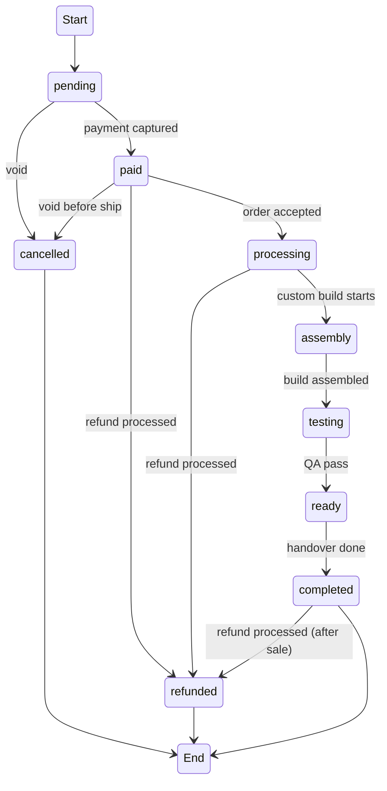

Transitions na pinapayagan sa RPC `rpc_update_order_status`:

- `pending` to `paid` (payment captured)
- `paid` to `processing`
- `processing` to `assembly`, `testing`, `ready`
- `assembly` to `testing`
- `testing` to `ready`
- `ready` to `completed` (release completed)
- anumang pre-completed na estado papunta sa `cancelled`
- `paid`, `processing`, `completed` papunta sa `refunded` (sa pamamagitan ng `rpc_process_refund`, hindi direktang status flip)

### 7.2 Build status machine

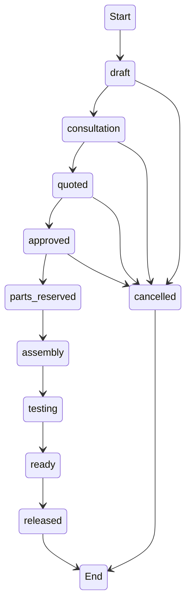

Ang `build_ops.stage` ay ang execution-level detail ng estado (assembly, cable_management, bios, os_install, drivers, testing, qa). Ang `builds.status` ay ang sales-level estado. I-synchronize sila ng RPC (Section 21, `rpc_advance_build_stage`).

### 7.3 Service ticket status machine

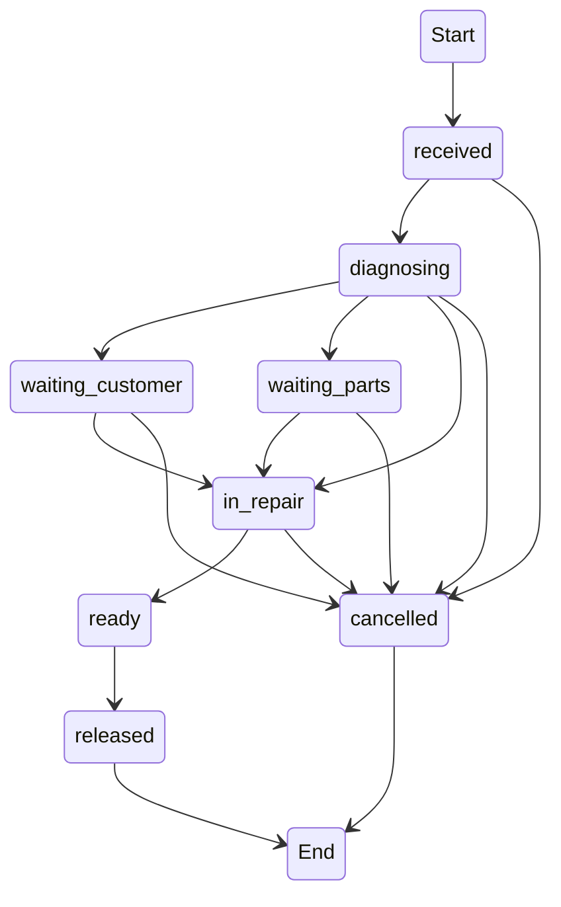

Ang frontend ay nagbibigay-daan sa "next statuses" mula sa kasalukuyang posisyon sa flow (`received, diagnosing, waiting_customer, waiting_parts, in_repair, ready, released`); ang `cancelled` ay laging pinapayagan hangga't hindi pa `released`.

### 7.4 Warranty claim status machine

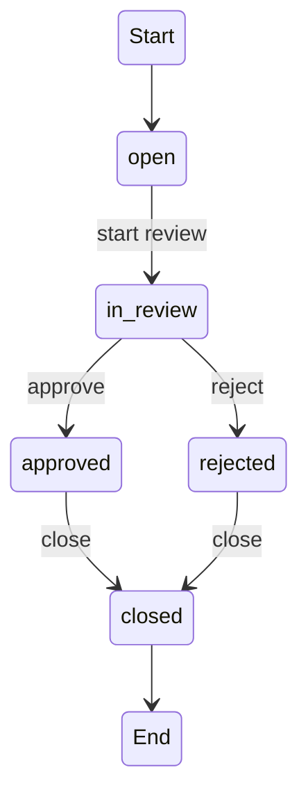

### 7.5 Warranty status machine

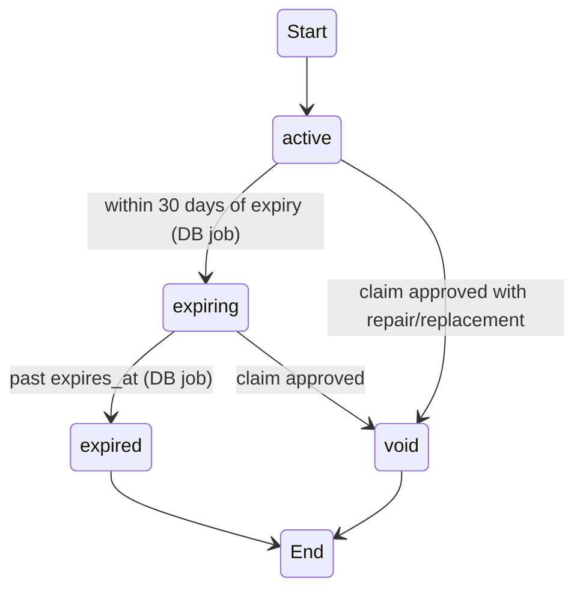

MUST: ang status na ito ay i-maintain ng DB scheduler (na tumatakbo araw-araw), hindi lamang computed sa render.

### 7.6 Serial status machine

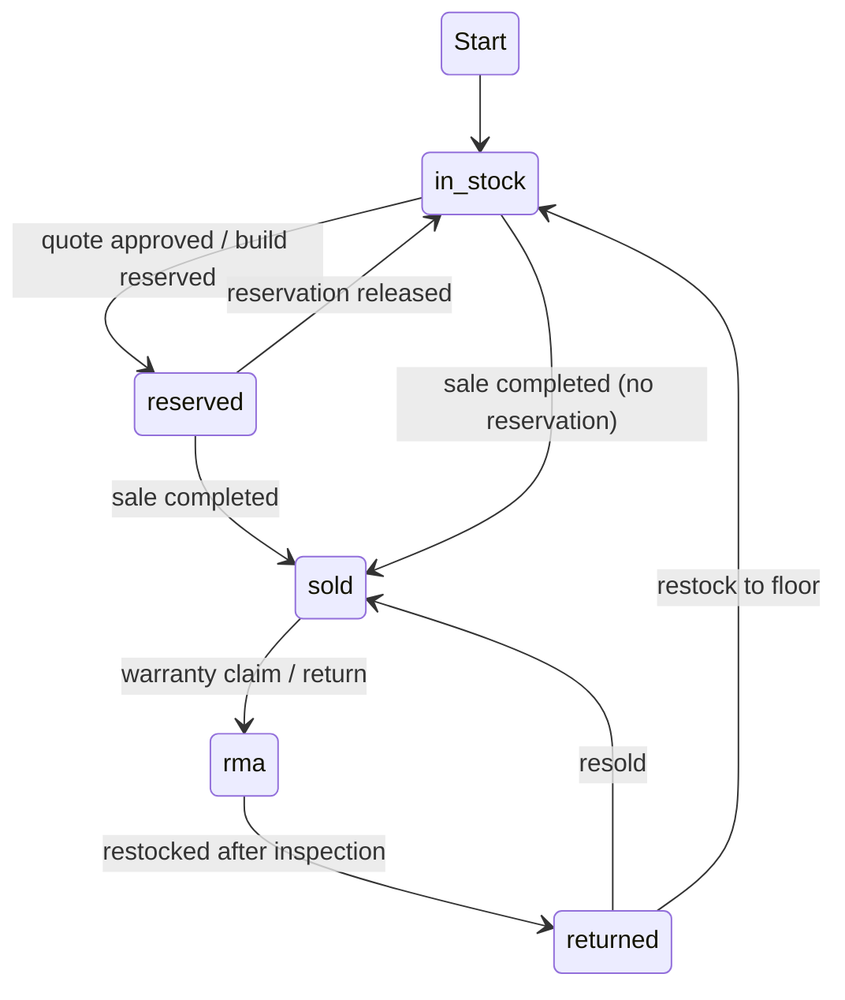

Tandaan: ang `installed` status ay dead code — hindi ito nilalabas kahit saan sa frontend, kaya hindi ito isasama.

### 7.7 Quote status machine

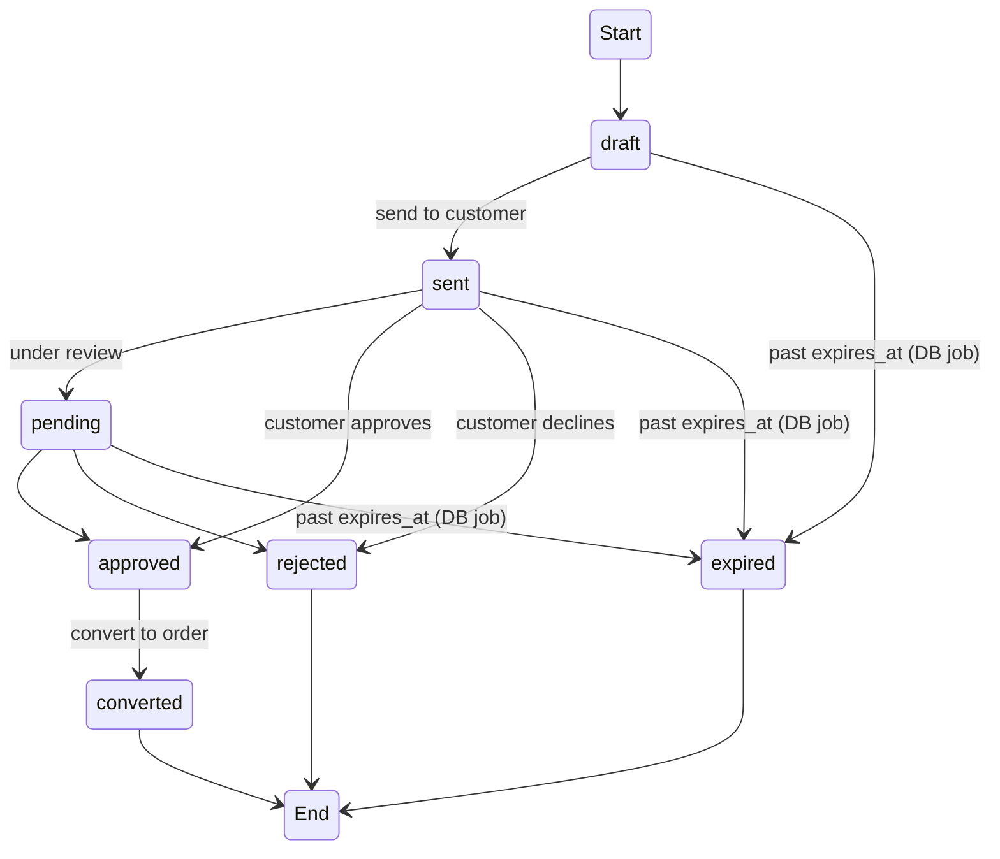

### 7.8 Purchase order status machine

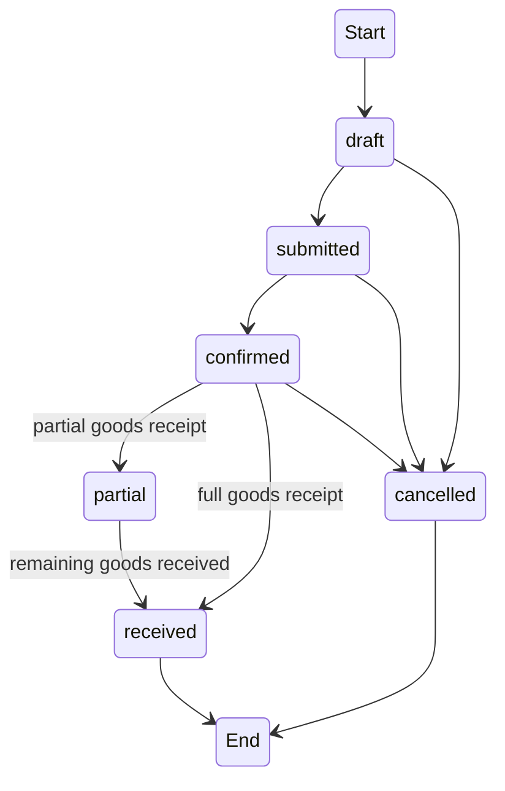

### 7.9 Goods receipt status machine

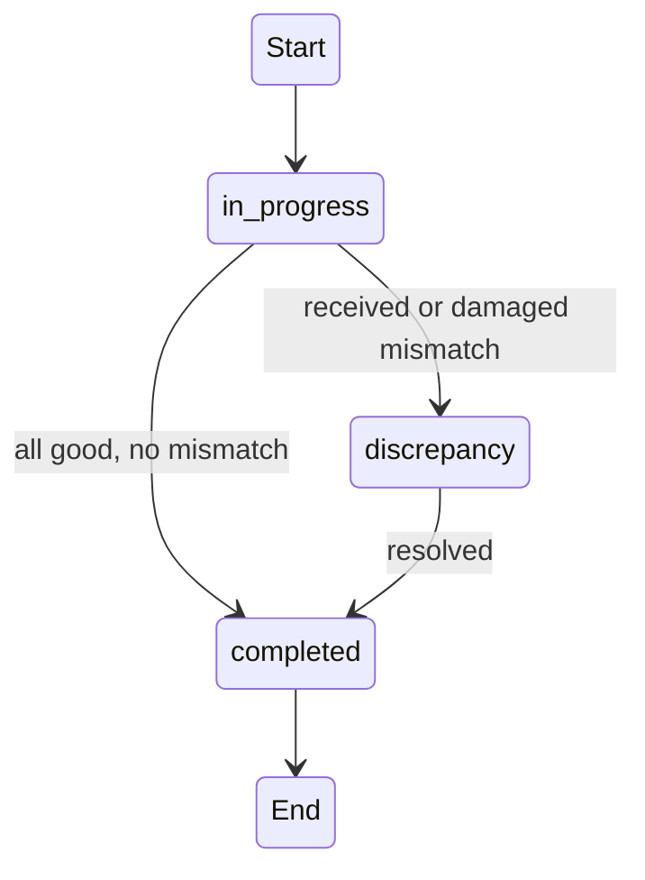

### 7.10 Return request status machine

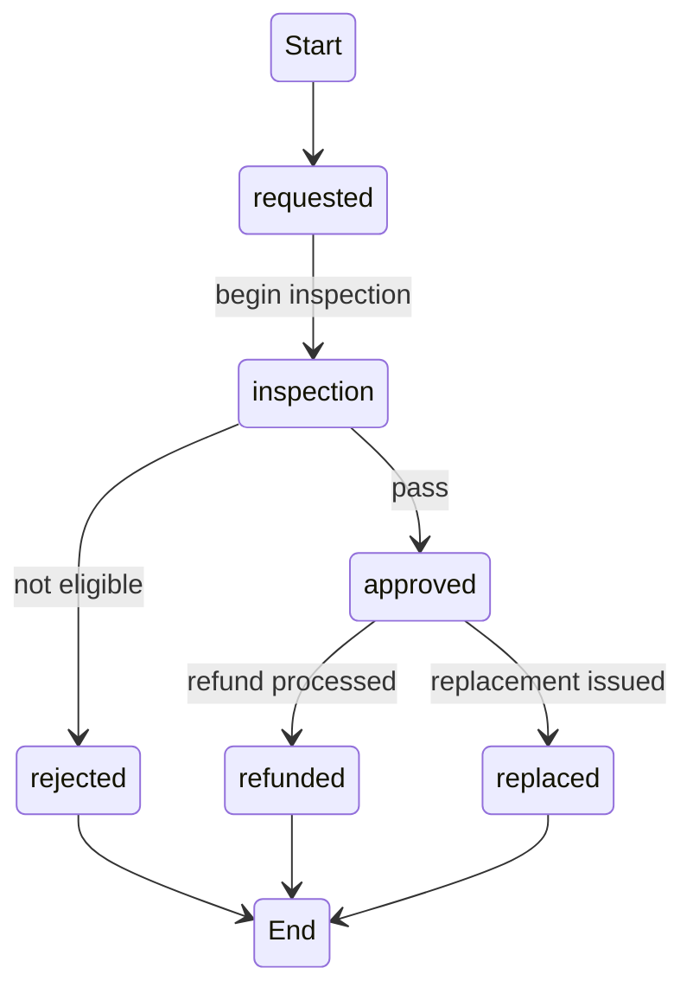

### 7.11 Shift status machine

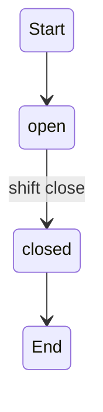

### 7.12 Consultation status machine

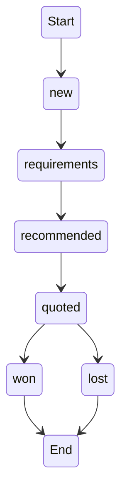

### 7.13 Release status machine

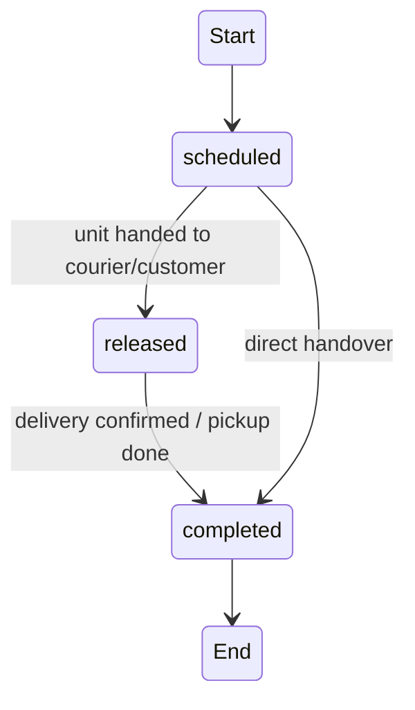

### 7.14 Task status machine

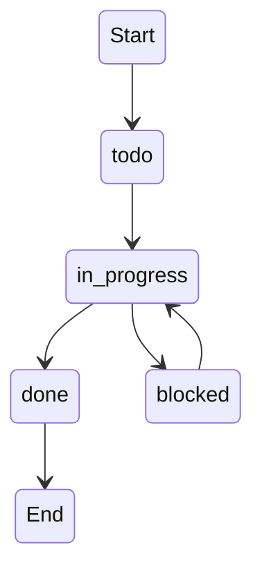

## 8. ID Strategy

Two-tier na ID:

- Primary key — `uuid` (internal). Ito ang foreign key na ginagamit sa lahat ng relasyon.
- `display_id` — human-readable na may prefix + year + padded sequence. Ito ang ipinapakita sa user at sa mga dokumento.

Format: `<PREFIX>-<YEAR>-<6-digit sequence>`

| Entity | Prefix | Halimbawa |
| --- | --- | --- |
| Order | DPC | DPC-2026-000123 |
| Quotation | QT | QT-2026-000045 |
| Build | BUILD | BUILD-2026-000007 |
| Service ticket | SRV | SRV-2026-000032 |
| Warranty record | WR | WR-2026-000009 |
| Warranty claim | WC | WC-2026-000021 |
| Refund | REF | REF-2026-000012 |
| Purchase order | PO | PO-2026-000081 |
| Goods receipt | GR | GR-2026-000044 |
| Return request | RMA | RMA-2026-000017 |
| Shift | SH | SH-2026-000004 |
| Consultation | CONS | CONS-2026-000011 |
| Release | REL | REL-2026-000031 |

Ang mga prefix na ito ay tumutugma sa kung ano ang ginagamit ng frontend ngayon (na-verify sa `demo-data.ts`, `ops-data.ts`, at sa store actions): `DPC-`, `QT-`, `BUILD-`, `SRV-`, `WR-`, `WC-`, `PO-`, `GR-`, `RMA-`, `SH-`, `CONS-`, `REL-`. Ang `REF-` lamang ang bago (walang refund entity sa frontend ngayon).

Implementasyon:

- Gumawa ng sequence table na `public.id_sequences` (kind text PK, last_value bigint). Ang RPC helper na `fn_next_display_id(kind, prefix)` ay nag-iincrement gamit ang row lock sa loob ng transaction.
- Ang customer-facing entities (Order, Quote, Build, ServiceTicket, WarrantyClaim, Refund, PurchaseOrder, GoodsReceipt, ReturnRequest, Shift, Consultation, Release) ay nakakakuha ng `display_id` sa pamamagitan ng RPC sa oras ng creation.
- Huwag gumamit ng UUID substring para sa display — hindi readable at mahirap i-verify sa telepono.
- Ang `serial` ng mga serial-tracked items ay mananatili sa kung anong mayroon ang physical unit (manufacturer serial) — ito ang natural key sa `UNIQUE(product_id, serial)`.

Bakit hindi UUID v7 na gawing display? Ang `display_id` ay may business prefix at taon; ang user ay nagsasabi ng "PO 81" at nais na ito ay ma-verify kaagad. Ang sequential display IDs ay para lamang sa display — hindi sila ginagamit sa relasyon.

---

## 9. Inventory Architecture

Ngayon, ang stock ay naka-imbak bilang `InventoryItem.onHand` at `reserved` counters na direktang minu-mutate ng client code (may race sa dalawa o higit pang browser tabs). Ang target ay:

### 9.1 Single source of truth

- `inventory_items` ang source of truth ng `on_hand`, `reserved`, `reorder_point`, `damaged`.
- Lahat ng writes ay sa pamamagitan ng RPC na may `SELECT ... FOR UPDATE` row lock sa `inventory_items` bago mag-adjust.
- Ang `inventory_movements` ang append-only ledger ng bawat pagbabago. Hindi ka mag-e-edit ng history — laging magdaragdag.

### 9.2 Movement types

| type | qty sign | kailan |
| --- | --- | --- |
| received | positive | goods receipt na natapos |
| reserved | negative | reservation ng quote/build |
| sold | negative | checkout o build release |
| adjusted | positive o negative | manual adjustment (`rpc_adjust_stock`) |
| damaged | negative | damaged units mula receiving |
| returned | positive | return/refund na may restock |

Normalization note (mula sa field-by-field audit ng `store.tsx`): ang frontend ay gumagamit ng `adjusted` para sa parts-consumed sa service ticket at sa manual adjustments, at `received` para sa positive adjustments at part returns. Pinapalitan natin ang mga ito ng semantically-correct na types:

- Parts used sa service ticket: `adjusted` sa frontend, magiging `sold` (consumed inventory) sa DB.
- Part return mula sa ticket: `received` sa frontend, magiging `returned` sa DB.
- Positive manual adjustment: `received` sa frontend, magiging `adjusted` sa DB.

Ito ay sinadyang normalization para hindi malito ang report aggregation — ang `received` ay para lamang sa goods receipt, ang `returned` ay para lamang sa pagbabalik ng stock, at ang `sold` ay para sa consumption o benta.

### 9.3 Available computation

Ang available ay `on_hand - reserved` (kapareho ng `Math.max(0, onHand - reserved)` sa inventory detail page). Sa DB:

- Query time: `on_hand - reserved` sa read.
- Write time: CHECK constraint na `reserved <= on_hand`, at RPC validation na `qty_to_deduct <= on_hand - reserved` (anti-oversell). Para sa serial-tracked items, ang available ay ang bilang ng `serial_numbers` na may `status = in_stock`.

### 9.4 Low stock / reorder

- Reorder point sa `inventory_items.reorder_point`.
- Notification (kind `stock`) na bubuo ang RPC kapag ang `on_hand` ay bumaba sa o mas mababa sa reorder point — ang frontend notification bell ay may kaukulang trigger dito.

### 9.5 Damaged handling (MUST fix)

Sa kasalukuyan, ang `ReceivingLine.damaged` ay nawawala dahil ang `completeReceipt` ay nagpo-post lamang ng `received` qty bilang good. Sa target:

- Sa `rpc_complete_receipt`, ang `received - damaged` ang pumapasok sa `on_hand` bilang movement type `received`.
- Ang `damaged` ay pumapasok sa `damaged` counter bilang movement type `damaged`.
- Ang `damaged` units ay maaaring i-adjust pabalik sa `on_hand` o i-write off sa pamamagitan ng `rpc_adjust_stock`.

---

## 10. Serial Number Architecture

### 10.1 Regalo ng track

Ang bawat unit na `serial_tracked` ay may isang row sa `serial_numbers`. Ang status ay naka-encode sa CHECK:

- `in_stock` — nasa warehouse, maaaring ibenta
- `reserved` — naka-reserve para sa quote/build/order
- `sold` — nabenta na
- `rma` — nasa warranty process
- `returned` — naibalik sa warehouse matapos ang return o RMA

### 10.2 Event log

Ang bawat transition ay may kaukulang `serial_number_events` row. Halimbawa:

- received sa warehouse: from null to `in_stock` (na may receipt linkage)
- reserved para sa quote: `in_stock` to `reserved` (na may reservation linkage)
- sold: `reserved` o `in_stock` to `sold` (na may order linkage)
- warranty claim approved (replacement/repair): `sold` to `rma`
- restock matapos ang return: `sold` o `rma` to `in_stock` o `returned`

Ang `serial_number_events` ang nagbibigay ng history na ipinapakita sa `/serials` page at sa warranty detail.

### 10.3 Warranty linkage (MUST)

Sa kasalukuyan, ang `Warranty.serial` ay isang string na pinagmamatch sa `SerialNumber.serial` — walang FK. Sa target, ang `warranties.serial_number_id` ay tumuturo sa `serial_numbers.id`. Ang `serial_numbers.warranty_id` ay ang reverse link. Isa lang ang totoong relasyon — hindi string join.

### 10.4 Installed status (removed)

Ang `installed` status ay dead code sa frontend — hindi ito nilalabas kahit saan. Hindi ito isasama sa database upang maiwasan ang status na walang kumokonsumo. Kung may requirement na "installed inside a machine" (bilang component), i-encode ito sa pamamagitan ng `build_components`, hindi ng serial status.

### 10.5 Warranty creation sa sale

Kapag ang `rpc_complete_sale` ay nagbebenta ng serial-tracked na item na may `warranty_months > 0`, awtomatikong:

- Gumagawa ng `warranties` row (purchased_at = now, expires_at = now + warranty_months).
- Inililink ang `serial_numbers.warranty_id`.
- Gumagawa ng notification kung `status = expiring` (kapag malapit na).

### 10.6 Pag-expire (DB job)

- Araw-araw na scheduler (pg_cron) na `update_warranty_statuses`:
  - `active` to `expiring` kapag nasa loob na ng 30 araw.
  - `expiring` o `active` to `expired` kapag lampas na ng `expires_at`.
- Ginagawa rin nito ang same para sa `quotations` (draft/sent/pending to `expired` kapag lampas `expires_at`) at `inventory_reservations` (expired).

## 11. POS and Sales

### 11.1 Checkout flow (rpc_complete_sale)

Pinapalitan ang `store.completeSale` sa frontend. Transaction steps:

1. Validate cart: bawat line ay may available stock (non-serial: `on_hand - reserved`; serial: bilang ng `in_stock` serials na ibinigay).
2. I-lock ang `inventory_items` rows ng lahat ng products (deterministic order ayon sa id para maiwasan ang deadlock).
3. Gumawa ng `orders` (status `paid`), `order_items`, at `order_payments` (sum ng tendered).
4. I-compute ang `subtotal`, `discount`, `service_total`, `tax` gamit ang `company_profile.tax_rate`, at `total`.
5. Para sa non-serial items: mag-post ng `inventory_movements` type `sold` at i-decrement `on_hand`.
6. Para sa serial-tracked items: itakda ang bawat `serial_numbers.status` to `sold`, gumawa ng `serial_number_events`, i-link ang `order_item_serials`, at i-decrement `on_hand`.
7. Gumawa ng `warranties` para sa mga item na may `warranty_months > 0`.
8. I-convert ang `active` na `inventory_reservations` ng order/quote/build na ito sa `fulfilled` (inilalabas ang `reserved` counter).
9. Gumawa ng `order_timeline_events` at `audit_logs` entry.
10. Magdagdag ng shift linkage: i-attribute ang payment sa kasalukuyang open shift ng cashier.

### 11.2 Cart sa frontend

Ang `CartLine` (productId, qty, serials) ay mananatiling transient client state. Sa checkout, ipapasa ito sa RPC bilang JSONB array. Ang pag-compile ng totals (VAT na 12%) ay lilipat sa server-side computation gamit ang `company_profile.tax_rate`.

### 11.3 Order lifecycle

Ang status transitions ay sa pamamagitan ng `rpc_update_order_status`, na nagpapa-validate ng legal transitions (Section 7.1), nag-a-add ng timeline event, at nagpo-post sa audit. Ang `cancelled` orders ay nagre-release ng reservations.

### 11.4 Order types

- `retail` — walang build; direktang checkout.
- `custom_build` — may `build_id`; status flow sa pagitan ng `processing`, `assembly`, `testing`, `ready`, `completed`.
- `service` — may `service_total` mula sa ticket; ang checkout ay nagre-release ng ticket.

MUST: sa kasalukuyan, ang service tickets ay hindi kailanman na-bi-bill sa pamamagitan ng payment (walang order o payment record para sa ticket). Sa target, ang `rpc_complete_sale` ay maaaring gumawa ng order na type `service` na kumukuha ng `labor + parts` mula sa ticket — ito ang nagiging billable at nagko-close ng ticket sa `released`.

---

## 12. Payments and Refunds

### 12.1 Payments

- Ang bawat payment ay isang `order_payments` row (hindi lang isang `Order.payment` object).
- Ang isang order ay maaaring magkaroon ng maraming payments (split payment: cash + gcash).
- Ang `order_payments.received_by` ay ang cashier ng shift.
- Sa shift close, ang `shift_tenders` ay nagiging breakdown ng lahat ng payments na na-attribute sa shift.

### 12.2 Payment methods

- `cash`, `gcash`, `bank`, `card` (kapareho ng `PaymentMethod` sa types.ts).
- Para sa cash: i-record ang `tendered` at `change`.
- Para sa gcash/bank: i-record ang `reference`.

### 12.3 Refunds (MUST fix)

Ang kasalukuyang frontend ay nagko-set ng `Order.status = "refunded"` nang walang refund entity, at hindi itinatama ang `sold` at `on_hand`. Ang target na `rpc_process_refund`:

1. Gumagawa ng `refunds` row (status `processed`).
2. Ina-update ang order status sa `refunded` (kung buong order) o nag-i-issue ng partial refund.
3. Kung `restock_required`:
   - Non-serial: mag-post ng `inventory_movements` type `returned` at i-increment `on_hand`.
   - Serial: itakda ang `serial_numbers.status` sa `returned` o `rma` at gumawa ng event.
4. Gumagawa ng timeline event at audit.
5. Inilalabas ang shift refund accounting: kapag ang refund ay may `shift_id`, idadagdag sa `refunds` total ng shift close.

### 12.4 Service billing

- Ang `labor` at `service_parts` ng ticket ay magiging isang `orders` type `service` sa pamamagitan ng `rpc_bill_service_ticket` (na nagpapatakbo ng parehong payment flow tulad ng checkout).
- Pagkatapos ng bayad, ang ticket ay maaaring i-mark `released`.

### 12.5 Shift refunds

Sa kasalukuyan, ang shift close ay hand-typed ng `refunds` amount. Sa target:

- Ang `shifts.refunds` ay naka-compute mula sa `refunds` rows na naka-link sa shift (o mula sa `cash_adjustments` kind `cash_out` na may refund reason).
- Pinapanatili natin ang column para sa display, ngunit ang RPC `rpc_close_shift` ang mag-re-compute nito kung ang frontend ay hindi pa na-migrate.

---

## 13. Custom Builds

### 13.1 Build model

- Ang `builds` ang sales-level entity (customer, purpose, budget, components, services, status).
- Ang `build_ops` ang execution-level entity (stage, assembly steps, test results, technician, QA).
- MUST: i-desolve ang dual-store coupling. Ngayon, ang `Build.status` (main store) at `BuildOps.stage` (ops store) ay naka-sync sa pamamagitan ng pub/sub (`build-sync.ts`) na pwedeng mag-desync sa crash o multi-tab. Sa target, isang transaction ang nag-a-advance ng parehong `build_ops.stage` at `builds.status`.

### 13.2 Stage mapping

Ang `build_ops.stage` na execution stages ay imamapa sa `builds.status`:

| build_ops.stage | builds.status |
| --- | --- |
| consultation, quote, approved | approved |
| parts_reserved | parts_reserved |
| assembly, cable_management, bios, os_install, drivers | assembly |
| testing, qa | testing |
| ready | ready |
| release, released | released |

### 13.3 Parts reservation (MUST fix)

Kapag ang isang build ay `approved`, ang `rpc_reserve_build_parts` ay:

1. Gumagawa ng `inventory_reservations` (source_type `build`) para sa bawat component.
2. I-increment ang `inventory_items.reserved` (may lock at oversell check).
3. Para sa serial-tracked components: minamarkahan ang kinakailangang bilang ng serials na `reserved`.

Kapag ang build ay `released` o `cancelled`:

- `rpc_release_reservations` ang nagre-release ng lahat ng `active` reservations at nire-reset ang `reserved` counter.
- Ang aktwal na pag-decrement ng `on_hand` ay nangyayari lamang sa `rpc_complete_sale` kapag na-checkout ang order ng build (iwas sa double-count).

### 13.4 QA at release

- Ang `build_qa_checks` ay naka-save sa pamamagitan ng `rpc_save_build_qa`; ang lahat ng `hardware` at `testing` checks ay dapat may result bago payagan ang `ready`.
- Ang `qa_signed_at` at `qa_staff_id` sa `build_ops` ang QA signature.
- Ang release ng build ay dumadaan sa `releases` (Section 18) — hindi lamang status flip.

### 13.5 Build order conversion

Kapag ang isang build ay na-convert sa order (sa pamamagitan ng `convertQuoteToOrder` o direktang sale), ang `orders.build_id` ay itinatakda at ang status ng order ay magsisimula sa `processing`. Ang order items ay nagmumula sa `build_components` + `build_services`.

## 14. Service Center

### 14.1 Ticket lifecycle

Ang `service_tickets` ay sumusunod sa status machine sa Section 7.3. Ang bawat transition ay:

- Na-validate ng RPC `rpc_update_ticket_status` (legal transition check).
- May kaukulang `service_timeline_events` row.
- May audit entry.

### 14.2 Parts consumption (MUST fix concurrency)

- Ang `rpc_add_service_part` ay nagde-deduct ng stock na may row lock (kapareho ng checkout) at gumagawa ng `inventory_movements` type `sold` na may reference sa ticket.
- Ang `rpc_remove_service_part` ay nagre-return ng stock (movement type `returned`) — pinapanatili ang frontend behavior na "removed part returns to stock".
- Ang `service_parts` ay naka-UNIQUE sa `(ticket_id, product_id)` — ang pag-edit ay i-upsert ng qty, hindi duplicate rows.

### 14.3 Diagnosis at costs

- Ang `diagnosis`, `labor`, `estimated_cost`, at `actual_cost` ay ina-update sa pamamagitan ng RPC `rpc_update_ticket` (na may audit diff).
- Ang `actual_cost` ay naka-compute kapag natapos ang repair; ang `labor + partsTotal` ang nagsisilbing billable amount (Section 12.4).

### 14.4 Technician assignment

- Ang `technician_id` ay FK sa `staff_members` (MUST — dati ay string).
- Maaaring magdagdag ng `rpc_assign_ticket_technician` na nag-set ng assignee at nagpo-post ng notification sa technician.

### 14.5 Release

- Kapag ang ticket ay `ready`, maaaring mag-schedule ng release sa pamamagitan ng `releases` (kind `service`).
- Kapag nakumpleto ang release (o naka-bill na), ang ticket ay magiging `released`.

---

## 15. Warranty and RMA

### 15.1 Warranty creation

- Nilikha sa `rpc_complete_sale` para sa serial-tracked items na may `warranty_months > 0`.
- Ang `expires_at` = purchased_at + warranty_months.
- Ang `serial_number_id` ay ang tamang FK (MUST fix ang string join).

### 15.2 Claim flow (rpc_create_claim, rpc_decide_claim)

Ang frontend claim flow ay: `open` to `in_review` to `approved`/`rejected` to `closed`.

- `rpc_create_claim` — gumagawa ng `warranty_claims` (status `open`) at `claim_timeline_events`.
- `rpc_update_claim_status` — ina-advance ang status (na may transition validation at timeline event).
- `rpc_decide_claim` — nagre-record ng resolution at note; kapag `approved` na may resolution `replacement` o `repair`:
  - Inu-void ang warranty (`status = void`).
  - Itinatakda ang serial sa `rma`.
  - Kung `replacement`: gumagawa ng replacement serial (kung serial-tracked) o gumagawa ng return request (Section 4.6).
- Kapag `approved` na may `refund` o `store_credit`: dumadaan sa `rpc_process_refund` (Section 12.3).

### 15.3 Warranty status maintenance

- Ang `update_warranty_statuses` DB job ang nag-a-update ng `active`/`expiring`/`expired` (Section 10.6).
- Ang `void` ay ang tanging manual transition (sa pamamagitan ng claim approval).

### 15.4 RMA at returns integration

- Ang `return_requests` na may condition `defective` at resolution `replacement`/`refund` ay konektado sa warranty claim sa pamamagitan ng `refunds.return_request_id` at `warranty_claims` linkage.
- Ang serial status `rma` ang nagsasabi na ang unit ay nasa labas ng stock at nasa warranty process.

---

## 16. Purchasing and Receiving

### 16.1 Purchase orders

- Ang `purchase_orders` at `purchase_order_lines` ay nilikha sa pamamagitan ng `rpc_create_po` (na gumagawa ng `display_id`).
- Status flow: `draft` to `submitted` to `confirmed` (Section 7.8). Ang `rpc_update_po_status` ang nag-va-validate.
- Ang `expected_at` ang ginagamit sa dashboard "overdue" computation (kasalukuyan: `daysUntil(po.expectedAt) < 0`).

### 16.2 Receiving (rpc_complete_receipt) — MUST fix damaged loss

1. Gumagawa ng `goods_receipts` (status `completed` o `discrepancy`) at `goods_receipt_lines`.
2. Para sa bawat line:
   - `received - damaged` ang pumapasok sa `on_hand` (movement type `received`).
   - `damaged` ang pumapasok sa `damaged` counter (movement type `damaged`).
3. Inirehistro ang serials na naka-list sa line (kung serial-tracked): gumagawa ng `serial_numbers` (status `in_stock`) at `serial_number_events`.
4. Ina-update ang `purchase_order_lines.received`; kapag kumpleto ang lahat ng lines, ang PO ay magiging `received`; kung may kulang, `partial`.
5. Ang `receipt.status` ay magiging `discrepancy` kung ang alinmang line ay may `received + damaged != expected` o may damaged units.
6. Audit at notification (kind `stock`).

### 16.3 Supplier linkage

- Ang `purchase_orders.supplier_id` ay FK sa `suppliers`.
- Ang `supplier_name` ay [display] na kopya para sa history stability kapag pinalitan ang supplier name.
- Ang `products.supplier_name` (frontend product field) ay display lamang; kung may supplier match sa seed, gagawa ng purchase line para sa bagong product.

### 16.4 Backorder behavior

- Kapag ang isang PO ay `partial` (may lines na hindi kumpleto ang `received`), ang status ay nananatiling open at ang natitirang lines ay maaaring matanggap sa pamamagitan ng bagong goods receipt.

## 17. Shifts and Cash Drawer

### 17.1 Shift opening

- Ang `shifts` ay nilikha sa pamamagitan ng `rpc_open_shift` na may `opening_cash` at `cashier_id`.
- Isang shift bawat cashier sa isang pagkakataon (partial unique index sa `cashier_id WHERE status = 'open'`).
- Ang shift ay nag-iipon ng attributed `order_payments` at `cash_adjustments`.

### 17.2 Shift close (rpc_close_shift) — MUST fix hand-typed refunds

1. Kinokolekta ang `counted_cash` at ang `tenders` breakdown mula sa frontend (o kinukuwenta mula sa `order_payments` ng shift).
2. Gumagawa ng `shift_tenders` rows (method, amount, expected) na may UNIQUE sa `(shift_id, method)`.
3. Kinukuwenta ang expected cash:
   - `expected = opening_cash + sum(cash tenders) + sum(cash_in) - sum(cash_out) - refunds(shift-linked)`
   - Ito ang pinapalitan ng frontend `expectedCash` logic.
4. Kinukuwenta ang variance: `counted_cash - expected`.
5. Itinatakda ang `status = closed`, `closed_at`, `counted_cash`, `refunds` (recomputed).
6. Audit at notification kung may malaking variance.

### 17.3 Cash adjustments

- Ang `rpc_record_cash_adjustment` ay gumagawa ng `cash_adjustments` (kind `cash_in`/`cash_out`) na naka-link sa open shift.
- Ang reason ay mandatory.

---

## 18. Release and Handover

### 18.1 Release record

Ang `releases` ay nagpa-plano at nagko-complete ng handover ng isang build, service ticket, o order.

- `rpc_schedule_release` — gumagawa ng `releases` (status `scheduled`, method `pickup` o `delivery`).
- `rpc_mark_release` — ina-advance ang status sa `released` (inilalabas ang unit) o `completed` (kinumpirma ang delivery/pickup).
- Kapag `completed`:
  - Kung kind `build`: `builds.status = released`.
  - Kung kind `service`: `service_tickets.status = released`.
  - Kung kind `order`: `orders.status = completed`.

### 18.2 Handover details

- `released_by_id` at `received_by_id` ang magre-record kung sino ang nag-release at tumanggap.
- Ang `customer_name` ay [display] kopya para sa delivery slip.

---

## 19. Staff, Auth and Security

### 19.1 Auth

- Supabase Auth (email/password) ang magpapalit sa demo plaintext login sa `src/routes/index.tsx`.
- Ang `staff_members.user_id` ang nagli-link ng auth account sa staff profile.
- Ang `auth.users.raw_app_meta_data.role` ang nagtataglay ng role. Bawal ang client-only na role claim — dapat verified server-side sa RLS at sa SECURITY DEFINER functions.

### 19.2 Roles

Ang limang roles mula sa `src/lib/permissions.ts`:

- `owner` — buong access.
- `admin` — buong operational access, walang pag-customize ng billing config (kapareho ng permissions matrix sa ngayon).
- `cashier` — POS, payments, shifts, returns, customers, quotes.
- `technician` — builds, services, warranty, releases.
- `inventory` — products, inventory, purchasing, receiving, suppliers, adjustments.

### 19.3 Bakit walang RBAC tables (DEFERRED)

Ang permission model ng frontend ay static (25 capabilities, hardcoded). Walang UI na nag-e-edit ng roles o permissions. Ang paggawa ng roles/permissions/user_roles tables ay magiging dead code. Kapag may dynamic na requirement, doon palang magdadagdag. Hanggang doon, ang RLS policies + `app_metadata.role` ang sapat at mas secure.

### 19.4 Actor/name string normalization (MUST)

Lahat ng string na ginamit bilang actor o staff name ay nagiging FK:

| Frontend field | Target column |
| --- | --- |
| Order.cashier | orders.cashier_id |
| Quote.preparedBy | quotations.prepared_by_id |
| Build.technician | builds.technician_id |
| BuildOps.technician | build_ops.technician_id |
| BuildOps.qaStaff | build_ops.qa_staff_id |
| ServiceTicket.technician | service_tickets.technician_id |
| PurchaseOrder.createdBy | purchase_orders.created_by_id |
| GoodsReceipt.receivedBy | goods_receipts.received_by_id |
| ReturnRequest.inspectedBy | return_requests.inspected_by_id |
| Shift.cashier | shifts.cashier_id |
| Consultation.consultant | consultations.consultant_id |
| OpsTask.assignee | ops_tasks.assignee_id |
| ReleaseRecord.releasedBy | releases.released_by_id |
| ReleaseRecord.receivedBy | releases.received_by_id |
| Movement.actor | inventory_movements.actor_id |
| AuditLog.actor | audit_logs.actor_id |

### 19.5 Authentication tokens

- Gumamit ng Supabase Auth session; huwag mag-imbak ng plaintext password.
- Ang `permissions.ts` ay mananatiling UI helper (page access), ngunit ang tunay na enforce ay RLS at RPC authorization (Section 20 at 21).

---

## 20. RLS Matrix

Ang lahat ng tables ay naka-enable ang RLS. Walang `permissive` na "service_role only" shortcut sa app client. Ang mga RPC ay SECURITY DEFINER at sila mismo ang nag-che-check ng role.

Mga policy summary (gamit ang `auth.jwt() ->> 'role'`):

| Table group | owner | admin | cashier | technician | inventory |
| --- | --- | --- | --- | --- | --- |
| categories, products | all | all | read | read | read + update |
| inventory_items, serial_numbers, movements, reservations | all | all | read | read + reserve | read + update |
| customers | all | all | read + create + update | read | read + create + update |
| orders, order_items, order_payments, timelines | all | all | create + read + update(own shift) | read | read |
| quotations, quote_items | all | all | create + read + update | read + create | read |
| builds, build_components, build_services, build_qa_checks | all | all | read | create + read + update | read |
| build_ops, build_assembly_steps, build_test_results | all | all | read | create + read + update | read |
| service_tickets, service_parts, service_timeline_events | all | all | read + create(bill) | create + read + update | read |
| warranties, warranty_claims, claim_timeline_events | all | all | read | create + read + update | read |
| refunds, return_requests | all | all | read + create | read + update | read |
| suppliers, purchase_orders, purchase_order_lines | all | all | read | read | create + read + update |
| goods_receipts, goods_receipt_lines | all | all | read | read | create + read + update |
| shifts, shift_tenders, cash_adjustments | all | all | create + read + close(own) | read | read |
| consultations, ops_tasks | all | all | read | read + update | read + create |
| staff_members | all | read + update | read | read | read |
| releases | all | all | read + schedule | read + schedule | read |
| company_profile | all | read | read | read | read |
| notifications | own rows only | own rows only | own rows only | own rows only | own rows only |
| audit_logs | all | all | read(own) | read(own) | read(own) |
| id_sequences | no direct access | no direct access | no direct access | no direct access | no direct access |

Pagpapatupad ng payo:

- Ang `cashier` ay hindi maaaring direktang i-edit ang products o staff — ang POS pages ay read-only sa mga ito.
- Ang `technician` ay hindi maaaring mag-void ng order o mag-approve ng refund.
- Ang `inventory` ay hindi maaaring mag-checkout o mag-close ng shift.
- Lahat ng policy ay `USING` + `WITH CHECK`; para sa updates, gamitin ang `FOR ALL` at `FOR UPDATE` na may role check sa `app_metadata`.
- Ang `service_role` key ay hindi kailanman ginagamit sa client — panloob lamang sa edge functions kung kinakailangan.

## 21. RPC Architecture

Lahat ng writes ay sa pamamagitan ng SECURITY DEFINER RPC. Bawat RPC:

- Ay nag-va-validate ng role ng caller mula sa `auth.jwt() ->> 'role'`.
- Ay nag-i-enforce ng transition rules (status machines).
- Ay nagpo-post ng `audit_logs` entry.
- Ay gumagamit ng single transaction.
- Ay nagre-return ng JSON na may bagong nilikhang `display_id`/id para sa redirect.

### 21.1 POS at sales

| RPC | Layunin |
| --- | --- |
| rpc_complete_sale | Full checkout (Section 11.1). In: customer info, cart lines (jsonb), payments (jsonb), shift_id, build_id/quote_id optional. Out: order_id, display_id |
| rpc_update_order_status | Legal transition check + timeline + audit |
| rpc_cancel_order | Sets cancelled, releases reservations, restores stock kung hindi pa nadeduct |
| rpc_bill_service_ticket | Gumagawa ng service order mula sa ticket (labor + parts), nagre-release ng ticket |

### 21.2 Payments at refunds

| RPC | Layunin |
| --- | --- |
| rpc_add_payment | Nagdadagdag ng `order_payments` sa open order |
| rpc_process_refund | Gumagawa ng `refunds`, nagre-restock, nag-update ng serial status, nag-issue ng credit (Section 12.3) |
| rpc_void_refund | Nag-void ng draft refund |

### 21.3 Inventory at serials

| RPC | Layunin |
| --- | --- |
| rpc_adjust_stock | Manual adjustment na may note (required), movement type `adjusted`, lock |
| rpc_reserve_parts | Gumagawa ng `inventory_reservations` para sa quote/build (Section 13.3) |
| rpc_release_reservations | Nagre-release ng reservations para sa isang source (quote/build/order) |
| rpc_register_serials | Nagrerehistro ng bagong serials para sa isang product (replacement/RMA path) |
| rpc_post_movement | Panloob na helper (may lock) — hindi direktang tinatawag ng client |

### 21.4 Quotes at builds

| RPC | Layunin |
| --- | --- |
| rpc_create_quote | Gumagawa ng quote + items + display_id |
| rpc_set_quote_status | Legal transition check (draft/sent/pending/approved/rejected) |
| rpc_convert_quote_to_order | Gumagawa ng order mula sa quote, minamarkahang converted, inililipat ang reservations (MUST fix ang leak) |
| rpc_save_build | Gumagawa/ina-update ng build at components |
| rpc_advance_build_stage | Ina-advance ang `build_ops.stage` at sina-sync ang `builds.status` (Section 13.2) |
| rpc_save_build_qa | Nagse-save ng qa_checks, nag-set ng qa_result at qa_signed_at |
| rpc_assign_build_technician | Nag-assign ng technician + notification |

### 21.5 Services

| RPC | Layunin |
| --- | --- |
| rpc_create_ticket | Gumagawa ng ticket + display_id + timeline |
| rpc_update_ticket_status | Legal transition check + timeline |
| rpc_update_ticket | Diagnosis, labor, estimated_cost, actual_cost updates na may audit diff |
| rpc_add_service_part | Nagde-deduct ng stock (lock) + movement + upsert sa service_parts |
| rpc_remove_service_part | Nagre-return ng stock + movement + delete sa service_parts |

### 21.6 Warranty at claims

| RPC | Layunin |
| --- | --- |
| rpc_create_claim | Gumagawa ng claim + timeline |
| rpc_update_claim_status | open to in_review to approved/rejected to closed |
| rpc_decide_claim | Record resolution + note; inu-void ang warranty at itinatakda ang serial sa rma kung approved na may repair/replacement; nag-trigger ng refund path kung refund/store_credit |

### 21.7 Purchasing at receiving

| RPC | Layunin |
| --- | --- |
| rpc_create_po | Gumagawa ng PO + lines + display_id |
| rpc_update_po_status | Legal transition check |
| rpc_complete_receipt | Full receiving flow (Section 16.2) — MUST fix damaged loss |

### 21.8 Shifts at cash

| RPC | Layunin |
| --- | --- |
| rpc_open_shift | Gumagawa ng shift para sa cashier |
| rpc_close_shift | Compute tenders/variance/refunds (Section 17.2) |
| rpc_record_cash_adjustment | cash_in/cash_out na may shift linkage |

### 21.9 Releases, returns, tasks

| RPC | Layunin |
| --- | --- |
| rpc_schedule_release | Gumagawa ng release record |
| rpc_mark_release | released/completed + sync ng parent status (Section 18.1) |
| rpc_create_return | Gumagawa ng return request |
| rpc_update_return | Inspection, resolution, restock guard (restocked_at) |
| rpc_create_task / rpc_update_task | Task CRUD |

### 21.10 System

| RPC | Layunin |
| --- | --- |
| rpc_upsert_company_profile | Singleton profile update (tax rate, address, at iba pa) |
| rpc_mark_notification_read | Mark notif as read (own rows lamang) |
| rpc_create_user | Admin-created staff auth account (invite + staff_members link) |

### 21.11 Panuntunan

- Huwag mag-expose ng generic table RPC (hal. `rpc_update_table`). Bawat RPC ay domain-specific para sa tamang authorization at invariant.
- Ang SECURITY DEFINER functions ay dapat may `SET search_path = public` at explicit role check sa simula.
- Ang lahat ng input ay validated (types, ranges, enum values) bago ang anumang write.

---

## 22. Audit Logging

### 22.1 Ano ang ina-audit

- Lahat ng state-changing RPC (order, build, service, claim, refund, PO, receipt, shift, return).
- Lahat ng stock movement (may snapshot na `on_hand_before`/`on_hand_after` sa `inventory_movements`).
- Lahat ng status transitions (may timeline event + audit).
- Admin action tulad ng staff creation at profile edits.

### 22.2 Schema

Ang `audit_logs` (Section 5.3) ay may `action`, `entity_type`, `entity_id`, `details` (JSONB ng before/after). Ang `actor_id` ay galing sa `auth.uid()` — hindi galing sa client input.

### 22.3 Immutability

- Ang `audit_logs` ay INSERT-only. Walang UPDATE/DELETE policies sa RLS.
- Ang `serial_number_events`, `inventory_movements`, at lahat ng timeline events ay append-only din.

### 22.4 Audit UI

Ang `/audit` page sa frontend ay magba-select ng `audit_logs` na may join sa `staff_members` para sa actor display name. Ang pag-filter ay magaganap server-side (indexes sa Section 27).

---

## 23. Timeline Events Architecture

### 23.1 Uniform na pattern

Ang lahat ng timeline events (order, service ticket, claim) ay sumusunod sa pattern:

- Append-only table na may FK sa parent (order_timeline_events, service_timeline_events, claim_timeline_events).
- Columns: `label`, `note`, `state` (done/active/pending), `actor_id`, `at`.
- Nililikha lamang ng RPC/trigger — hindi direktang INSERT mula sa client.

### 23.2 Bakit hiwalay na tables (hindi array)

Ang frontend ay gumagamit ng `Order.timeline: TimelineEvent[]`, `ServiceTicket.timeline`, `Claim.timeline`. Ang pag-gawa ng tables:

- Nagbibigay-daan sa server-side timestamp (hindi ma-fake ng client).
- Nagbibigay-daan sa pag-query ng lahat ng events ng isang entity nang walang pag-parse ng JSON.
- Hindi nagpo-pollute sa parent row; ang parent row ay malinis na estado.

### 23.3 Order timeline example

- Order created: `Order placed` (pending)
- Payment captured: `Payment received (cash 5,000)` (done)
- Status changes: `Order processing`, `Build in assembly`, `QA passed`, `Ready for release`, `Completed`
- Refund: `Refund processed`

---

## 24. Notifications

### 24.1 Mga trigger

| Kailan | Kind | Recipient |
| --- | --- | --- |
| Mababa ang stock (at o mas mababa sa reorder point) | stock | owner, admin, inventory |
| Na-convert ang quote / na-approve | quote | owner, admin |
| Nakumpleto ang build QA o stage change | build | technician, owner, admin |
| Malapit na ma-expire ang warranty | warranty | owner, admin |
| Nakapag-schedule ng release | service | technician, owner, admin |
| May refund o payment na kahina-hinala | payment | owner, admin |

### 24.2 Schema at behavior

- Ang `notifications` ay per-recipient rows (recipient_id).
- Ang RPC `rpc_mark_notification_read` ay nagbabasa lamang ng sariling rows.
- Ang Supabase Realtime channel sa `notifications` ang nagpapagana ng instant bell update sa lahat ng terminals.

### 24.3 Realtime

- Mag-subscribe sa `notifications` (per user) at sa `orders`, `builds`, `service_tickets` para sa live dashboard counters.

---

## 25. Company Settings

### 25.1 MUST fix: hindi naka-persist ang settings

Ang store profile sa `/settings` ay component-local state — nagre-reset ito sa reload. Ang target na `company_profile` singleton table ang magpapa-persist:

- name, address, phone, email, tin
- currency (display symbol)
- tax_rate (pinapalitan ang hardcoded `VAT_RATE = 0.12` sa `src/lib/format.ts`)
- receipt_footer, logo_url

### 25.2 RPC at caching

- `rpc_upsert_company_profile` ang nag-update (owner/admin lamang).
- Ang frontend ay mag-load ng profile sa app boot at mag-cache sa React context; ang tax computation ay gagamit ng profile tax_rate sa halip na ang constant.
- Ang `updated_by` ang nagre-record kung sino ang huling nag-edit.

## 26. Reporting

### 26.1 Desisyon: client-side para sa Phase 1 (SHOULD)

Ang mga reports sa `/reports` ay kasalukuyang naka-compute sa client mula sa in-memory data. Para sa Phase 1, ang frontend ay magba-select ng raw tables (orders, order_items, payments, tickets) at i-compute ang parehong aggregates sa client — pinapanatili ang existing UI at logic.

### 26.2 Susunod na hakbang (DEFERRED hanggang may volume)

Kapag lumaki ang data at nag-slow ang client computation:

- Gumawa ng materialized views (hal. `mv_daily_sales`, `mv_revenue_by_category`, `mv_stock_movement_summary`) na nire-refresh ng DB job.
- Ang cost RLS: kung ang owner lang ang dapat makakita ng cost/margin, magdagdag ng column-level grant o isang separate view para sa cost metrics.
- Ang date ranges ay magiging parameter ng view queries (walang client filtering ng libu-libong rows).

### 26.3 Report inventory (mula sa frontend)

| Report | Data source |
| --- | --- |
| Sales summary | orders (type retail/custom_build/service) |
| Revenue by payment method | order_payments + shift_tenders |
| Inventory valuation | products.cost x inventory_items.on_hand |
| Stock movement | inventory_movements |
| Service revenue | service_tickets (actual_cost, parts) |
| Warranty status | warranties |
| Shift report | shifts + shift_tenders + cash_adjustments |
| Purchasing | purchase_orders + goods_receipts |

---

## 27. Index Strategy

### 27.1 Query-driven indexes

| Table | Index | Para saan |
| --- | --- | --- |
| products | sku UNIQUE, category_id, is_active | search, filter |
| inventory_items | product_id UNIQUE | 1:1 lookup |
| serial_numbers | (product_id, status), UNIQUE (product_id, serial), order_id | serial page, availability |
| serial_number_events | serial_number_id | history |
| inventory_movements | (product_id, at DESC), order_id | detail page |
| inventory_reservations | (product_id, status), (source_type, source_id) | availability, release |
| customers | name, contact UNIQUE | search |
| orders | customer_id, status, created_at DESC, cashier_id | list, dashboard, shift |
| order_items | order_id | detail |
| order_payments | order_id, at | detail, shift tenders |
| order_timeline_events | (order_id, at) | timeline |
| quotations | customer_id, status | list |
| builds | customer_id, status, technician_id | list |
| build_ops | stage | queue |
| service_tickets | customer_id, status | list, queue |
| warranties | customer_id, serial_number_id, status | registry |
| warranty_claims | warranty_id | detail |
| purchase_orders | supplier_id, status | list |
| purchase_order_lines | po_id | detail |
| goods_receipts | po_id, received_at | list |
| goods_receipt_lines | receipt_id | detail |
| return_requests | order_id, status | list |
| shifts | cashier_id, opened_at | list |
| shift_tenders | shift_id | close |
| consultations | customer_id, status | list |
| ops_tasks | (assignee_id, status), due_at | queue |
| releases | (kind, ref_id), status | list |
| notifications | (recipient_id, read), at DESC | bell |
| audit_logs | (entity_type, entity_id), at DESC, actor_id | audit page |
| staff_members | user_id | auth link |

### 27.2 B-tree vs GIN

- Karamihan: B-tree (ranggo, equality, sort).
- Array columns (supplier categories, consultation workloads, preferences, existing_hardware): GIN index kung may `@>` queries. Kung wala pang ganitong query, i-defer (SHOULD).

---

## 28. Constraints and Data Integrity

### 28.1 NOT NULL at CHECK

- Lahat ng money at quantity columns ay may CHECK (>= 0 o > 0).
- Lahat ng status columns ay may CHECK na enum values (ang buong listahan ay nasa Sections 3 hanggang 5).
- `products.sku` ay UNIQUE (case-insensitive sa pamamagitan ng `lower(sku)` unique index).

### 28.2 Cross-table invariants

| Invariant | Enforcement |
| --- | --- |
| `reserved <= on_hand` sa inventory_items | CHECK constraint |
| Hindi maaaring mag-negative ang on_hand | CHECK + RPC lock |
| `qty_to_deduct <= on_hand - reserved` | RPC validation bago mag-post ng sold/damaged |
| Isang open shift per cashier | Partial unique index sa `shifts(cashier_id) WHERE status = 'open'` |
| Isang active reservation per (source_type, source_id, product_id) | Partial unique index sa `inventory_reservations(source_type, source_id, product_id) WHERE status = 'active'` |
| Display ID uniqueness | UNIQUE per table |
| Singleton company_profile | CHECK constraint na `id = gen_random_uuid()` ay hindi possible; gumamit ng fixed constant id (hal. `00000000-0000-0000-0000-000000000001`) at CHECK `id = '00000000-0000-0000-0000-000000000001'` |
| Polymorphic FKs (reservations, tasks links, releases ref_id) | CHECK na may tamang source table + trigger o application-level validation sa RPC (documented; walang native polymorphic FK) |
| Walang duplicate serial per product | UNIQUE (product_id, serial) |
| Refund amount <= paid amount ng order | RPC validation (Section 12.3) |

### 28.3 Foreign key behaviors

- Pagtanggal ng product: `SET NULL` sa lahat ng FK kung historical integrity ang gusto (order_items.product_id ay SET NULL); `CASCADE` lamang sa child tables na walang kahulugan kung wala ang parent (order_items kung tatanggalin ang order — bagaman sa practice, ang orders ay hindi tinatanggal, tinatawag na cancelled/refunded).
- Ang `orders`, `quotations`, `builds`, at iba pang business records ay HINDI pinapayagang ma-delete pagkatapos ng creation — sa pamamagitan ng RLS (walang DELETE policy) o soft-delete.

### 28.4 Soft vs hard delete

- Business entities: walang DELETE policy sa RLS para sa lahat maliban sa `draft` status.
- Draft records (draft quote, draft PO, draft build) ay maaaring tanggalin ng may-ari.

---

## 29. Transaction Safety

### 29.1 Concurrency model

Ang pangunahing problema ng localStorage ay ang race sa pagitan ng dalawa o higit pang tabs/terminals na nag-e-edit ng parehong counters. Sa Postgres:

- Lahat ng writes ay nasa isang transaction.
- Bago mag-adjust ng `inventory_items`, mag-issue ng `SELECT ... FOR UPDATE` (row lock) sa lahat ng apektadong rows sa deterministic order (sorted by id) para maiwasan ang deadlock.
- Ang lahat ng sequence increments (display_id) ay nasa loob ng parehong transaction.

### 29.2 Oversell prevention

Walang write ang makakapagpababa ng `on_hand` sa ibaba ng `reserved`, at walang sale ang magbe-break ng available stock. Itong dalawang layer (CHECK + RPC lock) ang nagbibigay ng anti-oversell.

### 29.3 Idempotency

- Ang `rpc_complete_sale` ay tumatanggap ng `client_request_id` (UUID na ginagawa ng client bawat checkout). Ang `order_payments` o `orders` ay may unique index dito para ma-iwasan ang double-charge kung ma-replay ang request (network retry).
- Ang `restocked_at` guard ng return (mayroon na sa frontend) ay pinapanatili sa DB — hindi maaaring i-restock nang dalawang beses ang parehong return.

### 29.4 Multi-terminal na operasyon

- Ang Supabase Realtime ang mag-sync ng UI; ang RLS + RPC ang mag-e-enforce ng invariants kahit na magkasabay ang dalawang terminals.
- Ang shift tenders at reservation status ay naka-lock sa loob ng close/release transactions.

---

## 30. Frontend Migration Plan

### 30.1 Layer ng pagbabago

Hindi natin binabago ang buong frontend nang sabay-sabay. Ang plano ay paunti-unti sa pamamagitan ng isang data access layer:

1. Gumawa ng `src/lib/api.ts` na nag-expose ng typed async functions (getProducts, completeSale, at iba pa) na kumukonekta sa Supabase RPC/tables.
2. Panatilihin ang `src/lib/store.tsx` at `src/lib/ops-store.tsx` bilang facade — ang kanilang action signatures ay mananatiling pareho, ngunit ang implementation ay tumawag sa `api.ts` kaysa sa localStorage.
3. Ang mga route/component ay hindi kailangang baguhin sa una — pareho pa rin ang shape ng data na kanilang nakikita.
4. Ang reads na mabagal ay i-migrate sa React Query (TanStack Query) para sa caching at pag-sync.

### 30.2 Sequence ng paglipat (bawat isa ay mabe-verify ng umiiral na pages)

1. Auth (index login page) — pinakamahalaga, ginagawa muna.
2. Products, categories, customers (master data).
3. Inventory at serials (stock reads + adjustments).
4. POS checkout (completeSale) — gawing RPC.
5. Quotations at conversion (fix reservation leak).
6. Purchasing, receiving, suppliers.
7. Service tickets.
8. Warranty at claims.
9. Builds at build_ops (unify dual store).
10. Shifts at cash drawer.
11. Returns at refunds.
12. Releases, tasks, consultations, notifications.
13. Reports at audit.

### 30.3 Dual-store de-coupling (MUST)

Ang `build-sync.ts`, `build-state.ts`, at `release-complete.ts` ay ipapalit sa iisang build domain service na tumatawag sa `rpc_advance_build_stage`. Ang `Build.status` at `build_ops.stage` ay parehong nababasa mula sa isang query (join) at parehong naa-update sa isang transaction.

### 30.4 Constant removal (MUST)

- Alisin ang `VAT_RATE = 0.12` mula sa `src/lib/format.ts` at gamitin ang `company_profile.tax_rate`.
- Alisin ang demo role-switcher at plaintext login.

### 30.5 Pagpapanatili ng demo

- Panatilihin ang localStorage demo store bilang fallback kung wala pang Supabase project (development mode). Ang `api.ts` ang pipili ng adapter (local vs supabase) batay sa env flag.

## 31. Data Migration and Seed Strategy

### 31.1 Paglipat ng demo data

Ang `src/lib/demo-data.ts` at `src/lib/ops-data.ts` ang pinagmumulan ng seed. Ang migration script (Phase 2) ay:

1. Gumagawa ng `categories` at `products` mula sa `Product` array.
2. Gumagawa ng `inventory_items` mula sa `InventoryItem` counts.
3. Gumagawa ng `serial_numbers` mula sa serial arrays ng demo data.
4. Gumagawa ng `customers` mula sa `Customer` array.
5. Gumagawa ng `suppliers` mula sa ops demo data.
6. Gumagawa ng `staff_members` at nagli-link ng auth users (Phase 0 auth).
7. Gumagawa ng `orders`, `order_items`, `order_payments` mula sa orders (na may display_id).
8. Gumagawa ng `quotations`, `builds`, `service_tickets`, `warranties`, `claims` at ang kanilang child tables at timelines.
9. Gumagawa ng `purchase_orders`, `goods_receipts`, `shifts`, `consultations`, `ops_tasks`, `releases`, `return_requests`.
10. Gumagawa ng `company_profile` singleton.

Ang migration ay dapat idempotent: magagamit muli nang walang duplicate (truncate + re-seed sa development; delta import sa production).

### 31.2 ID mapping

Dahil ang demo data ay gumagamit ng string IDs (hal. `prod_cpu_ryzen9`, `cus_001`), ang migration script ay gagawa ng mapping table (old_id to new uuid) upang:

- Hindi mawala ang relasyon sa pagitan ng orders at kanilang items/customers.
- Ang `walk-in` customer id ay mapapalitan ng isang totoong uuid ng walk-in customer row.

### 31.3 Walang fake IDs (MUST)

- Ang `customerId = "walk-in"` ay magiging isang totoong customer row na may `is_walk_in = true`.
- Ang lahat ng serial strings sa warranty at returns ay magiging `serial_number_id` na resolvable sa `serial_numbers`.

### 31.4 Password at auth seed

- Hindi na gagamit ng plaintext passwords (demo `demoUsers`). Ang Phase 0 ay gagawa ng mga staff invite na gumagamit ng Supabase Auth invite links.
- Ang seed ay gagawa ng `staff_members` rows at ang bawat isa ay magkakaroon ng user_id pagkatapos i-accept ang invite.

### 31.5 Environment

- Supabase CLI migrations para sa schema (idempotent, versioned).
- Hiwalay na seed para sa development (`supabase/seed.sql`) at production (manual import ng maliit na dataset lamang).

---

## 32. Security Threat Model and Backup Recovery

### 32.1 Threat model

| Threat | Mitigation |
| --- | --- |
| Plaintext credentials sa client code | Supabase Auth; alisin ang demo login |
| Client-side role bypass | RLS + SECURITY DEFINER RPC na may role check; walang trust sa client claims |
| Oversell o negative stock | Row locks + CHECK constraints |
| Double-charge sa network retry | `client_request_id` idempotency |
| Refund abuse | `rpc_process_refund` na may amount validation at audit; tanging owner/admin/cashier na may tamang shift |
| Fake actor (string names) | Lahat ng actor ay `actor_id` mula sa `auth.uid()` |
| Tampered timestamps | Lahat ng `at`/`created_at` ay DB-side default `now()` |
| RLS misconfiguration | Lahat ng tables ay may RLS; test suite ng policy (Supabase local) |
| SQL injection | Parameterized queries sa lahat ng RPC at client calls; walang string concatenation |
| Data tampering ng isang kasalukuyang o dating employee | Audit trail (append-only), no DELETE policies sa business records |

### 32.2 Secrets at keys

- Ang Supabase anon key ay public (tinitingnan ng client) — okay para sa RLS-enabled reads.
- Ang `service_role` key ay HINDI kailanman inilalagay sa frontend bundle; ginagamit lamang sa edge functions/back-end na may tamang access.
- Walang secrets sa git (nasa `.env.local`, naka-gitignore).

### 32.3 Backup at recovery

- Supabase automatic backups (daily) — i-enable at i-verify ang restore procedure.
- PITR (point-in-time recovery) para sa production.
- Scheduled DB exports (pg_dump) para sa off-site storage.
- Recovery drill: i-test ang restore sa staging bago ang go-live.
- Ang `id_sequences` ay kasama sa backups (ang display_id sequence ay hindi ma-reset).

### 32.4 Monitoring

- Supabase Logs para sa failed RPC calls at RLS denials.
- Alerts sa failed login attempts at 4xx error spikes.

---

## 33. Implementation Order, Traceability Matrix, Final Checklist and Consistency Audit

### 33.1 Implementation order (Phase 0 hanggang 13)

| Phase | Nilalaman | Pangunahing deliverables |
| --- | --- | --- |
| 0 | Setup at base | Supabase project, migrations scaffolding, `company_profile`, `categories`, `products`, `staff_members`, auth invites, `id_sequences` |
| 1 | Master data | `customers`, `inventory_items`, `suppliers`; master data CRUD RPC |
| 2 | Migration tooling | Demo data import scripts (Section 31), seed SQL, mapping |
| 3 | Inventory core | `inventory_movements`, `serial_numbers`, `serial_number_events`, `rpc_adjust_stock`, `rpc_register_serials`, reservations tables |
| 4 | POS | `orders`, `order_items`, `order_item_serials`, `order_payments`, `order_timeline_events`, `rpc_complete_sale`, `rpc_update_order_status`, `rpc_cancel_order` |
| 5 | Quotes at reservations | `quotations`, `quote_items`, `rpc_create_quote`, `rpc_set_quote_status`, `rpc_convert_quote_to_order` (fix leak), `rpc_reserve_parts` |
| 6 | Purchasing at receiving | `purchase_orders`, `purchase_order_lines`, `goods_receipts`, `goods_receipt_lines`, `rpc_create_po`, `rpc_complete_receipt` (damaged fix) |
| 7 | Service center | `service_tickets`, `service_parts`, `service_timeline_events`, `rpc_create_ticket`, `rpc_update_ticket_status`, `rpc_add_service_part`, `rpc_remove_service_part`, `rpc_bill_service_ticket` |
| 8 | Warranty at claims | `warranties`, `warranty_claims`, `claim_timeline_events`, `rpc_create_claim`, `rpc_update_claim_status`, `rpc_decide_claim`, warranty status job |
| 9 | Builds at build_ops | `builds`, `build_components`, `build_services`, `build_qa_checks`, `build_ops`, `build_assembly_steps`, `build_test_results`, `rpc_advance_build_stage`, `rpc_save_build_qa`, de-couple dual store |
| 10 | Shifts at cash | `shifts`, `shift_tenders`, `cash_adjustments`, `rpc_open_shift`, `rpc_close_shift`, `rpc_record_cash_adjustment` |
| 11 | Returns at refunds | `return_requests`, `refunds`, `rpc_create_return`, `rpc_update_return`, `rpc_process_refund` |
| 12 | Handover at ops | `releases`, `consultations`, `ops_tasks`, `rpc_schedule_release`, `rpc_mark_release`, notifications, auth migration (login), remove role-switcher, VAT constant removal |
| 13 | Reports at hardening | Reports page sa Supabase, `audit_logs` backfill, index review, performance test, security review, backup drill |

### 33.2 Traceability matrix

| Frontend module | Source files | Backend tables | RPC |
| --- | --- | --- | --- |
| POS checkout | `routes/_app.pos.tsx`, `lib/store.tsx` completeSale | orders, order_items, order_payments, inventory_items, inventory_movements, serial_numbers, serial_number_events, order_item_serials, warranties, order_timeline_events, audit_logs | rpc_complete_sale, rpc_update_order_status, rpc_cancel_order |
| Quotations | `routes/quotes`, `convertQuoteToOrder` | quotations, quote_items, inventory_reservations, orders | rpc_create_quote, rpc_set_quote_status, rpc_convert_quote_to_order |
| Custom builds | `routes/assembly`, `build-sync`, `build-state` | builds, build_components, build_services, build_qa_checks, build_ops, build_assembly_steps, build_test_results | rpc_save_build, rpc_advance_build_stage, rpc_save_build_qa |
| Service center | `routes/services`, `service-editor` | service_tickets, service_parts, service_timeline_events | rpc_create_ticket, rpc_update_ticket_status, rpc_add_service_part, rpc_remove_service_part, rpc_bill_service_ticket |
| Warranty | `routes/warranty`, claim detail | warranties, warranty_claims, claim_timeline_events | rpc_create_claim, rpc_update_claim_status, rpc_decide_claim |
| Returns | `returns/new-return-dialog`, `returns/$returnId` | return_requests, refunds | rpc_create_return, rpc_update_return, rpc_process_refund |
| Inventory | `routes/inventory`, `routes/serials`, `adjustStock` | products, inventory_items, inventory_movements, serial_numbers, serial_number_events | rpc_adjust_stock, rpc_register_serials |
| Receiving | `routes/receiving`, `completeReceipt` | goods_receipts, goods_receipt_lines, purchase_orders, purchase_order_lines, inventory_movements | rpc_complete_receipt |
| Purchasing | `routes/purchasing`, suppliers | suppliers, purchase_orders, purchase_order_lines | rpc_create_po, rpc_update_po_status |
| Shifts | `routes/shifts`, `closeShift`, `expectedCash` | shifts, shift_tenders, cash_adjustments, order_payments | rpc_open_shift, rpc_close_shift, rpc_record_cash_adjustment |
| Releases | `routes/releases`, `release-complete` | releases | rpc_schedule_release, rpc_mark_release |
| Tasks | `routes/tasks` | ops_tasks | rpc_create_task, rpc_update_task |
| Consultations | `routes/consultations` | consultations | (derecho sa RLS updates) |
| Notifications | `lib/store.tsx` notifications, sidebar bell | notifications | rpc_mark_notification_read |
| Audit | `routes/audit` | audit_logs | (read-only) |
| Settings | `routes/settings` | company_profile | rpc_upsert_company_profile |
| Reports | `routes/reports` | orders, order_payments, inventory_movements, shifts, at iba pa | (client compute Phase 1) |
| Auth | `routes/index.tsx` (login), `app-sidebar` (role switcher) | auth.users, staff_members | rpc_create_user |

### 33.3 Final checklist bago ang go-live

MUST (kinakailangan):

- [ ] Wala nang string-based foreign keys sa actor, serial, warranty, at customer fields.
- [ ] Wala nang dual-store coupling; isang build_ops state machine.
- [ ] Wala nang reservation leak; ang bawat active reservation ay fulfilled o released.
- [ ] Hindi nawawala ang damaged units sa receiving.
- [ ] May refund entity at tamang stock/serial correction sa refunds.
- [ ] May billable flow para sa service tickets (orders type service).
- [ ] May shift_tenders at recomputed refunds sa shift close.
- [ ] Naka-database ang tax rate (walang hardcoded 0.12).
- [ ] Naka-persist ang company profile.
- [ ] Ang warranty status ay naka-maintain ng DB job, hindi lamang render-time.
- [ ] Ang walk-in customer ay isang totoong row.
- [ ] Ang lahat ng status transitions ay nasa RPC (hindi direktang client UPDATE).
- [ ] RLS enabled sa lahat ng tables na may tamang policies per role.
- [ ] Audit logs sa lahat ng state-changing RPC.
- [ ] Walang plaintext passwords at walang demo role-switcher sa production.
- [ ] Nakapag-run ng end-to-end demo: checkout, quote convert, build stage, service release, warranty claim, PO/receipt, shift close, refund.

SHOULD (dapat gawin sa lalong madaling panahon):

- [ ] Client_request_id idempotency sa checkout.
- [ ] GIN indexes sa array columns kung may array queries.
- [ ] Materialized views para sa reports.
- [ ] PITR at backup restore drill.

DEFERRED (hindi sa Phase 0 hanggang 13):

- [ ] organizations at locations.
- [ ] product_variants.
- [ ] bundles composition.
- [ ] brands table.
- [ ] documents/file storage.
- [ ] RBAC tables.

### 33.4 Final consistency audit

Ang sumusunod ay ang audit ng bawat frontend requirement laban sa database design na ito.

| Requirement (frontend) | Representasyon | Status |
| --- | --- | --- |
| `Order.payment` single object | `order_payments` rows (multi) | SHOULD — frontend extension; backward compatible |
| `Order.timeline` array | `order_timeline_events` | Represented |
| `Order.items[].serials` array | `order_item_serials` | Represented (normalized) |
| `Build.components` array | `build_components` | Represented |
| `Build.services` array | `build_services` | Represented |
| `Build.qa` array | `build_qa_checks` | Represented |
| `BuildOps.assembly` array | `build_assembly_steps` | Represented |
| `BuildOps.tests` array | `build_test_results` | Represented |
| `ServiceTicket.parts` array | `service_parts` | Represented |
| `ServiceTicket.timeline` array | `service_timeline_events` | Represented |
| `Claim.timeline` array | `claim_timeline_events` | Represented |
| `Shift.tenders` record | `shift_tenders` | Represented |
| `Shift.adjustments` array | `cash_adjustments` | Represented |
| `Consultation.workloads/preferences/existingHardware` arrays | text[] columns | Represented |
| `Supplier.categories` array | text[] column | Represented |
| `Product.specs` text parser | `jsonb` specs column | Represented (import parser) |
| `Movement` type `installed`? | wala — dead code | Inalis, nakadokumento |
| `SerialStatus.installed` | wala | Inalis, nakadokumento sa Section 10.4 |
| `Warranty.customerId = "walk-in"` | walk-in customer row | MUST fix — naka-schedule |
| `Warranty.serial` string join | `serial_number_id` FK | MUST fix — naka-schedule |
| `VAT_RATE` constant | `company_profile.tax_rate` | MUST fix — naka-schedule |
| Settings profile component-local | `company_profile` | MUST fix — naka-schedule |
| `expectedCash` client logic | `rpc_close_shift` variance computation | Represented (inilipat sa RPC) |
| `convertQuoteToOrder` reservation leak | reservations lifecycle sa RPC | MUST fix — naka-schedule |
| Bundle product type sa product form | `product_type` value lamang | DEFERRED composition |
| Documents register (browser print) | walang table | DEFERRED — naka-derive |
| `Category.archived` flag | `categories.archived` | Represented (naayos sa audit) |
| `Product.description`, `Product.archived` | `products.description`, `products.archived` | Represented (naayos sa audit) |
| `Product.isService` flag | derived mula sa `product_type` | Represented (normalized) |
| `InventoryItem.sold` counter | `inventory_items.sold` | Represented (naayos sa audit) |
| `SerialNumber.buildId` | `serial_numbers.build_id` | Represented (naayos sa audit) |
| `SerialNumber.customerId` | `serial_numbers.customer_id` | Represented (naayos sa audit) |
| `SerialNumber.warrantyUntil` | `serial_numbers.warranty_until` | Represented (naayos sa audit) |
| `Customer.email` + `Customer.phone` | `customers.email`, `customers.phone` | Represented (naayos sa audit) |
| Movement types ng parts sa ticket | normalized sa `sold`/`returned` | Represented (intentional, Section 9.2) |
| Display ID prefixes (`BUILD-`, `WC-`, `RMA-`, `SH-`, `CONS-`) | spec table sa Section 8 | Represented (naayos sa audit) |

Konklusyon ng audit: WALANG frontend requirement na hindi ma-represent. Ang mga may kulang ay nakilala bilang MUST-fix (na may target phase) o DEFERRED (na may malinaw na rason). Ang disenyo ay handa para sa implementation.

---

End of specification. Para sa mga tanong o karagdagang detalye, i-raise bilang issue sa repo o i-email sa DPC Nexus engineering.